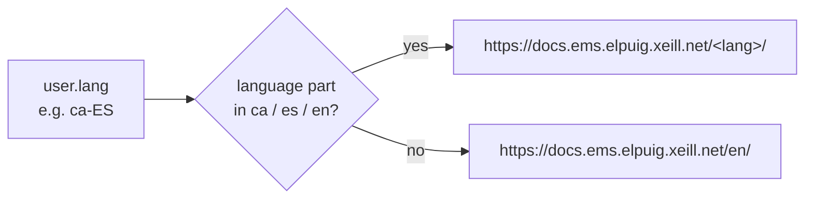

# User menu "Documentation" entry

The avatar dropdown in the backend's top-right corner (the user menu) has a native
"Documentation" entry that opens Odoo's developer documentation. EMS users are teachers,
secretaries and administrators, not Odoo developers, so EMS replaces that entry's destination
with its own user manuals.

## How it works

Odoo builds the user menu from the `user_menuitems` registry
(`web/static/src/webclient/user_menu/user_menu_items.js`). Each entry is a function returning
`{type, id, description, href, callback, sequence}`.
`static/src/js/backend/user_menu_documentation.js` re-registers the `"documentation"` key with
`{ force: true }`. The entry keeps its position (`sequence: 10`) and its already-translated
label, and it only changes the URL:

The target is the docs index of each language, which lists every role's manuals. It is not a
role-specific manual, because a single user can hold several roles.

## Access control

| Role | Sees the entry | Destination |
|------|----------------|-------------|
| Any internal user | Yes | EMS docs index in their language |

There is no server-side part. The link is public documentation, so no access rights apply.

## Tests

`tests/test_user_menu_documentation_tour.py` logs in as a teacher (the least-privileged
backend role), opens the user menu and asserts the entry's `href`. It checks two cases:
`ca_ES` goes to `/ca/`, and `fr_FR` falls back to `/en/`. The link itself is never clicked,
because it opens an external site.
