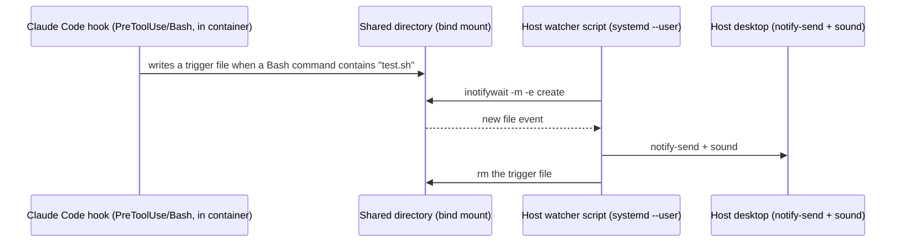

# AI agent test notifications when running inside a container

When an AI coding agent (e.g. Claude Code) runs `./test.sh`/`./upgrade.sh` on your behalf, it can send you a proactive push/desktop notification so you know to refresh an open Odoo browser tab (see the "test hangs on open browser tabs" note in the project's `CLAUDE.md`, under *Development scripts*). This works out of the box for a normal terminal install. It does **not** work out of the box when the agent's session runs inside a container (LXC, Incus, a Docker devcontainer, etc.) that is reached through an editor's native extension rather than the standalone terminal CLI — this doc explains why, and how to bridge it.

## Why the default channels fail in a container

- **Mobile push (Remote Control) is CLI-only.** It is not exposed anywhere in the VSCode native extension — no settings entry, no UI toggle, no `remote-control` subcommand if the standalone `claude` binary isn't separately installed in the container. There is currently no workaround; this is a product limitation, not a misconfiguration (tracked upstream as a feature request).
- **A direct DBus bridge to the host session bus is normally not viable in an *unprivileged* container.** These containers remap UIDs: the host user's UID (e.g. `1000`) is not in the container's mapped ID range, so a bind-mounted `/run/user/<uid>/bus` shows up owned by `nobody` inside the container, and the container's own root maps to some other, unrelated host UID. DBus's authentication handshake rejects the mismatch (`Did not receive a reply`). Confirm this quickly rather than debugging blind:
  ```bash
  dbus-send --session --dest=org.freedesktop.Notifications --type=method_call \
    --print-reply /org/freedesktop/Notifications org.freedesktop.Notifications.GetServerInformation
  ```
  A `ServiceUnknown`/auth failure here means this path is a dead end without deeper `raw.idmap` container surgery, which isn't worth it just for a notification.

## The fallback: a host-side file-drop bridge

Since a shared plain directory sidesteps the DBus UID problem entirely (`notify-send` only needs to run natively in the *host* user's own desktop session — no namespace involved), the working setup is:



### 1. Host: shared directory

```bash
mkdir -p ~/claude-notify
chmod 1777 ~/claude-notify   # world-writable + sticky bit: the container's remapped root needs write access
sudo apt install inotify-tools libnotify-bin
```

### 2. Host → container bind mount

Adapt to whichever tool manages the container. The container's own hostname is **not** necessarily its instance name — confirm the real instance name first (`incus list`, `docker ps`, etc.) rather than assuming.

```bash
# Incus/LXD
incus config device add <instance-name> notify-drop disk \
  source=/home/<user>/claude-notify path=/mnt/claude-notify

# raw LXC: add to the container's config file, then restart the container
# lxc.mount.entry = /home/<user>/claude-notify mnt/claude-notify none bind,create=dir 0 0

# Docker: add a bind mount
# -v /home/<user>/claude-notify:/mnt/claude-notify
```

### 3. Host: watcher script, run as your own user (never `sudo`)

`sudo` breaks this two ways at once: `~` expands to `/root` instead of your home directory inside the script, and `notify-send` run as `root` has no access to your real desktop session's DBus/display.

```bash
#!/bin/bash
# ~/claude-notify-watch.sh
mkdir -p ~/claude-notify
inotifywait -m -e create --format '%f' ~/claude-notify | while read -r f; do
  msg="$(cat ~/claude-notify/"$f" 2>/dev/null)"
  notify-send "Claude Code" "$msg"
  canberra-gtk-play -i dialog-information 2>/dev/null || \
    paplay /usr/share/sounds/freedesktop/stereo/dialog-information.oga 2>/dev/null
  rm -f ~/claude-notify/"$f"
done
```

Run it as a `systemd --user` service so it survives logout/login and doesn't need relaunching after every reboot:

```bash
mkdir -p ~/.config/systemd/user
cat > ~/.config/systemd/user/claude-notify-watch.service << 'EOF'
[Unit]
Description=AI agent notify watcher (container bridge)

[Service]
ExecStart=/home/<user>/claude-notify-watch.sh
Restart=on-failure

[Install]
WantedBy=default.target
EOF

systemctl --user daemon-reload
systemctl --user enable --now claude-notify-watch.service
```

Check with `systemctl --user status claude-notify-watch.service` — `active (running)`. Before assuming something's broken, check for a duplicated watcher first (`ps aux | grep claude-notify-watch`): a second instance running alongside the systemd-managed one fires every notification twice.

### 4. Container: Claude Code hook

In `~/.claude/settings.json` (**user-level**, not the project's checked-in `.claude/settings.json` — the mount path and username here are specific to one developer's machine):

```json
{
  "hooks": {
    "PreToolUse": [{
      "matcher": "Bash",
      "hooks": [{
        "type": "command",
        "command": "jq -r '.tool_input.command' | { read -r cmd; case \"$cmd\" in *test.sh*) echo \"$(date +%H:%M:%S) EMS: launching test -> $cmd\" > /mnt/claude-notify/test-$(date +%s%N).txt ;; esac; } 2>/dev/null || true"
      }]
    }]
  }
}
```

This fires unconditionally on any Bash command containing `test.sh` — deliberately not scoped to tour/`HttpCase`-only runs, and not subject to the agent's own "you're probably still looking at this" push-notification throttle, since it's a plain filesystem write with no such logic attached.

## Verifying each layer

Test bottom-up before declaring it done:
1. Write a file into the shared directory from inside the container (`echo test > /mnt/claude-notify/x.txt`) — confirms the bind mount and permissions.
2. Confirm the watcher consumes and deletes it, and that `notify-send`/sound actually reach the desktop.
3. Trigger the hook for real (a Bash command containing `test.sh`) — confirms the hook JSON is well-formed and wired to the right matcher.

## When to offer this

If a developer mentions they're not noticing test-hang reminders and their agent session is running inside a container rather than a bare-metal/VM terminal CLI install, that combination is the specific signature this fix addresses — offer to set it up rather than waiting to be asked.
