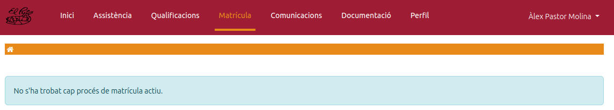
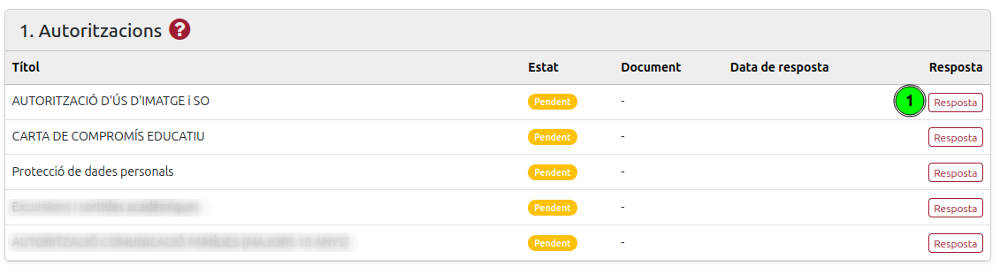
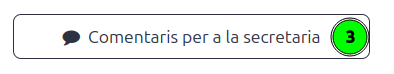
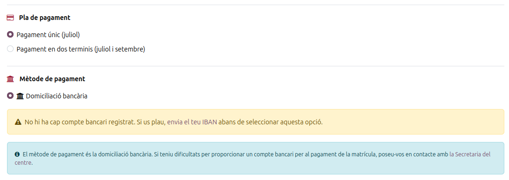
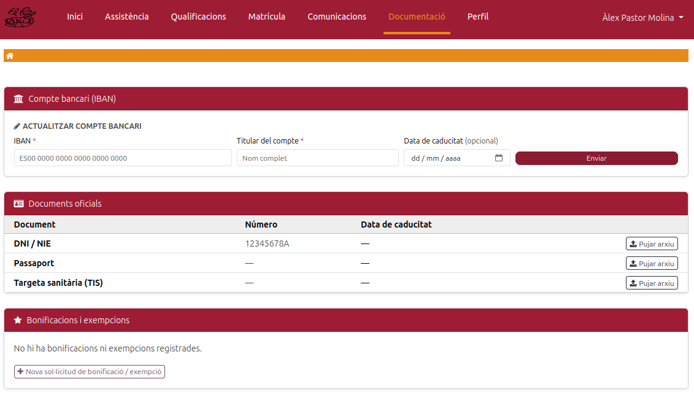

[Català](../../ca/families/manual-confirmacio-matricula.md) | [Castellano](../../es/families/manual-confirmacio-matricula.md) | [English](manual-confirmacio-matricula.md)

---

# Guide to confirming the enrollment proposal

This guide explains, step by step, how families (or students) confirm the **enrollment proposal** that the school sends them by email, using the school's education portal.

---

## Index

1. [Before you start: the proposal email](#before-you-start-the-proposal-email)
2. [Step 1 — Accessing the portal and the Enrollment section](#step-1--accessing-the-portal-and-the-enrollment-section)
3. [Step 2 — Responding to the authorizations](#step-2--responding-to-the-authorizations)
4. [Step 3 — Reviewing the enrollment details](#step-3--reviewing-the-enrollment-details)
5. [Step 4 — (Optional) Sending a comment to the Secretary's office](#step-4--optional-sending-a-comment-to-the-secretarys-office)
6. [Step 5 — Choosing the payment plan and method](#step-5--choosing-the-payment-plan-and-method)
7. [Step 6 — Registering the bank account (IBAN)](#step-6--registering-the-bank-account-iban)
8. [Step 7 — Confirming the enrollment](#step-7--confirming-the-enrollment)

---

## Before you start: the proposal email

When the enrollment proposal for the upcoming academic year is available, you will receive an **email** from the school (INS Puig Castellar) at the address you provided. The message informs you that the enrollment can now be processed and tells you the steps to follow.

To start the process, click the **my enrollment** link in the email, or access the school portal directly as explained in Step 1.

> **Note:** to log in to the portal you need an activated account. If you have not activated it yet, please first check the [Student portal access and activation](manual-portal-alumne.md) guide.

---

## Step 1 — Accessing the portal and the Enrollment section

Once you have logged in, you will land on the portal's home page (*My account*). From the top menu or the central cards, click **Enrollment**.

In the **Enrollment** section you will see the proposal the school has prepared for you, with all the sections to review and confirm.

> **If you do not see any proposal:** if, when you open Enrollment, the message *“No active enrollment process found”* appears, it means you currently have no pending proposal (because it has not been sent to you yet). If in doubt, contact the school's Secretary's office.

---

## Step 2 — Responding to the authorizations

The first section, **1. Authorizations**, contains the documents and consents you must respond to before you can confirm the enrollment (image and sound use authorization, educational commitment agreement, data protection, etc.).

Each authorization appears with the **Pending** status. To respond to it, click the **Answer** button on the corresponding row **(1)**.

A window will open with the full text of the authorization. Read it carefully and, if applicable, fill in the requested fields (some are mandatory and are marked with an asterisk `*`). Then:

* Click **Accept Authorization** to give your consent.
* Click **Reject** if the authorization allows it and you do not wish to give consent.

> **Important:** you must respond to **all mandatory authorizations** (they must end up in the *Accepted* status). While any mandatory authorization remains pending, the enrollment confirmation button will stay disabled.

---

## Step 3 — Reviewing the enrollment details

In the **2. Enrollment details** section you will find the breakdown of all the items (enrollment, PTA fee, fees, modules or subjects...) with their **price** and the **total** to pay.

Check that all the information is correct.

* If you **agree** with everything, you can continue with the payment (Step 5).
* If you have **any questions or want to report an issue** about an item, follow Step 4.

---

## Step 4 — (Optional) Sending a comment to the Secretary's office

If you want to ask about or comment on any of the items **before confirming**, you can send a message to the Secretary's office from the portal itself:

1. Tick the box **(1)** in the *Comment* column to the right of the line or lines you want to ask about.
2. When you tick a box, the **Comments** box **(2)** will open, where you must write your question or remark.

3. When any line is ticked, the confirm button is replaced by the **Comments for the secretary's office** button **(3)**. Click it to send your query.

> **Please note that:**
> * Sending a comment **does not confirm** the enrollment: it only sends your query to the Secretary's office.
> * The Secretary's office will review your message and reply. You will find the full message history in the **3. Enrollment Communications** section, within the same enrollment page.
> * Once the matter is resolved, you can come back and confirm the enrollment as usual.

---

## Step 5 — Choosing the payment plan and method

At the bottom of the details section you must indicate how you want to pay the enrollment.

**Payment plan.** Choose one of the available options:

* **Single payment (July).**
* **Payment in two installments (July and September).** If you choose this option, the breakdown of the two payments will be shown.

> The *Payment in two installments* option is **only available** if the enrollment includes **Fees** (CFGS). *Fees are the only enrollment item that can be split into two payments.*

**Payment method.** The school uses **direct debit**. To be able to select this option you need a **registered bank account (IBAN)**. If you have not registered one yet, you will see a warning like the one in the image, prompting you to submit your IBAN before continuing (see Step 6).

> If you have difficulties providing a bank account, contact the school's Secretary's office.

---

## Step 6 — Registering the bank account (IBAN)

To register the bank account, go to the **Documentation** section in the top menu. In the **Bank account (IBAN)** section, fill in the **Update bank account** form:

* The account **IBAN**.
* **Account holder** (full name).
* **Expiry date** (optional).

Then click **Submit**.

If you already had an account registered from another year, in this same section you can:

1. **Renew current account** **(1)** — if you want to keep the same account and update its validity.
2. **Update bank account** **(2)** — if you want to enter a new account (fill in the details and click *Submit*).

Once the IBAN is registered, go back to the **Enrollment** section to complete the process.

---

## Step 7 — Confirming the enrollment

Back in **Enrollment**, check that everything is correct:

1. The chosen **payment plan** **(1)**.
2. The **registered bank account**, which now appears confirmed with the IBAN, the holder and the validity **(2)**.

The **Confirm Enrollment** button **(3)** stays disabled (light colour) until **all** of these conditions are met:

* All mandatory authorizations are **accepted**.
* You have selected a **payment plan**.
* You have a **valid bank account (IBAN)** registered.

When all of them are met, the **Confirm Enrollment** button becomes active (maroon colour). Click it to complete the process.

> Once confirmed, the enrollment is registered and the page switches to read-only mode, showing the enrollment information. If you later need to make any change, you will have to contact the [school's Secretary's office](https://elpuig.xeill.net/el-centre/secretaria).

---

[← Back to the families index](index.md)
