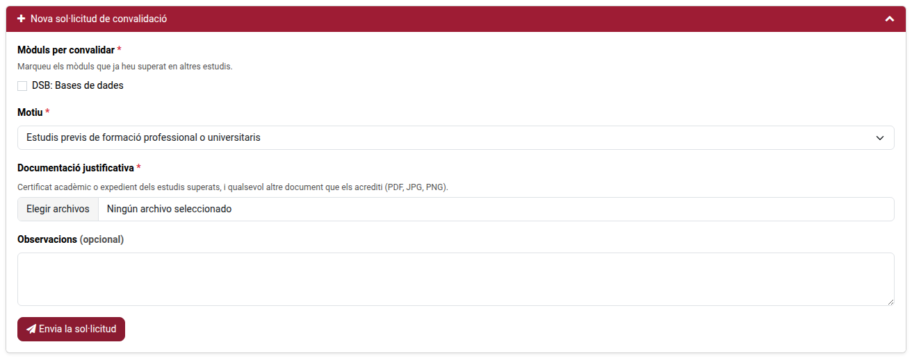
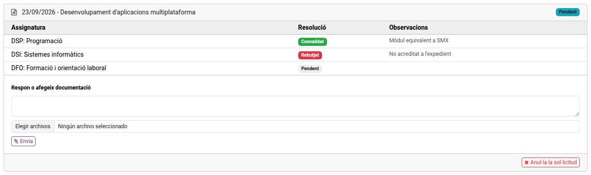

[Català](../../ca/families/manual-convalidacions.md) | [Castellano](../../es/families/manual-convalidacions.md) | [English](manual-convalidacions.md)

---

# Requesting Convalidations from the Portal

Ask for the convalidation of vocational training modules you already passed in other studies, and follow the resolution, from the student portal.

Convalidations can only be requested for vocational training cycles (CFGM and CFGS).

---

## Access

On the portal's home page, click the **Convalidations** card, or **Convalidations** in the top bar.

If you are a family with more than one child at the school, first choose the child in the portal's top bar: the request is always made for the selected child.

---

## Making a Request

Before you start, have the academic certificate or transcript of the studies you passed ready as a PDF or an image.

1. Click **New convalidation request** to open the form, and tick the modules you want to convalidate.
2. Choose the **Grounds**.
3. In **Supporting documents**, attach the certificate and any other document that proves the studies. You can select several files at once.
4. Optionally, write a comment.
5. Click **Submit request**.

A message confirms the request has been submitted. Modules already requested no longer appear in the form, unless they were rejected.

---

## Following the Request

Each request appears below the form, with the date, the study and its state:

| State | Meaning |
|-------|---------|
| **Submitted** | The school has not started resolving it yet. |
| **In progress** | Some modules are resolved or have been forwarded to the Departament d'Educació. |
| **Resolved** | Every module has a resolution. |
| **Cancelled** | The request was cancelled. |

The table shows the resolution of each module (**Pending**, **Forwarded to the Department of Education**, **Convalidated** or **Rejected**) and the school's remarks.

When every module is resolved, you receive an email with the resolution. The request, its cancellation and the resolution are also recorded on the **Communications** page.

---

## Cancelling a Request

While a request is **Submitted**, click **Cancel request** in its box.

---

[← Back to main index](index.md)
