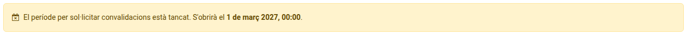
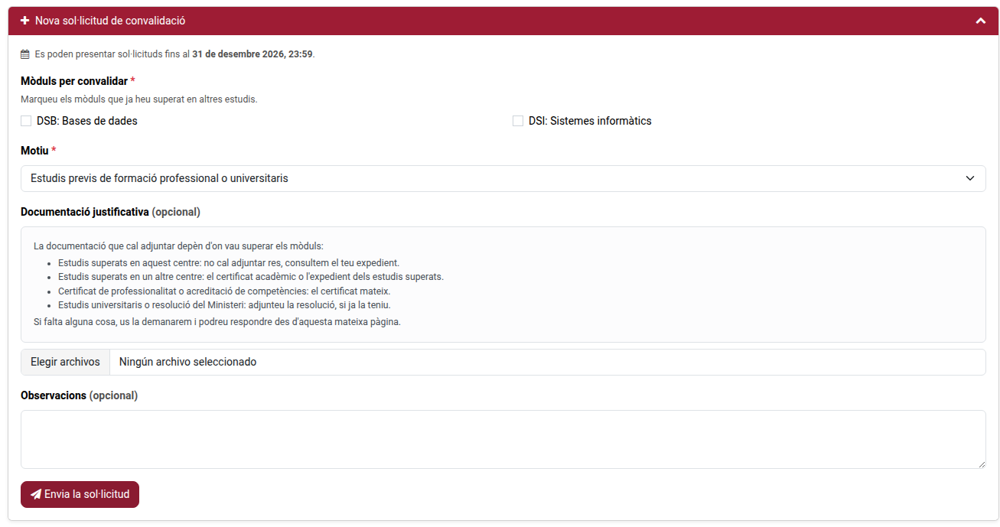
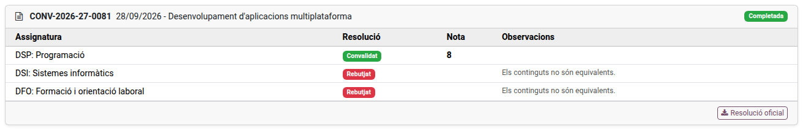
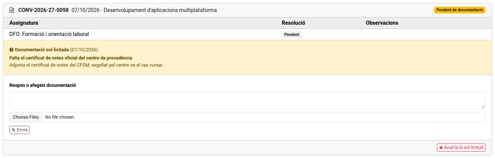

[Català](../../ca/families/manual-convalidacions.md) | [Castellano](../../es/families/manual-convalidacions.md) | [English](manual-convalidacions.md)

---

# Requesting convalidations from the portal

Ask for the convalidation of vocational training modules you already passed in other studies, and check its resolution, from the student portal.

Convalidations can only be requested for vocational training cycles (CFGM and CFGS).

---

## Who can request them

| Student | Who files the request | Who can follow it |
|---------|-----------------------|-------------------|
| Minor | The family, from its own account | The family and the student |
| Adult | The student, from their own account | The student |
| Adult who has authorized sharing information with the family | The student or the family, each from their own account | The student and the family |

A minor student sees their requests but cannot file them: the portal tells them their family has to. If the centre has no family member of theirs on file, the portal asks them to fill in their family's contact details from the profile page.

---

## Access

On the portal home page, click the **Convalidations** card, or **Convalidations** in the top bar.

If you are a family with more than one child at the centre, first pick the child in the portal's top bar: the request is always made for the selected child.

---

## Request period

New requests can only be submitted during the request period the centre sets every year (usually from 1 October at 08:00 to 31 March at 23:59). While it is open, the form says until when requests can be submitted.

Outside that period the form is replaced by a notice saying when it opens again:

Requests already submitted are not affected: you can keep checking them, answering the centre and cancelling them while they are pending.

---

## Making a request

1. Click **New convalidation request** to open the form, and tick the modules you want to convalidate.
2. Choose the **Grounds**.
3. Under **Supporting documents**, attach the documents needed. You can select several files at once.
4. If you want, write some comments.
5. Click **Submit request**.

### Which documents to attach

| Case | Documents |
|------|-----------|
| Studies passed at this centre | None: the centre looks the record up. |
| Studies passed at another centre | The academic certificate or transcript of the studies passed. |
| Professional certificate or accreditation of competences | The certificate itself. |
| University studies or a Ministry resolution | The resolution, if you already have it. |

If anything is missing, the centre will ask you for it and you can attach it from this same page.

A message confirms the request has been submitted. Modules already requested no longer appear on the form, unless they were rejected.

---

## Following the request

Each request appears below the form, with its registration number (e.g. CONV-2026-27-0001), the date, the study and the state:

| State | Meaning |
|-------|---------|
| **Pending** | The centre is reviewing it. |
| **In process at the Ministry** | The centre has filed it with the Ministry, which will resolve it. It can no longer be cancelled. |
| **Pending the Director** | Reviewed; the Director's official resolution is missing. |
| **Pending the secretariat** | Resolved; the secretariat is registering it in the student's record. |
| **Completed** | Registered, with at least one module convalidated. You can see each convalidated module's grade, and no longer attend those modules. |
| **Rejected** | Registered, with no module convalidated. |
| **Cancelled** | The request was cancelled. |

The table shows each module's resolution (**Pending**, **Convalidated** or **Rejected**) and, under **Remarks**, the reason for the rejected ones. Once the request is **Completed**, the **Grade** column appears too.

When the request becomes **Completed** or **Rejected**, you get an email with the official resolution as a PDF. You can also download it from the portal with the **Official resolution** button.

The request, each change of state and the resolution are also recorded on the **Communications** page.

---

## Answering or adding documentation

If the centre asks you for documentation, you get an email and, on the request's box, you see the **Documentation requested** notice with what they need. Right below it, under **Answer or add documentation**, write your answer, attach the files and click **Send**. The documents are added to the request.

You can answer while the request is **Pending** or **In process at the Ministry**.

---

## Cancelling a request

While a request is **Pending**, click **Cancel request** on its box.

---

[← Back to the index](index.md)
