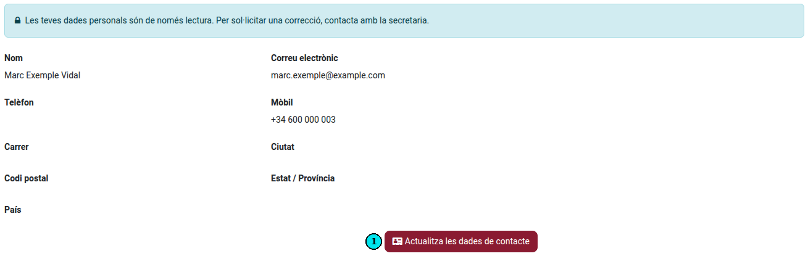
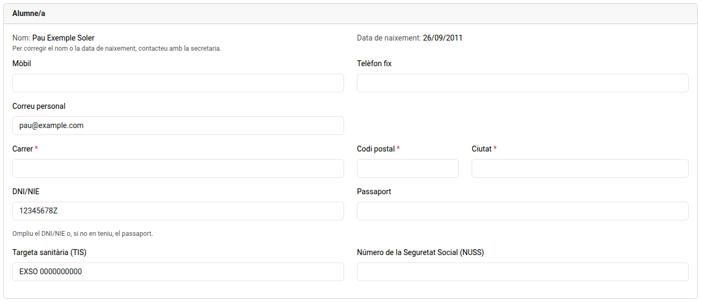
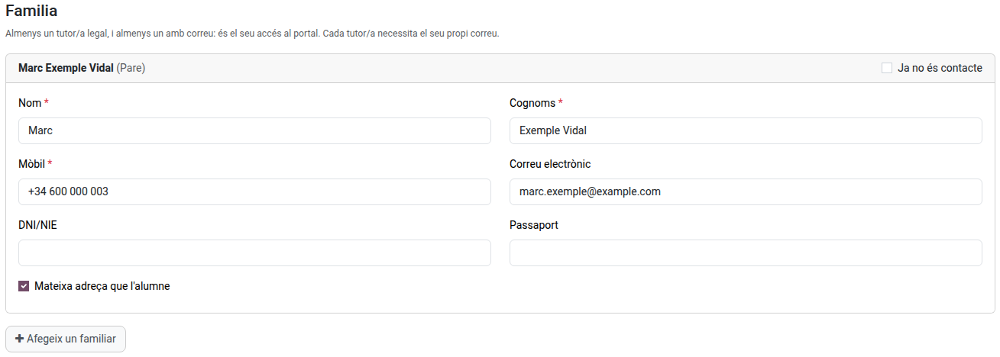
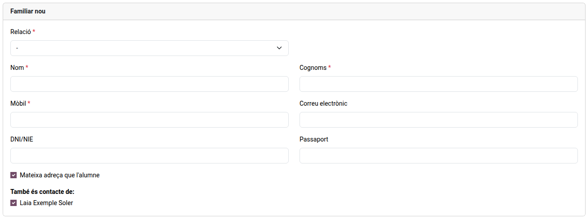
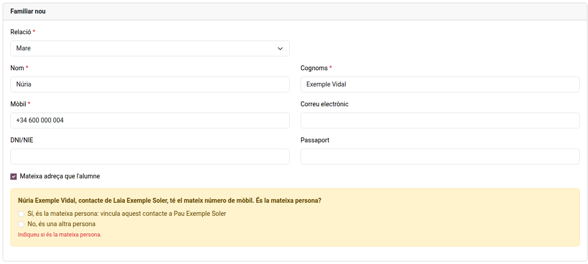
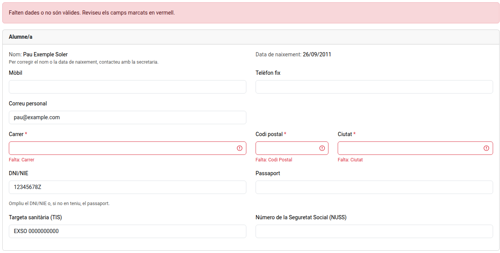

[Català](../../ca/families/manual-dades-contacte.md) | [Castellano](../../es/families/manual-dades-contacte.md) | [English](manual-dades-contacte.md)

---

# Reviewing the contact details

How to review and complete the contact details of the student and the family from the student portal.

---

## Open the contact details

Open the portal, click **Profile** and then **Update contact details** (1). When the school has asked you for them, the notice at the top of the home page also has a **Review** button, and the school's email has a link to the same page.

Only whoever answers for the student sees the button: the family of a student under 18, or an adult student from their own account. A student under 18 who signs in with their own account can consult the portal but not send the details: their family does.

If you have more than one child at the school, choose the student in the menu at the top right first.

## Fill in the details

- **Student**: street, ZIP and city are required, and the DNI/NIE or, if there is none, the passport. An adult student also needs a personal email: it is their portal login. The mobile, landline, health card (TIS) and Social Security number (NUSS) are optional.
- **Emails**: enter personal addresses. An address of the school's own domain, such as the student's school email, is not accepted.

- **Family** (required for a student under 18): each family contact needs first name, last name and mobile. At least one of them needs an email, and each one needs their own.
- **Same address as the student**: untick it to enter a different address for that family contact.
- **Add a family contact**: adds a new one. Choose the relation and fill in their details.
- **No longer a contact**: tick it for a family contact who should no longer be contacted.
- The name and the birth date of the student cannot be changed here: to correct them, contact the secretary's office.

## Several children

A family contact you add is also offered for your other children at the school: under **Also a contact of**, leave ticked the children they are a contact of. Once the school approves it they are linked to all of them, so you do not have to add them again for each child.

If the new contact has the same DNI/NIE or mobile as a contact of another of your children, the form points it out before sending. Choose **Yes, it is the same person** to link that contact to this child too, instead of adding a new one, or **No, it is another person**. With the same DNI/NIE the answer can only be yes: if it is not the same person, correct the document.

## Send

Click **Send**. If a field is missing or not valid, it is marked in red: correct it and send again.

The school reviews the changes before applying them. Until then, you can open the page again, correct them and send them again. If the school returns them, you receive an email explaining what to correct.
