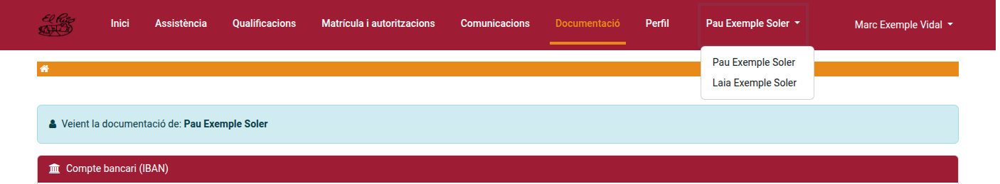
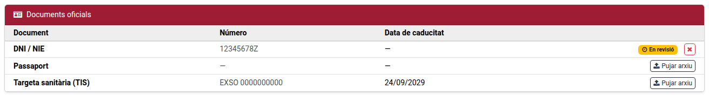
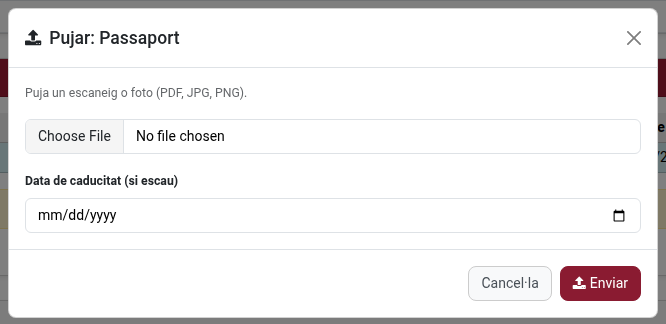
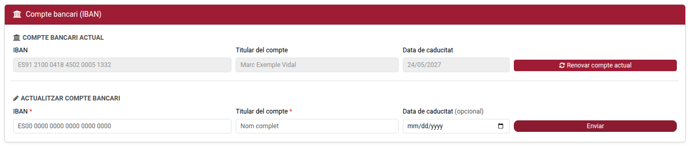
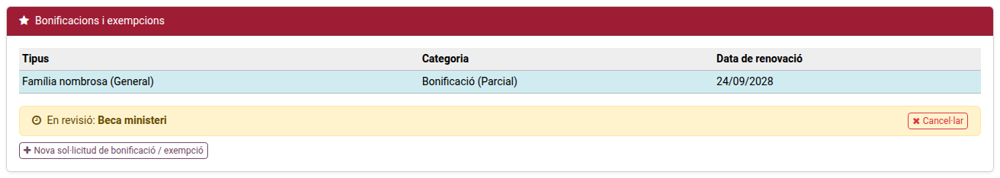
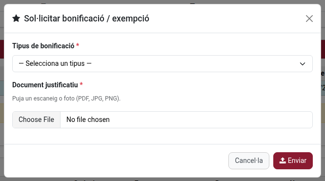
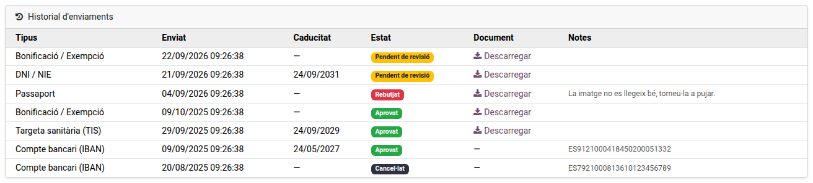

[Català](../../ca/families/manual-documentacio.md) | [Castellano](../../es/families/manual-documentacio.md) | [English](manual-documentacio.md)

---

# Uploading official documents, IBAN and benefit requests

This guide explains how to submit official documents (ID/passport, health insurance card), register your bank account (IBAN) and request a bonification or fee exemption, from the **Documentation** page of the student portal.

---

## Table of Contents

1. [Where to submit documents](#where-to-submit-documents)
2. [Uploading an ID, passport or medical card](#uploading-an-id-passport-or-medical-card)
3. [Registering or renewing your IBAN](#registering-or-renewing-your-iban)
4. [Requesting a bonification or exemption](#requesting-a-bonification-or-exemption)
5. [Checking the status of a submission](#checking-the-status-of-a-submission)

---

## Where to submit documents

From the portal's main dashboard, open **Documentation**. If you manage more than one student (several children at the school), make sure you have the right one selected before submitting anything: the selector with the student's name at the top of the page switches between them, and the page always shows whose documentation you are viewing.

## Uploading an ID, passport or medical card

Next to the document, click **Upload scan**, attach the file (a clear photo or scan is enough) and submit. It will show up immediately with status **Pending review**. You can cancel a submission yourself while it is still pending, in case you picked the wrong file — once it has been reviewed, only the school can reopen it.

## Registering or renewing your IBAN

Enter the account number (IBAN) and, optionally, the account holder's name if it's different from the student's. If the school already has an active IBAN on file for the student, you can renew it directly from the same page — it extends the expiry by a year without needing to resubmit the number, unless it actually changed.

Only **one** IBAN submission can be pending review at a time — if you need to correct one you just sent, cancel it first (while it's still pending) before submitting a new one.

## Requesting a bonification or exemption

Choose the type that applies (large family, single-parent family, ministry scholarship, disability, or other) and attach the supporting document (the official certificate). Once approved, it appears among the student's active benefits — see the request's status on this same page.

## Checking the status of a submission

Every submission shows one of four statuses:

- **Pending review** — waiting for the school to check it.
- **Approved** — accepted; for an IBAN or a benefit, it has already taken effect (see above).
- **Rejected** — not accepted; the reason given by the school is shown alongside it. Submit a corrected document to try again.
- **Cancelled** — withdrawn (either by you, while it was still pending, or superseded by a later approved submission of the same type).

You will receive an email whenever the school approves or rejects one of your submissions.

---

[← Back to families index](index.md)
