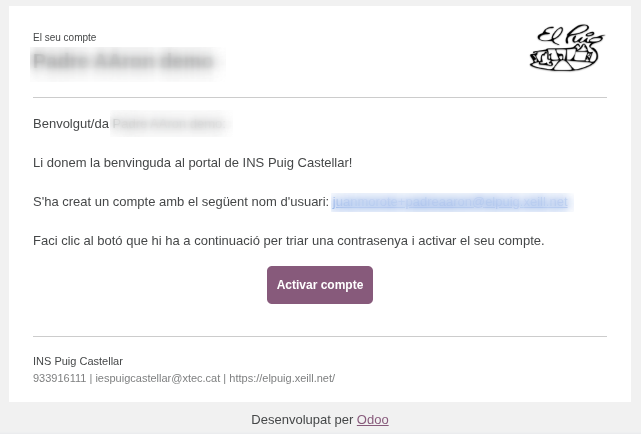
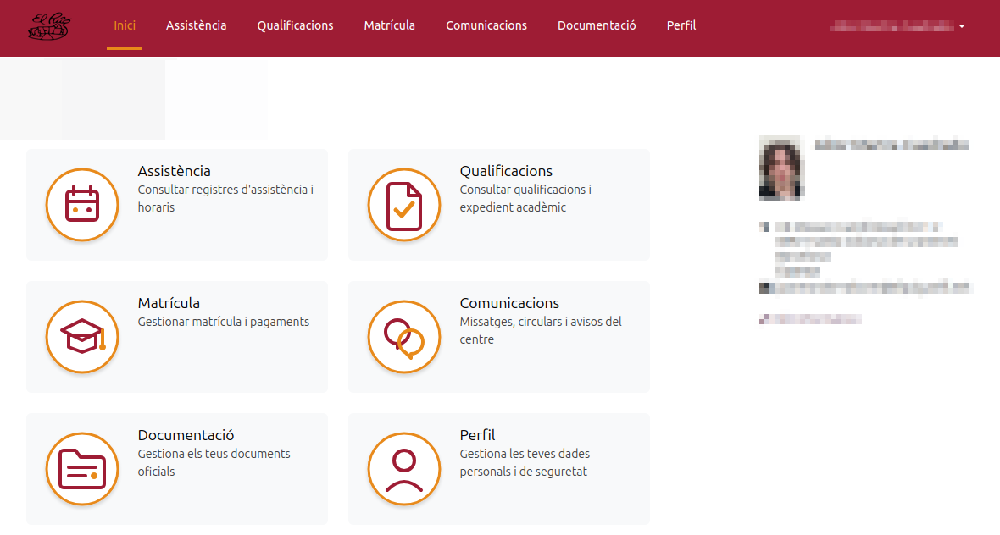

[Català](../../ca/families/manual-portal-alumne.md) | [Español](../../es/families/manual-portal-alumne.md) | [English](manual-portal-alumne.md)

---

# Student portal access and activation guide

This guide explains in detail the steps students (or their families) must follow to activate their account and access the school's educational portal for the first time.

---

## Table of Contents

1. [Introduction](#introduction)
2. [Step 1 — Email invitation instructions](#step-1--email-invitation-instructions)
3. [Step 2 — Password form](#step-2--password-form)
4. [Step 3 — Confirmation email](#step-3--confirmation-email)
5. [Step 4 — Portal access](#step-4--portal-access)

---

## Introduction

The student portal is the centralized virtual space from which the student and their family can manage their academic and administrative life with the school in a simple, fast and fully online way.

Currently, the portal allows the following tasks:
* **Enrollment:** Manage the enrollment process, answer and sign the school authorizations digitally, and review payments or fees.
* **Documentation:** Upload, store and consult all the official documents requested by the school.
* **Communications:** Receive messages, circulars and notices sent by the management team, tutors or the secretariat immediately.
* **Profile:** Keep the personal, contact and account security data up to date.

**Features available soon.** We are developing new modules to improve the tool. The following areas will be activated very soon:
* **Attendance:** Check attendance records.
* **Grades:** Access the marks of the different evaluations directly.

---

## Step 1 — Email invitation instructions

When the school registers you in the EMS management system, you will receive an automatic invitation email at the email address you provided during the enrollment process.

To start the activation process, follow these steps:
1. Open your email client and look for the welcome message sent by **INS Puig Castellar**.
2. Check that the username shown matches your correct email address.
3. Click directly on the central **Activate account** button. This link will securely redirect you to the portal setup wizard.

---

## Step 2 — Password form

Once you open the link from the email, the school's official registration window will open automatically so you can set up your security credentials.

In this form, complete the following actions following the numbered indicators in the image:

1. **Your email (1):** Check that the email address is correct. This field acts as your unique user identifier by default.
2. **Your name (2):** Check that your name and surname appear.
3. **Password (3):** Type a new, secure password for your account.
4. **Confirm password (4):** Re-enter exactly the same password to make sure there was no typing error.
5. **Sign up (5):** Finally, click the maroon **Sign up** button to validate and save your access data.

---

## Step 3 — Confirmation email

After submitting the registration form correctly, you will receive a second automatic email in your inbox from the system.

This message officially confirms that the registration process has been completed successfully, that your user profile is now active and that you have been granted all the permissions to access the platform independently.

---

## Step 4 — Portal access

Once registered, you will go directly to the main dashboard or home page of the student portal.

The web interface is optimized and designed to provide clean and intuitive navigation:
* **Top menu:** You have permanent access to all the school's management areas.
* **Centralized cards:** You have visual buttons to access each of the key services (**Attendance**, **Grades**, **Enrollment**, **Communications**, **Documentation** and **Profile**).
* **User profile:** On the right side you will always see the basic information of the active student profile along with their ID photo from the record.

---

[← Back to families index](index.md)
