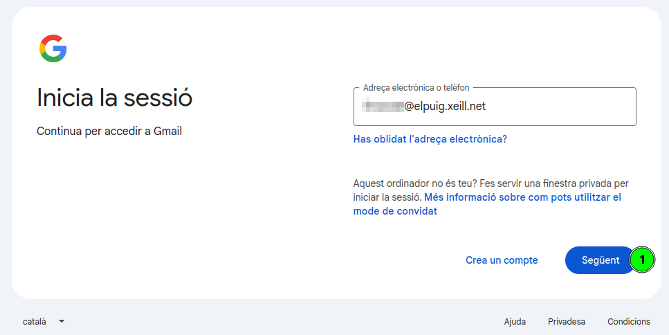
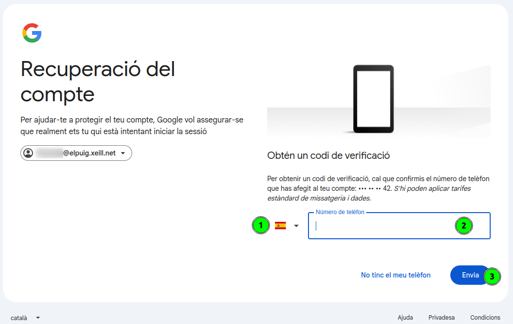
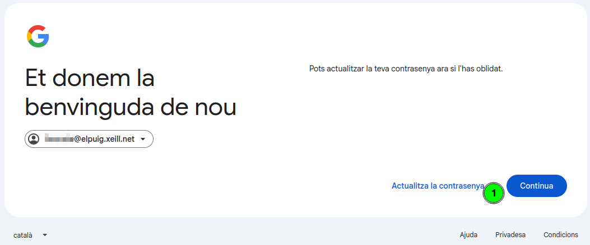

[Català](../../ca/families/manual-recuperacio-contrasenya-correu.md) | [Castellano](../../es/families/manual-recuperacio-contrasenya-correu.md) | [English](manual-recuperacio-contrasenya-correu.md)

---

# Guide to recovering the school email password (@elpuig.xeill.net)

This guide explains step by step how to recover the password of the school email account (`@elpuig.xeill.net`) when you have forgotten it or it has stopped working.

The school email account is a **Google (Gmail)** account, so recovery is done through Google's official assistant.

> **Important:** to recover the password you must have a **recovery phone number** associated with the account. This is the phone number you provided when the account was created. If you do not have access to that phone, contact the school office.

---

## Index

1. [Step 1 — Sign in with your email](#step-1--sign-in-with-your-email)
2. [Step 2 — Click "Forgot password?"](#step-2--click-forgot-password)
3. [Step 3 — Account recovery screen](#step-3--account-recovery-screen)
4. [Step 4 — Confirm the phone number](#step-4--confirm-the-phone-number)
5. [Step 5 — Enter the verification code](#step-5--enter-the-verification-code)
6. [Step 6 — Update the password](#step-6--update-the-password)
7. [Step 7 — Create the new password](#step-7--create-the-new-password)

---

## Step 1 — Sign in with your email

Open your browser and go to [Gmail](https://mail.google.com) (or any Google service). On the sign-in screen:

1. Type the full school email address (`user@elpuig.xeill.net`).
2. Click the **Next (1)** button.

---

## Step 2 — Click "Forgot password?"

On the screen that asks for your password, you do not need to type anything. To start the recovery process:

1. Click the **Forgot password? (1)** link.

---

## Step 3 — Account recovery screen

Google will open the **Account recovery** assistant. It will ask for the last password you remember:

1. If you remember any, type it in the **Enter the last password you remember (1)** field and click **Next (2)**.
2. If you do not remember any, click **Try another way (3)** to continue with a different verification option.

> In both cases, the goal is to reach the phone-number verification described in the next step.

---

## Step 4 — Confirm the phone number

To make sure it is really you, Google will ask you to confirm the **phone number** associated with the account (you will see the last digits as a hint):

1. Check that the **country prefix (1)** is correct (Spain).
2. Type the **full phone number (2)** associated with the account.
3. Click **Send (3)** to receive the verification code via SMS.

> If you do not have access to that phone, you will not be able to continue on your own: contact the **school office** so they can help you restore access.

---

## Step 5 — Enter the verification code

You will receive a text message (SMS) with a **6-digit verification code** at the indicated number:

1. Type the received code in the **Enter the code (1)** field (the `G-` prefix is already filled in).
2. Click **Next (2)**.

> If you do not receive the message within a few minutes, you can click **Resend it** to request a new code.

---

## Step 6 — Update the password

Once your identity is verified, Google will welcome you back and offer to update the password:

1. Click the **Update password (1)** link to set a new one.

---

## Step 7 — Create the new password

Finally, set the new account password:

1. Type the new password in the **Create a password (1)** field. It must be **at least 8 characters** long, and it is recommended that you do not use it on any other website.
2. Type it again in the **Confirm (2)** field to avoid typing mistakes.
3. Click **Save password (3)**.

Once saved, you can access the school email with the new password.

---

[← Back to families index](index.md)
