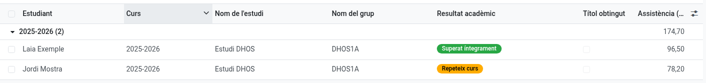

[Català](../../ca/head_of_studies/academic-history.md) | [Castellano](../../es/head_of_studies/academic-history.md) | [English](academic-history.md)

---

# Academic history: cohort queries

The **academic history** keeps one permanent record per student and course: study, group, subjects with their grades per learning outcome, attendance and academic result. It is generated automatically (at each withdrawal and at the course transition) as a **frozen copy** of the grades subsystem, so it survives the yearly cleanup of operational data.

As Head of Studies or Director you have **access to the whole history**: cohort-level queries, and applying a grade review to a course already closed.

---

## Where to find it

**Planning and Grading → Grades → Academic history** lists every record, grouped by course by default.

Also, on any student's form, the **Academic history** tab shows that student's records — including **former students** (alumni and withdrawals), whose tab remains as their permanent record.

## Useful queries

- **Group by course + study:** results of each cohort, year by year.
- **Academic result filters:** *Fully passed*, *Partially passed*, *Repeating*, *Withdrawn* — e.g. how many students of a study repeated in a given course.
- **Title obtained:** every student who obtained the title in a course.
- **Finals pending placement:** passed subjects whose final grade is still waiting for the work placement (EM) — the pending work list for placement grading.

## How to read the grades

- The **subject state** (Passed / Not passed) is decided **only by the learning outcomes**: a pending or failed work placement never fails a subject, it only leaves the final grade empty until a new placement is passed.
- The stored **weights** (internal/EM and per RA) are the ones in force that course: the history is self-contained and keeps its meaning even if a later teaching plan changes the weights.
- The **academic result** is proposed automatically from grades and the destination enrollment; secretariat/administrators may have adjusted it by hand.

## Applying a grade review

A grade review corrects the academic history of a course already closed: the grade of a subject through its learning outcomes, a subject missing from a record, or a subject that should not be there.

Open the student's record for that course and click **Grade review**. The full step-by-step is in the [secretariat manual](../secretary/academic-history.md#applying-a-grade-review) — the screen and the rules are the same for both roles.

---

[← Back to main index](index.md)
