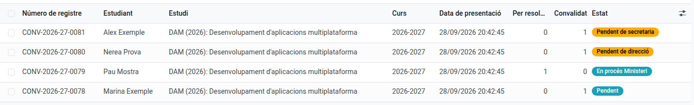
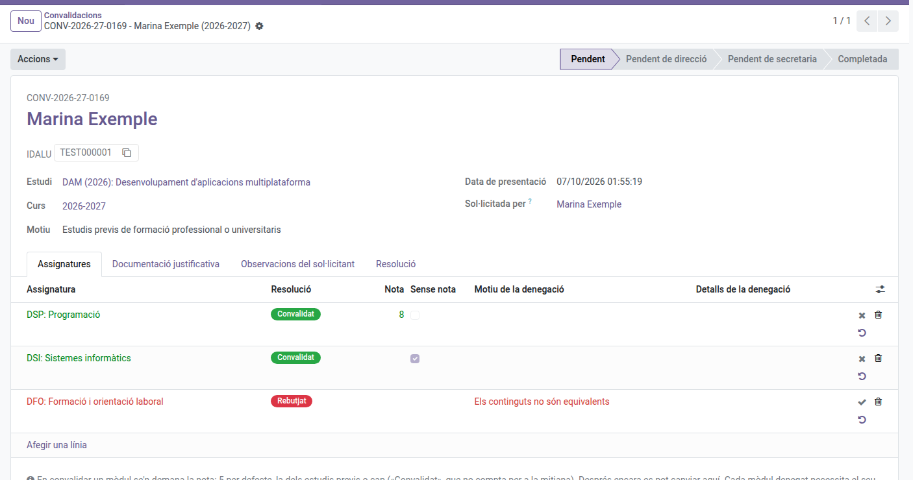
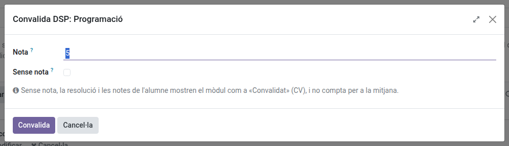
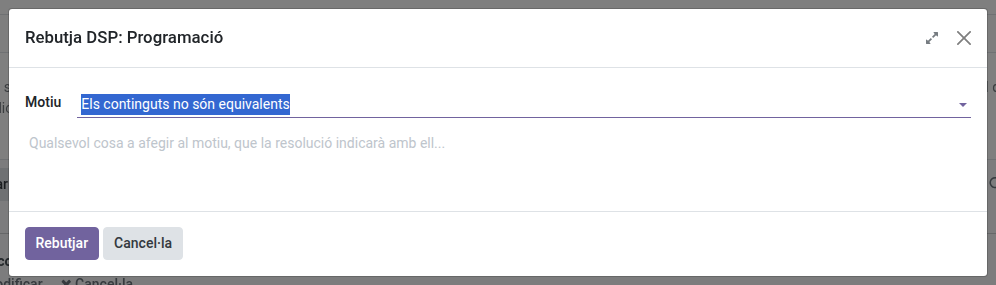
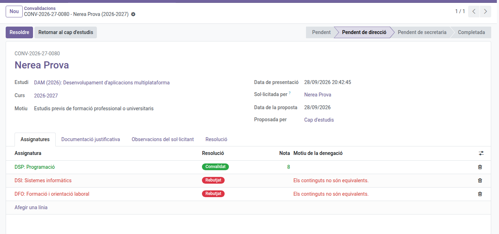
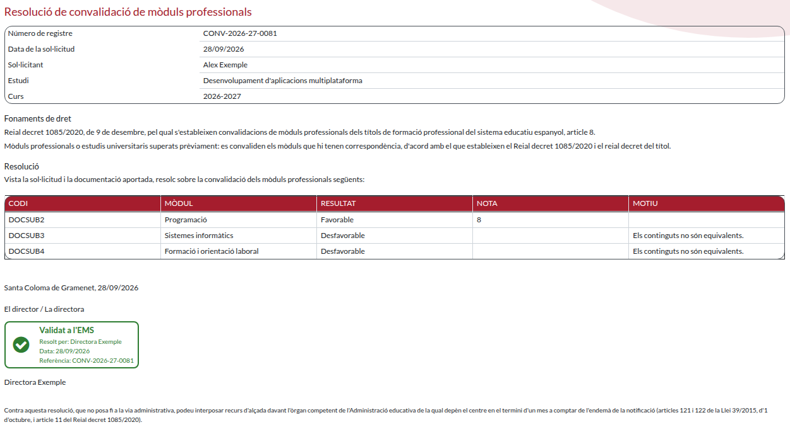
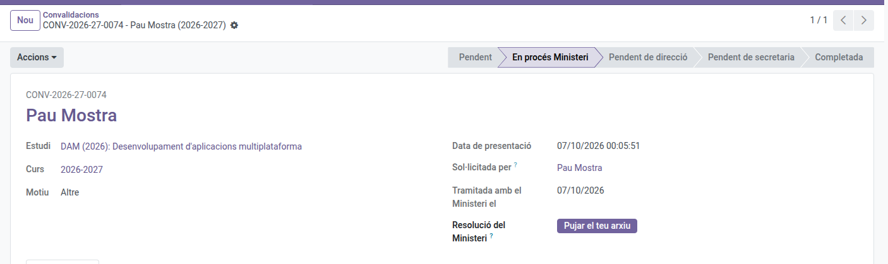

[Català](../../ca/head_of_studies/convalidations.md) | [Castellano](../../es/head_of_studies/convalidations.md) | [English](convalidations.md)

---

# Convalidations: reviewing and resolving requests

Review the module convalidations requested from the portal, decide each module and draft the resolution proposal (Deputy Head of Studies), or resolve it officially (Director).

**Required role:** Deputy Head of Studies or Head of Studies to review; Director to resolve.

---

## The circuit

Each request is resolved in one of two ways:

- **By the centre:** the Head of Studies drafts the proposal and the Director resolves it. Resolving it generates the official resolution as a PDF.
- **By the Ministry:** the Head of Studies files it with the Ministry and, when the answer arrives, records its outcome. It does not go through the Director.

Either way, the secretariat then registers the resolution in Esfera and closes the request.

| State | Who acts |
|-------|----------|
| **Pending** | The Head of Studies reviews it. It stays there until it is resolved. |
| **In process at the Ministry** | The Head of Studies has filed it with the Ministry and is waiting for its answer. |
| **Pending documentation** | The applicant has been asked for documentation. It goes back to **Pending** (or **In process at the Ministry**) once it arrives. |
| **Pending the Director** | The Director has to resolve the proposal or send it back. |
| **Pending the secretariat** | It is resolved; the secretariat has to register it in Esfera. |
| **Completed** | Registered, with at least one module convalidated. The student can see the grade. |
| **Rejected** | Registered, with no module convalidated. |
| **Cancelled** | The student or the family cancelled it from the portal. |

The state only changes through the actions of each step, in the form's **Actions** menu.

---

## Access

Navigate to: **Academic management → Convalidations**

The list opens with every request waiting for the centre: **Pending the Head of Studies**, **In process at the Ministry**, **Pending the Director** and **Pending the secretariat**. Requests waiting for the applicant's documentation are left out: use the **Pending documentation** filter to see them. Remove the filters to see them all, or use **Completed**, **Rejected** and **Cancelled**.

To see a student's requests, open their record and click the **Convalidations** button.

Each step creates a task in the activity tray (🕒) of whoever has to do it:

- Every new request, or one sent back by the Director, for whoever holds the **Deputy Head of Studies** position. While a request waits for the applicant's documentation the task leaves the tray, and it comes back when the documentation arrives.
- Every proposal, for whoever holds the **Director** position.

Creating a task sends no email. Instead, every working day at the start of your working hours you get a single email listing everything still pending in your tray: see [Daily Summary of Pending Tasks](../teachers/task-digest.md).

---

## Reviewing a request (Head of Studies)

Open the request from the list. The form shows:

- The **registration number** (e.g. CONV-2026-27-0001), above the student's name.
- The student's **IDALU**, under their name, with a button that copies it so you can paste it into Esfera to look up their academic record. You can also type an IDALU in the list's search bar, under *Student*, to find their requests.
- **Study**, **Course** and **Grounds**. These, the student and the applicant's comments come from the request and cannot be changed.
- Under the student's name, the notice **Holds a title obtained at this centre** when the academic history records a title obtained here.
- **Subjects** tab: one line for each module requested.
- **Supporting documents** tab: the attached files.
- **Applicant's comments** tab: what the student or the family wrote.
- **Documentation requested** tab: the last documentation you asked for, if any.
- **Resolution** tab: comments for the student, sent with the resolution.

### Deciding each module

On each line of the **Subjects** tab, use the buttons on the right:

| Button | Result |
|--------|--------|
| ✔ (Convalidate) | Asks for the module's grade, then convalidates it. |
| ✖ (Reject) | Asks for the reason, then refuses the module. |
| ↺ (Back to pending) | Undoes the line's decision. |

- **Grade:** each module is checked and graded one by one. When you click ✔, a dialog asks for it: with **Mode** set to **With grade** (the default), write the grade, 5 by default or the one the previous studies hold (from 5 to 10). Choose **Without grade** when the module is convalidated with no grade: the resolution shows it as **Convalidat**, the grades as **CV**, and it does not count towards the average. Until you send the proposal, you can still change the **Grade** and **Without grade** columns on the line.
- **Reason for refusal:** when you click ✖, a dialog asks for the **Reason**, with the most usual one already selected, and optional **Details**. Both appear on the resolution. They can still be changed on the line until you send the proposal. The list of reasons is maintained by the EMS administrator (see [Convalidation settings](../admin/convalidation-settings.md)).

### Asking for documentation

1. In **Actions**, choose **Request information**.
2. Choose the **Reason**. The most usual one, **Missing official grade certificate from the previous centre**, comes selected.
3. If needed, write in **Details** exactly what is missing.
4. Click **Send**.

The student gets an email with the reason and the details, and so does the family if the student is a minor or has authorized sharing information with it. They also appear on the portal, on the request itself, right above the form to answer and attach documents.

The request moves to **Pending documentation** until the documentation arrives:

- **From the portal:** as soon as the applicant answers, the request goes back to where it was (**Pending** or **In process at the Ministry**).
- **Some other way** (on paper, by email): in **Actions**, choose **Documentation received**.

Meanwhile you can still decide the modules, but you cannot send the proposal or file the request with the Ministry. The **Documentation requested** tab shows the date, the reason and the details of the last request.

Documentation can be requested while the request is **Pending**, **Pending documentation** or **In process at the Ministry**. The list of reasons is maintained by the EMS administrator (see [Convalidation settings](../admin/convalidation-settings.md)).

---

## Resolving it at the centre

1. Decide every module, with the reason for the ones you reject.
2. In **Actions**, choose **Send proposal to the Director**.

The request moves to **Pending the Director**, and its modules and grades can no longer be changed.

### Resolving the proposal (Director)

Both options are in the form's **Actions** menu.

- **Resolve:** issues the official resolution as proposed. The resolution PDF is generated and the request moves to **Pending the secretariat**. The PDF appears in the form's **Resolution** field: click the file name to open it.
- **Return to the Head of Studies:** write the reason and click **Return**. The request goes back to **Pending**, with the reason in a yellow notice at the top of the form, and the Head of Studies gets the task again. The student does not see the reason. When the Head of Studies sends the proposal again, the notice disappears.

### The resolution PDF

The resolution is issued in Catalan and contains:

- The registration number, the request date, the student and, for a minor, the family member who represents them, the study and the course.
- The grounds of law: Royal Decree 1085/2020, article 8, and the text for the request's grounds.
- One line per module: code, name, outcome (favourable or unfavourable), grade (**Convalidat** or the grade) and reason when unfavourable.
- Place and date, the Director's signature with the **Validat a l'EMS** stamp, and the appeal footer.

The grounds-of-law and appeal texts, and signing by delegation, are configured in [Convalidation settings](../admin/convalidation-settings.md).

---

## Resolving it through the Ministry

1. File the request with the Ministry.
2. In **Actions**, choose **In process at the Ministry** and confirm. The request stays in your hands: the student can no longer cancel it, but you can still ask them for documentation.
3. When the Ministry's answer arrives, decide each module as it resolved, with the reason for the rejected ones.
4. If you have the Ministry's resolution, upload it to the **Ministry resolution** field. It is optional.
5. In **Actions**, choose **Ministry resolution received**.

The request moves straight to **Pending the secretariat**, without going through the Director. If you uploaded the Ministry's resolution, that is the one the student receives.

---

## What happens next

The secretariat registers the resolution in Esfera (see [Convalidations: registering resolutions](../secretary/convalidations.md)). At that moment:

- The request becomes **Completed** (if any module is convalidated) or **Rejected**.
- The student receives the resolution by email, with the PDF attached. So does the family if the student is a minor or has authorized sharing information with it.
- The grades reach the student's grades: the student stops taking each convalidated module, the module's teachers and the tutor are notified, and the academic history records it as passed with the grade, the **CV** mark and the registration number.

---

## Registering a paper request

1. Click **New**.
2. Choose the **Student**, **Study**, **Course** and **Grounds**, and write the applicant's comments if there are any.
3. On the **Subjects** tab, click **Add a line** and choose each module.
4. On the **Supporting documents** tab, upload the documents.
5. Click **Save**.

Once saved, the student, study, course, grounds and comments can no longer be changed.

You can register a request, and process any request, at any time: the portal's request period (see [Convalidation settings](../admin/convalidation-settings.md)) only limits new requests from students and families.

---

## Cancelling and reopening

- **Cancel request** is available while the request is **Pending**, or **Pending documentation** if it has not been filed with the Ministry.
- **Reopen** takes a cancelled request back to **Pending**.

---

## Studies that allow convalidations

Only studies whose level has **Allows convalidations** checked (by default, CFGM and CFGS) can receive requests. See [Levels](../admin/curriculum-levels.md).

---

[← Back to the Head of Studies index](index.md)
