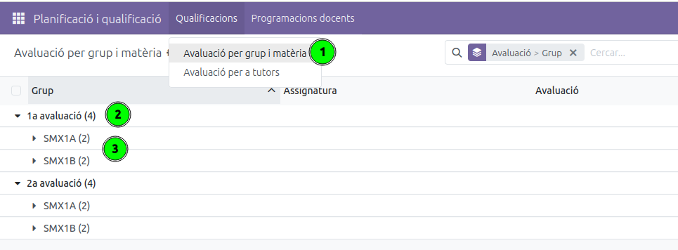
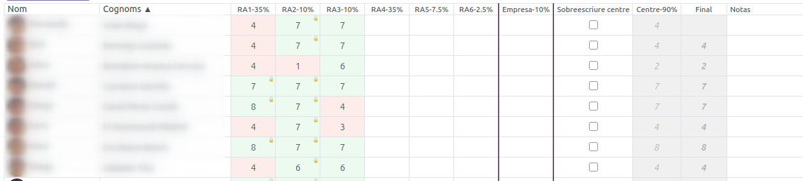
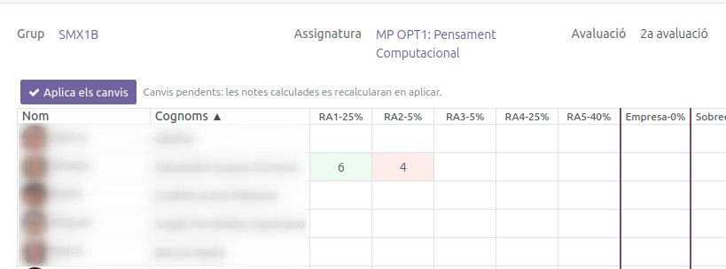
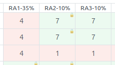
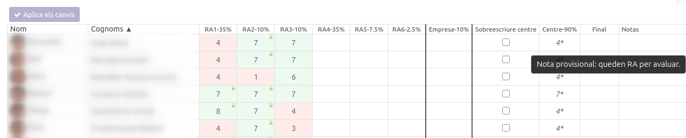
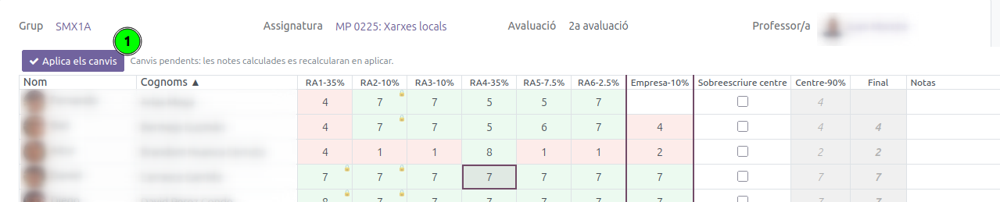

[Català](../../ca/professors/qualificacions.md) | [Castellano](../../es/professors/qualificacions.md) | [English](qualificacions.md)

---

# Evaluation: Record grades by learning outcome

This guide explains how teachers record and review the grades for their subjects in the **Evaluation by group and subject** view, where each student is graded **learning outcome (LO) by learning outcome** and the system computes the subject grade.

---

## Contents

1. [Access](#access)
2. [Finding your grade session](#finding-your-grade-session)
3. [The grading grid](#the-grading-grid)
4. [Entering the outcome grades](#entering-the-outcome-grades)
5. [Locked outcomes](#locked-outcomes)
6. [The subject-grade columns](#the-subject-grade-columns)
7. [Provisional grades](#provisional-grades)
8. [Applying the changes](#applying-the-changes)
9. [Evaluation states](#evaluation-states)
10. [How the grade is computed](#how-the-grade-is-computed)

---

## Access

**Planning and Grading → Grades → Evaluation by group and subject**

---

## Finding your grade session

The view shows the list of **grade sessions** grouped first by **Round** (1a, 2a…) and then by **Group**, so you can quickly find the one you need.

Each session corresponds to a combination of **group + subject + round**. Expand the round and the group and click the row of your subject to open it.

> **Tip:** You can filter or search by group, subject or round in the top bar. The **State** column shows whether the session is open, in the board stage or finalised (see [Evaluation states](#evaluation-states)).

---

## The grading grid

Opening the session shows a spreadsheet-like grid:

- **Rows:** one student per row, with photo, first name and last name.
- **Outcome columns:** one column per learning outcome of the subject, with its acronym and its weight (for example, **RA1-60%**).
- **External column:** the work-placement grade (external part), when the subject has one.
- **Subject-grade columns:** **Override Internal**, **Internal**, **Final** and **Comments** (see [The subject-grade columns](#the-subject-grade-columns)).

The cell colours help you read it at a glance:

- **Green:** grade equal to or above 5 (pass).
- **Red:** grade below 5 (fail).
- **White:** not informed yet.

---

## Entering the outcome grades

The grid works like a spreadsheet. To enter the grades:

- **Type:** click a cell and start typing, or double-click it (or press **Enter**) to edit its value.
- **Move around:** use the keyboard **arrows**; **Enter** moves down to the next row and **Tab** moves to the column on the right.
- **Clear:** select the cell and press **Del**.
- **Paste from a spreadsheet:** copy a block of grades (for example from Excel or Google Sheets) and paste it (**Ctrl+V**) on the starting cell; the block fills in automatically downwards and to the right.

Grades are whole numbers from **0 to 10**.

> **Important:** The changes you make in the grid are **not saved** until you press **Apply changes** (see [Applying the changes](#applying-the-changes)).

---

## Locked outcomes

If a student **has already passed a learning outcome in an earlier round** (grade equal to or above 5), that outcome cannot be re-evaluated. The cell appears **green with a padlock** and shows the grade it already had; it cannot be edited, cleared or pasted over.

Outcomes that **failed** in an earlier round (grade below 5) can be re-evaluated: the cell starts from the previous grade but you can change it.

---

## The subject-grade columns

To the right of the outcome columns are the columns that summarise the subject grade:

| Column | Meaning |
|--------|---------|
| **External** | Work-placement grade (external part). Informed manually, like another outcome. |
| **Override Internal** | Checkbox to **override the internal grade**. When ticked, you can set the internal grade manually instead of letting it be computed from the outcomes. |
| **Internal** | **Internal grade**, computed automatically from the outcomes according to their weights. |
| **Final** | **Final grade** of the subject, combining the internal and external grades according to the planning percentages. |
| **Comments** | Free per-student remark (optional). |

---

## Provisional grades

While there are **outcomes still to be evaluated**, the internal grade (and the final one) are shown **in italics with an asterisk** (`*`). This means the grade is **provisional**: it has been computed only with the outcomes already evaluated and may change when you inform the missing ones.

When every outcome is evaluated, the grade stops being provisional and is shown in normal format.

---

## Applying the changes

The grid works with a **local draft**: everything you type, paste or clear is stored temporarily and is not sent to the system until you press the **Apply changes** button.

- While there are pending changes, the computed columns (Internal, Final) are shown in **grey** until you apply.
- When you press **Apply changes**, everything is saved at once and the system recomputes the subject grades.
- If you try to **leave the view without applying**, the system warns you so you do not lose your work.

---

## Evaluation states

Each grade session has a **state** that determines who can edit it:

| State | Who can edit |
|-------|--------------|
| **Open** | Teachers and the group's tutor can enter and modify grades. |
| **Board** | Only the **group's tutor** (and the administration) can edit; teachers can only view. |
| **Finalised** | Only the **administration**. |

The administration changes the state. If the session is in the board stage or finalised and you do not have permission, you will see the grades but will not be able to modify them.

---

## How the grade is computed

- **Internal grade:** weighted average of the **evaluated** outcomes according to their weights, on a 0-to-10 scale. If any outcome is still to be evaluated, it is computed only with the evaluated ones and is **provisional**. If any evaluated outcome is failed (below 5), the internal grade is **capped at 4** (the subject cannot be passed with a failed or pending outcome).
- **Work-placement grade:** informed manually in the **External** column.
- **Final grade:** combines the internal and external grades according to the planning percentages. To pass the subject **both parts must be passed**; if one part is failed, the final grade is capped at 4.
- **Overriding the internal grade:** if you tick the **Override Internal** checkbox, you can set the internal grade manually instead of letting it be computed from the outcomes.

---

[← Back to the teachers index](index.md)
