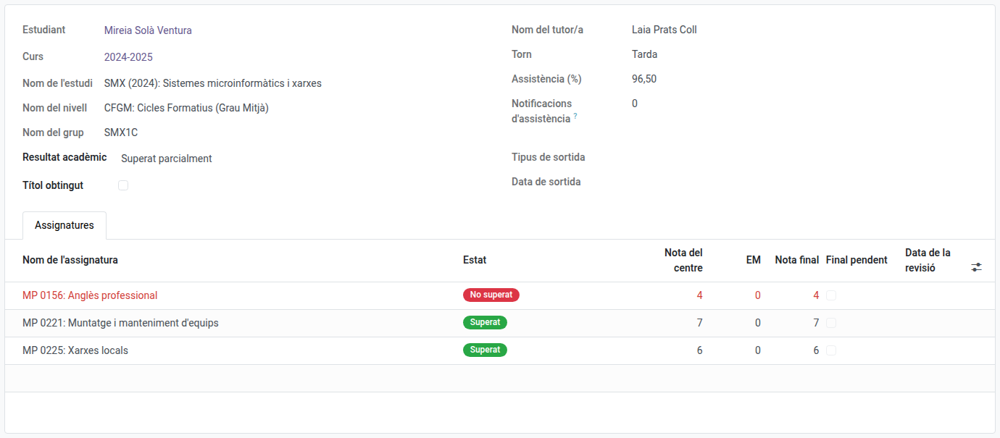
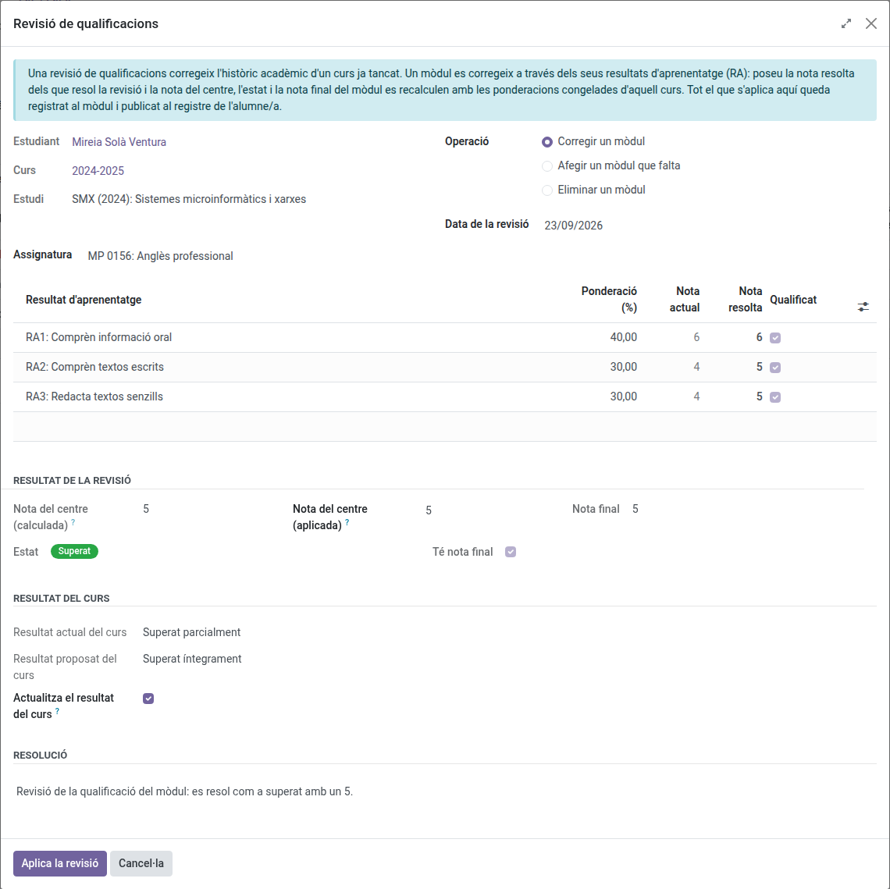

[Català](../../ca/secretary/academic-history.md) | [Castellano](../../es/secretary/academic-history.md) | [English](academic-history.md)

---

# Academic history: per-course student records

This guide explains the **academic history**: a permanent, per-course summary of each student (study, group, subjects with their grades per learning outcome, attendance and academic result). It is a **frozen copy** taken from the grades subsystem at the end of each course (or at the moment of a withdrawal), so it stays available after the operational data of the outgoing year is cleaned up during the course transition.

---

## Contents

1. [What the history contains](#what-the-history-contains)
2. [When records are created](#when-records-are-created)
3. [Consulting the history](#consulting-the-history)
4. [Adjusting the academic result](#adjusting-the-academic-result)
5. [Applying a grade review](#applying-a-grade-review)
6. [Adding a record from another centre](#adding-a-record-from-another-centre)
7. [Finals pending the work placement](#finals-pending-the-work-placement)

---

## What the history contains

One record per **student and course**, with three levels:

- **Course summary:** study, level, group, tutor and shift of that course, global attendance rate, number of attendance notifications sent to the family, academic result and whether the title was obtained that year.
- **Subjects:** one line per subject taken, with the internal grade, the work placement (EM) grade, the final grade, the state (**Passed / Not passed**) and the frozen grading weights in force that course.
- **Learning outcomes (RA):** inside each subject, the grade of every RA round by round, with its weight.

> The history is a **copy, never recalculated**: the values are the ones the grades subsystem computed while the course was running, frozen with the weights of that year's teaching plan. Grades keep their meaning even if the plan changes in later years.

The state of a subject depends **only on the RAs**: a student with every RA passed has **passed the subject**, even if the work placement is still pending — in that case only the **final grade** stays empty until the placement is graded. A failed placement is repeated; it never fails the subject.

## When records are created

- **On a withdrawal:** the [withdrawal wizard](graduation-withdrawal.md) freezes the student's history **at that moment**, before detaching them from their group. A student leaving mid-course keeps the record of everything done until that day (subjects, grades, attendance), with the result **Withdrawn**. Once the history is frozen, the withdrawal **removes the student from everything operational**: their subject enrollments, the grade lines of the live sessions, the attendance lines and templates, and the group's delegate if it was them. From that moment they no longer appear in the group, in the evaluation matrix, in the attendance sessions or in the work placement grading — only in their academic history.
- **On the course transition:** the transition wizard (run by the administrator at the end of the course) generates the records of every active student before cleaning up the operational data.
- **When a convalidation is completed:** if the convalidation's course has no record yet, one is opened marked as **Current course**, holding only the convalidated subjects (grade, **CV** mark and CONV registration number), so teachers see the grade from day one. When the course is closed (transition, withdrawal or graduation) the record is completed with the rest of the subjects and the result, and loses the mark. A grade review cannot be applied to a current-course record: grades of the running course are corrected in the grade sessions.
- **From another centre's certificate:** the course the student took at another centre is added by hand, see [Adding a record from another centre](#adding-a-record-from-another-centre).

Re-running the generation never duplicates a record: the existing one is refreshed.

## Consulting the history

Two entry points:

- **Per student:** open the student's form — the **Academic history** section, at the end of the **Studies** tab, lists their records, ordered by study and course. For **former students** (alumni and withdrawals) the Studies tab stays visible with just this section: it is their permanent record.
- **Cohort queries:** **Planning and Grading → Grades → Academic history** lists every record. Filter or group by course, study, group or academic result — e.g. "all the students of study X in course Y", or every record with the **Title obtained** mark.

## Adjusting the academic result

The **academic result** (*Fully passed*, *Partially passed*, *Repeating*, *Withdrawn*) is proposed automatically from the grades and the destination enrollment, but it is a plain field: secretariat and administrators can **adjust it by hand** on the record when the automatic proposal does not match reality (e.g. a study without enrollment flow resolved in September).

## Applying a grade review

A grade review corrects the academic history of a course already closed. Secretariat, administration, Head of Studies and Director may apply one.

1. Open **Planning and Grading → Grades → Academic history** and open the student's record for the course to correct.
2. Click **Grade review**.
3. Choose what the review does:
   - **Correct a subject:** pick the subject and set the **Resolved grade** of every learning outcome the review resolves.
   - **Add a missing subject:** pick the subject. Its weights and learning outcomes are proposed from the teaching plan of the study **for the same course being corrected** — not today's plan, so a correction on an old course always uses the weights that were actually in force then; fill in their grades.
   - **Remove a subject:** pick the subject to delete from the record.
4. Read **Result of the review**: the internal grade (grade of the centre), the state and the final grade the correction yields.
5. Read **Course result**: the proposed result is written on the record while **Update the course result** is ticked. Untick it to keep the current one.
6. Write the **Resolution** and click **Apply review**.

A subject is passed when every learning outcome is resolved at 5 or above. A subject whose work placement (EM) is not graded yet becomes passed with its final grade pending; grade the placement from the work placement screen. *Repeating* and *Withdrawn* are not proposed by a grade review: adjust them by hand on the record.

### Forcing the internal grade manually

Esfera sometimes records a slightly different number than what the learning outcomes' own calculation yields (typically a rounding difference). Instead of having to make up outcome grades that happen to average out to that number, **Result of the review** shows the internal grade as two fields side by side: **Internal grade (calculated)**, always read-only, and **Internal grade (applied)**, always editable and starting equal to the calculated one — type the value Esfera has directly into the applied field.

The final grade recomputes automatically from that forced value (same as always, combined with the work placement grade when the subject has one). The state (passed/not passed) **never changes** because of the override — it keeps depending only on the learning outcomes. That's why the system won't let you force a grade of 5 or above when a learning outcome is failed, nor one below 5 when every learning outcome already passes — only the exact number within whichever side the outcomes already determine can be adjusted.

The subject keeps the date, the author and the text of the last review applied to it, and the **Corrected by a grade review** filter of the history list shows the records with at least one. The detail of every change is recorded in the student's log.

## Adding a record from another centre

When a student comes to take the second year after doing the first one at another centre, their first-year record is added to the history from the academic certificate. Secretariat, administration, Head of Studies and Director can do it, for now only on VET studies.

Open the student's form and, in the **Actions** dropdown, click **Add record from another centre**.

### From the Esfera academic record (PDF)

1. In **Academic certificate**, upload the academic record PDF the other centre issued.
2. The origin centre, its code, the study and a grid with every module, learning outcome (RA) and work placement of the certificate are filled in. Courses taken at this centre are left out.
3. Check the grid:
   - **Certificate grade** is what the PDF says; **Grade** and **Graded** are what will be saved. Correct them if needed. An RA *No assolit* or *Pendent* is left without a grade, and its module not passed.
   - Lines with a **Warning** need attention: a module that is not part of the study (e.g. an optional module of the other centre) is not imported; if there is an equivalent one, pick it in **Module** and tick **Import**.
   - When the certificate's module grade differs from the one the RAs give with this centre's weights, the certificate's is applied, as long as both agree on passed or not passed.
4. Check that **Certificate student** is the student: if the identifier does not match their IDALU, the record is not created.
5. Click **Create record**. The record and every ticked module are created at once, with the PDF attached.

### From any other certificate

1. Fill in **Course** (only courses before the current one that the student does not have in the history yet are offered), **Study**, **Origin centre** and, if you have it, the **Origin centre code**. You can attach the certificate in **Academic certificate**.
2. Click **Create and add modules**. The **Grade review** opens to add the first module.
3. Pick the module and type the grade of each RA as shown on the certificate. If **Internal grade (calculated)** differs from the certificate's, type the certificate's in **Internal grade (applied)** (see [Forcing the internal grade manually](#forcing-the-internal-grade-manually)).
4. Click **Apply and add another module** to go on to the next module, with the same resolution and date. On the last module, click **Apply review**.

### Afterwards

If the certificate does not have a module's work placement (EM) grade yet, the module stays passed with its **final grade pending**, and the tutor of the student's current group grades it from the work placement screen.

The record shows with the **Another centre** ribbon, the origin centre and the certificate. The **Another centre** filter of the history list shows all of them. To correct it later, use the grade review as on any other record.

## Finals pending the work placement

Subjects passed whose final grade is waiting for the work placement (EM) show the **Final pending** mark. The **Finals pending placement** filter of the history list gives the work list of placements still to grade: when the placement is evaluated, the final grade of those archived subjects is completed with the frozen weights.

---

[← Back to main index](index.md)
