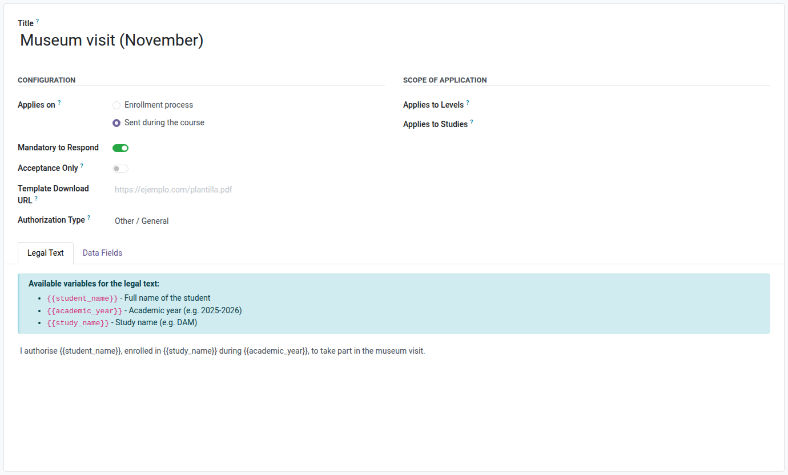
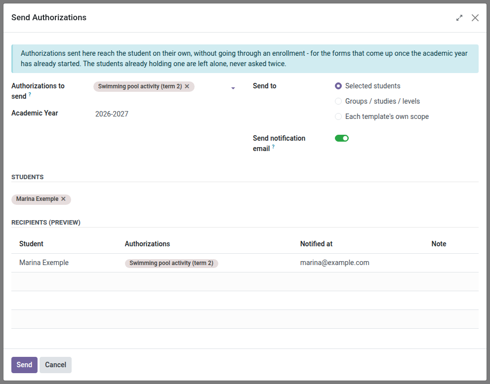
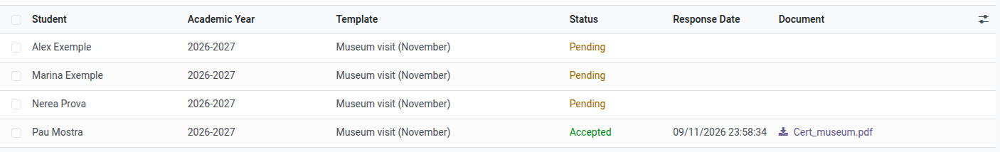

[Català](../../ca/secretary/authorizations.md) | [Castellano](../../es/secretary/authorizations.md) | [English](authorizations.md)

---

# Authorizations: creating, sending and following up

This guide explains how to create authorization forms, send them to students during the course, and follow up the answers.

---

## Contents

1. [Creating an authorization form](#creating-an-authorization-form)
2. [Sending authorizations to students](#sending-authorizations-to-students)
3. [What the family receives](#what-the-family-receives)
4. [Following up the answers](#following-up-the-answers)
5. [Answering on a family's behalf](#answering-on-a-familys-behalf)

---

## Creating an authorization form

Go to **Academic management > Authorizations > Configuration > Authorization Forms** and click **New**.

Fill in:

- **Title**: the name the student and the family will see, e.g. *Museum visit (November)*.
- **Applies to enrollment**: turn it on for a form that is part of the enrollment process. It is added automatically to the open enrollments that match its levels and studies.
- **Can be sent during the course**: turn it on for a form you want to send to students by hand during the school year.
- A form can have both options on. It needs at least one of them.
- **Mandatory to Respond**: turn it on if the student must answer it.
- **Acceptance Only**: turn it on if the family can only accept it, with no option to reject.
- **Template Download URL**: a link to the paper version, if there is one.
- **Authorization Type**: choose the matching type (image rights, school trips, health data or sharing with the family) to have the answer update that indicator on the student's record. For anything else, leave *Other / General*.
- **Applies to Levels** / **Applies to Studies**: leave both empty for a form that concerns every student. When you fill them in, the form only reaches the students of those levels and studies, both when it is added to enrollments and when it is sent during the course.

In the **Legal Text** tab, write the text the family will read before answering. You can use `{{student_name}}`, `{{academic_year}}` and `{{study_name}}`; each one is replaced by the student's own data.

In the **Data Fields** tab, add any extra data you need on acceptance (e.g. *Emergency phone number*). Turn on **Required when accepting** for the ones that cannot be left blank.

Click **Save**.

## Sending authorizations to students

Go to **Academic management > Authorizations > Send Authorizations**. You can also open the assistant from:

- the students list: select the students, then use the gear menu ⚙ and choose **Send authorizations**;
- a single student's own form: the same gear menu ⚙;
- the authorization form itself: the **Send to Students** button.

Fill in:

- **Authorizations to send**: one or more forms that can be sent during the course. They all go in the same email.
- **Academic Year**: the year the authorizations belong to.
- **Send to**:
  - **Selected students**: the students you add in the list below.
  - **Groups / studies / levels**: every student enrolled this year in the groups, studies or levels you choose. Choose at least one. Only the groups, studies and levels inside the forms' own scope are offered.
- **Send notification email**: leave it on to notify by email. Turn it off to make the authorizations appear on the portal without an email.

Each student only receives the forms whose levels and studies apply to them.

**Recipients (preview)** shows who is about to receive the authorizations and at which address. Check the **Note** column before sending:

- *Already requested*: the student already has that form this year. They are skipped.
- *Outside the scope of these authorizations*: none of the forms applies to that student. They are skipped.
- *No family contact found* or *Recipient without email*: the authorization is created, but nobody can be emailed.

Click **Send**. A summary shows how many authorizations were sent, how many emails were queued and how many students were skipped.

You can send the same form again later: the students who already have it are not asked again, and an answer already given is never reset.

## What the family receives

One email per student, listing every authorization sent in that batch, with a link to the portal. Adult students receive it themselves; for students under 18 the family contacts receive it.

The student and the family answer from **Enrollment and authorizations** on the portal.

## Following up the answers

Go to **Academic management > Authorizations > Responses**. The list opens on the current academic year.

- Filter by **Pending**, **Accepted** or **Rejected**, and by **Sent during the course** or **From an enrollment**.
- Group by authorization, student, academic year or status.
- Search by group to see one class at a time.
- The **Document** column holds the answer certificate, generated when the family answers from the portal. Click it to download the PDF with the legal text, the data provided, the date and who answered.

## Answering on a family's behalf

When a family hands in the signed form on paper, open the authorization from **Responses**, set the **Status** and attach the scanned document in the **Document** field. The status cannot be changed without attaching it.

---

[← Back to the secretariat index](index.md)
