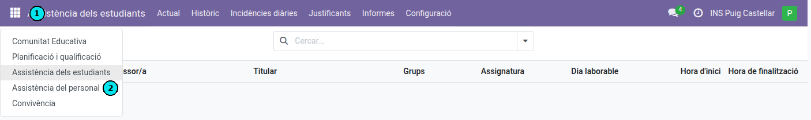

[Català](../../ca/teachers/absences.md) | [Castellano](../../es/teachers/absences.md) | [English](absences.md)

---

# Requesting an absence

**Role required:** anyone at the centre, teaching or administrative staff

---

## Contents

1. [Where to request one](#where-to-request-one)
2. [Absence type](#absence-type)
3. [Dates and times](#dates-and-times)
4. [Responsible declaration](#responsible-declaration)
5. [Supporting document](#supporting-document)
6. [Sending the request](#sending-the-request)
7. [Checking its status](#checking-its-status)
8. [Health absence allowance](#health-absence-allowance)

---

## Where to request one

**Employee Attendances > Absences**, then the **New absence** button.

---

## Absence type

**Required.** No option is preselected: you have to choose one.

| Type | When to use it |
|---|---|
| **Sick leave** | Officially filed medical leave |
| **Health** | Absence for health reasons without medical leave, reported to Direction immediately |
| **Medical appointment** | An appointment you could not arrange outside your working hours |
| **Invasive medical test** | Colonoscopy, endoscopy, gastroscopy or catheterisation. Takes the whole day |
| **Menstrual or climacteric flexibility** | Recoverable flexible hours, up to 8 hours a month, to be made up within 4 months |
| **Training** | Courses, Erasmus+ and training in general |
| **Justified absence** | Other justified absences that fit none of the above |
| **Service assignment** | Field trips, travel and representing the centre |
| **ATRI** | Leave you file on the Generalitat's ATRI portal |

Choosing the **ATRI** type shows the portal links on the form. The request has to be filed there as well:

- [My requests - leave and absences](https://atriportal.gencat.cat/ATRI-ng/#/meves-sollicituds/permisos-absencies)
- [ATRI leave and absences manual (PDF)](https://atriportal.gencat.cat/ATRI-web/gestor-continguts/2011.pdf)

Direction checks that you filed it on the portal before approving it on its side (**Direction status** `Done`).

Each option shows the full wording of the leave. Read it before choosing: ticking it declares that it applies to you.

---

## Dates and times

The **Whole day?** checkbox decides what you fill in:

| Whole day? | You give | What is counted |
|---|---|---|
| Unticked | One day, a start time and an end time | The time you were away |
| Ticked | A start date and an end date | 7.5 hours per working day |

Tick it if you are not coming in at all: it counts 7.5 hours even if you only had one lesson that day. Leave it unticked if you come in and have to leave, or arrive late.

To request more than one day, tick it and change the end date. For a single day the end date fills itself in.

`Health` and `Invasive medical test` open with the box ticked. If you were only away for part of the day, untick it.

---

## Responsible declaration

**Required for every type.** The request cannot be sent without it.

---

## Supporting document

**You can attach one to any absence, of any type, at any time.** Three types *require* one: **Sick leave**, **Medical appointment** and **Invasive medical test**; for the rest it is optional, and it is worth attaching whenever you have it.

For a medical appointment, the document must expressly state the patient's first name and surname and the time of entry to and exit from the centre or medical practice.

**A certificate that arrives later is filed on the same request.** Open the absence, even one already approved, attach the file and save. That is what clears a **Direction status** left at *Missing document*: you do not have to request the absence again.

To remove one, click the cross on the file and confirm.

---

## Sending the request

The **Send request** button at the bottom of the form. Until you press it and confirm, the request is not filed.

The button stays disabled while something is missing. Hover over it and it will tell you what:

- Choose the absence type.
- Give the times, with the end later than the start (unless it is a whole day).
- Accept the responsible declaration.

If you leave the form without sending it, EMS tells you and lets you discard it.

---

## Checking its status

**Absences** shows your own list. Your absence is approved twice, by your Head (Deputy Head of Studies, Head of Studies or Secretary) and by Direction, in either order.

**Status**

| Value | Means |
|---|---|
| Pending | Not decided yet |
| Pending Head | Direction has approved it, your Head has not yet |
| Pending Direction | Your Head has approved it, Direction has not reviewed it yet |
| Pending Document | Direction is waiting for your supporting document: attach it to the same request, even if it is already approved |
| Approved | Granted by both |
| Refused | Denied. This is final: to insist, file a new request |
| Cancelled | Withdrawn |

The **Head status** and **Direction status** columns show each one's decision separately.

Once your Head approves it, the absence already counts in the absence calendar and the guard duty board.

---

## Health absence allowance

**Health** absences count against an allowance of **15 hours per course**.

If a request takes you over it, you are warned as you file it. The warning does not stop you sending it: the request goes through and is flagged in the Head of Studies' list.

The hours you have used so far are shown on the form itself once you choose the `Health` type.
