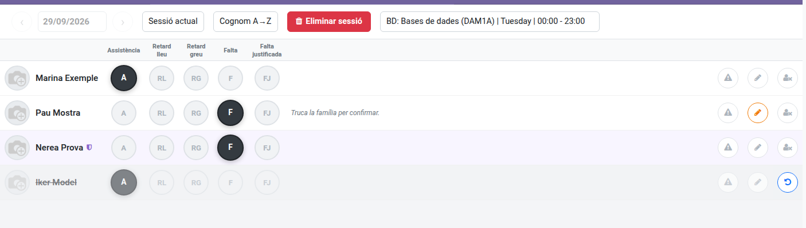
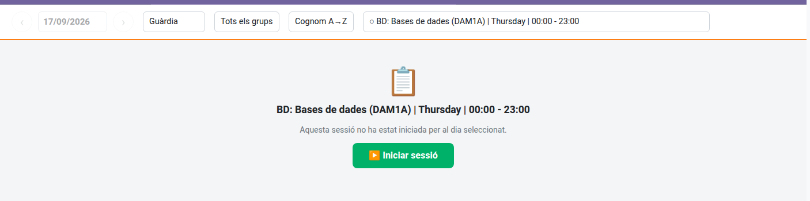

[Català](../../ca/teachers/attendance-session.md) | [Castellano](../../es/teachers/attendance-session.md) | [English](attendance-session.md)

---

# Taking Attendance: The Daily Roll-Call and Guard Mode

**Student's Attendances → Current** is where you take the roll-call for your sessions: mark each
student's status, add notes, issue a strike if needed, and — when you're covering someone else's
class — take attendance for a session that isn't yours.

**Required role:** Teacher

---

## The Three View Modes

A selector at the top of the screen switches between three modes:

- **Current session** (the default): shows only the session(s) or scheduled slot(s) whose time
  range covers *right now*. This is what you land on when you open the app.
- **Manual**: lets you pick any date (up to today — you can't take attendance for a future day)
  and browse every session or scheduled slot for that day, not just the current one. Use this to
  go back and finish a roll-call you didn't get to earlier, or to check an earlier period's
  session.
- **Guard**: shows *other teachers'* sessions and not-yet-started slots for today only — see
  "Guard Mode" below.

In **Manual** and **Guard** modes, a **group filter** appears next to the mode selector so you can
narrow the list down to one group.

---

> The day and the time this screen goes by (which slot is "current", what "today" is) are always
> the centre's, Spanish time, taken from the server: a computer with a wrong clock or timezone
> doesn't change them.

## Sessions vs. Planned Slots

The selector on the right lists what's available for the chosen date, split into two groups:

- **Sessions**: a roll-call that has already been started — select one to see and edit its
  students' statuses.
- **Planned (no session)**: a scheduled slot (from your weekly timetable) for which no session has
  been created yet. Selecting one shows a **Start session** button — click it to create the
  session and load its students.

> If more than one session or planned slot matches the current time slot, you'll see a warning
> telling you to pick one manually or switch to **Manual** mode — this can happen if your
> timetable has overlapping entries.

### Continuing a Double Period

If a subject spans two consecutive periods on the same day (e.g. two back-to-back lessons), starting
the second period's session copies each student's status from the first one automatically — a
banner tells you this happened. A student marked **Minor Delay** or **Severe Delay** in the first
period is presumed to have arrived by the second (shown as **Attended**); a **Justified Miss**
carries forward as an unconfirmed **Miss** unless their justification's own date actually covers
the second period too. You can freely change any of the copied statuses.

---

## Marking Attendance

Once a session is loaded, you get one row per student with a button for each attendance status
(e.g. **Attended**, **Minor Delay**, **Severe Delay**, **Miss**, **Justified Miss** — the exact set
and their colours are configured by the administration, see the
[Administrator's manual](../admin/attendance-status.md)). Click the button matching the student's
status for that session — it's saved immediately, no need to click a separate Save button.

- **Minor Delay** never counts as an absence and doesn't notify the family. **Severe Delay** counts
  as an absence and notifies the family, exactly like a Miss — use it for a delay serious enough to
  warrant the same treatment as a missed session.

- A shield icon next to a student's name means their absence is **already justified** (an approved
  justification or a prevision covers this session) — their status and notes are locked, since the
  justification is what decides it.
- Use the **sort** dropdown (top-right) to reorder the list by lastname or first name, ascending or
  descending.

---

## Adding Notes

Click the pencil icon on a student's row to open a small notes dialog, write anything relevant for
that session, and click **Save**. A short preview of the note then shows directly in the row. This
is disabled for a justified absence, same as the status buttons.

---

## Issuing a Strike

If a student's behaviour during the session needs to be flagged, click the strike icon (⚠) on
their row — see the [Strikes manual](strike.md) for the full flow (reason, kicked-out checkbox,
what happens after you send it).

---

## Removing a Student from the Roll-Call

Sometimes a student isn't required to attend a particular session, for example an exam that only
some of the group sit. Instead of marking them as attended or absent, click the remove icon (a
person with a cross) at the end of their row and confirm (see the last row in the screenshot under "Marking Attendance"). The row stays on the list, greyed out
and with its buttons locked, and the student counts **neither as attended nor as absent**: they're
left out of the attendance reports and percentages, and the family isn't notified.

- If you had already marked them absent and the family had **not** been notified yet, the
  notification is cancelled. If it had already been sent, the family gets the usual correction
  email saying the student wasn't required to attend.
- If the subject continues in the next period (a double period), the student is also removed
  there.
- Made a mistake? Click the restore icon (a curved arrow) on the greyed-out row and the student is
  back on the roll-call with the status they had.
- A student who got a strike in that session can't be removed: they were in class.

---

## Guard Mode

Switch the mode selector to **Guard** when you're covering a class that isn't your own (a
substitution). It shows, for today only:

- Sessions other teachers have already started (excluding your own, since those already show
  under **Current**/**Manual**).
- Slots from other teachers' timetables that haven't been turned into a session yet — pick one and
  click **Start session** just like in normal mode.

Marking statuses, adding notes and issuing strikes work exactly the same way as in your own
sessions. The **Delete session** button isn't available in Guard mode — only the teacher who
actually owns the slot (or an Administrator) can delete a guard-covered session.

---

## Automatic Check-In

If the centre has enabled it, starting a session also checks you in automatically, as long as you
haven't checked in yet today and you are taking the roll-call **during your own working hours**.
Taking the roll-call outside them (from home, before your shift starts) records the attendance
normally but doesn't check you in. When you leave, check out at the kiosk as usual.

---

## Deleting a Session

If you started a session by mistake, select it and click **Delete session** in the header, then
confirm. This isn't available in Guard mode, and it permanently removes the session and every
status/note recorded in it — there's no undo.

---

## Reviewing Past Sessions

**Student's Attendances → History** lists every session ever taken, most recent first — by
default it shows everyone's, not just yours; use the **Show only mine** filter to narrow it down,
or the **Archived** filter to see sessions that no longer count (e.g. because the underlying
schedule was archived by a course transition). Opening a session here is read-only: you can review
who was marked with which status, any notes, and — per student — how many strikes were issued
during that session, with a button to see their full detail.

> If you need to change something in a past session instead of just reviewing it, go back through
> **Current** in **Manual** mode and pick that session from the selector — the History list itself
> doesn't allow edits.

Students removed from a session's roll-call also appear in the session, greyed out.

---

## For Administrators

An Administrator who isn't a teacher sees every session and slot of the day, not only their own,
and can start any slot's roll-call on behalf of its teacher: the session is recorded under that
teacher, and nobody is checked in automatically.

Otherwise it's the same screen a teacher uses — what
shapes what appears here is entirely configuration, covered in the Administrator manuals:

- [Teacher Working Schedules & Schedule Frameworks](../admin/working-schedules.md) sets up the
  schedules that generate the planned slots and sessions shown here.
- [Attendance Statuses: Managing the Passlist Options](../admin/attendance-status.md) configures
  the status buttons themselves (which ones exist, their order and colours).

---

[← Back to Teachers manuals](index.md)
