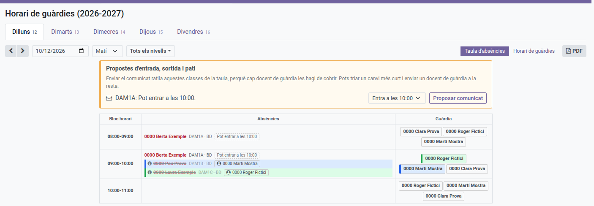
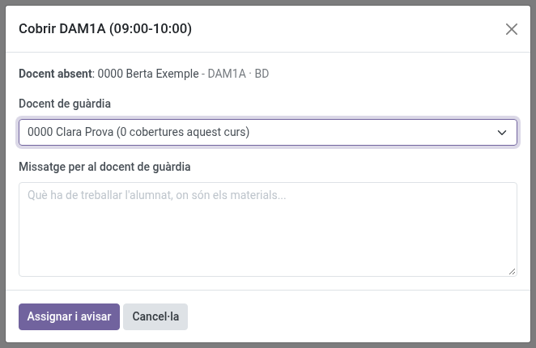
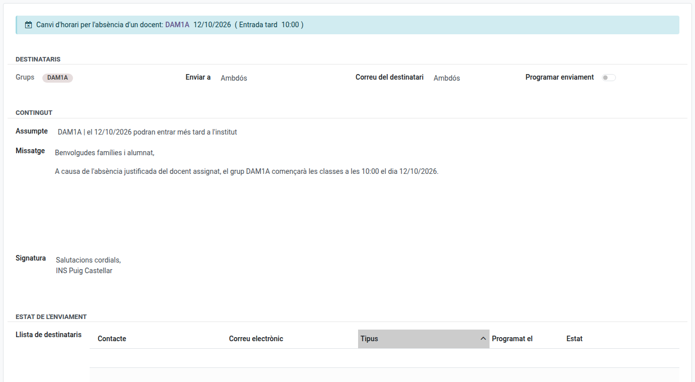

[Català](../../ca/teachers/guard-duty-schedule.md) | [Castellano](../../es/teachers/guard-duty-schedule.md) | [English](guard-duty-schedule.md)

---

# Guard Duty Schedule

See where every teacher is, and who is on guard duty, in each time block of the week — not just your own schedule.

**Required role:** Teacher (read-only; schedules are configured by a Department Chief or above from the corresponding teacher's own weekly schedule). Organising an absence from the Absences table is up to the absent teacher's Department or Seminar Chief and those above them (see [Organising an absence](#organising-an-absence)), who can also enter an expected absence for a teacher of their department (see [Entering an expected absence](#entering-an-expected-absence)).

---

## Access

Navigate to: **Employee Attendances → Guard schedule**

The board opens on today's own weekday and shift (morning before 15:00, afternoon from 15:00 on) — not always Monday morning — so you land straight on whatever's relevant right now.

---

## Choosing the Day and the Week

Click **Monday** to **Friday** at the top to switch days. Each tab also shows the day of the month it stands for in the week on screen.

Use the **‹** and **›** arrows to move to the previous or next week, or the date box next to them to jump to any date — the tabs move to that date's week and the board opens on its weekday.

Morning and afternoon are different shifts — use the dropdown to switch between them; only one is shown at a time.

---

## The Two Views

The two buttons on the right of the toolbar switch between the two ways of reading the same day and shift. The board opens on the **Absences table**:

- **Absences table** — one row per time block: who is missing and what has to be covered, against who is on guard duty to cover it.
- **Guard duty schedule** — the timetable, with everybody who is away marked on it.

---

## Reading the Timetable

The table's columns are the groups with a class in that shift; each row is a time block. A cell shows the subject (as its short code, e.g. "MP 0440"), the teacher(s) — more than one if the class is co-taught — and the classroom for that group's class at that time. An empty cell simply means nothing is scheduled there for that group.

The **Guard duty** column on the right lists every teacher on guard duty in that time block, each in a thin-bordered box. A guard-duty teacher has no group of their own at that moment (that's the whole point of guard duty), so they only ever appear here, never in a group's column. A teacher on a **Guard (WC)** duty specifically shows a **"(WC)"** tag right after their name — worth calling out because, unlike a break-time guard (see below), a WC guard duty can fall at any time of day, so there's no other way to tell it apart from a plain guard duty at a glance.

A row whose time block is a break period for some level — with no class scheduled in it for anyone — gets a small **"Break"** label next to its time, plus a thin brown accent on the left edge of that same cell, so an otherwise empty-looking row doesn't read as a gap in the schedule.

---

## Filtering by Level

Next to the shift dropdown there's a **level filter** button (it reads "All levels" until you check something). Click it to open a checklist of every level — ESO, Batxillerat, each vocational-training cycle, etc. — and check as many as you need. For example, check both **ESO** and **Batxillerat** together to see only that half of the centre while a colleague works from the vocational-training levels instead. Leave everything unchecked to see every level at once, exactly as before.

Once one or more levels are checked:
- Only the groups belonging to the checked level(s) become columns — every other group disappears from the table.
- The **Guard duty** column keeps listing every teacher on duty in a visible time block, regardless of what they otherwise teach — being on duty is what matters, not which level a guard happens to teach elsewhere that day.
- A guard duty that falls during the checked level's own break, with no class of that level running then, gets its own dedicated "Break" row so it stays visible even though no class of that level is on at that moment (the same "Break" marker described above already covers this under "All levels" too).

---

## Reading the Absences Table

Each row is a time block of the shift on screen:

- **Absences** — one line per class left without a teacher: who is away, and the group, subject and classroom that needs covering.
- **Guard duty** — the teachers on guard duty in that time block, the same ones the timetable shows.

A time block where nobody is missing has an empty Absences column.

In a co-taught class (two teachers in the same classroom) where only one of them is away, their line is **struck through**: it stays there so you know who is missing, but no guard is needed because the other teacher is taking the class. Hover over the line or click it to see why; the **ⓘ** icon on its left shows there is an explanation.

Every struck-through line has that icon, whatever the reason: a co-teacher is in the class, a guard teacher has already been sent to it (their name appears next to it), or the families were told the students can stay at home for it (see [Organising an absence](#organising-an-absence)). If both are away, or each teacher has half of the group in a different classroom, the line is not struck through and the class does need covering.

---

## Absences

A teacher who is away is shown in red wherever their name appears — in their own cell on the timetable, and in the Guard duty column when they were the one on guard:

- **Bold red** — the absence is approved.
- **Lighter italic red** — the absence has been requested and is still awaiting approval.

Refused and cancelled requests are not shown.

An absence their chief or the Head of Studies already knows about, but the teacher has not requested yet (an *expected absence*, see below), is also shown as awaiting approval.

A teacher on guard duty who is away is marked in the Guard duty column, and produces no line in the Absences column: they have no class of their own for anyone to cover.

Only the fact that somebody is away is shown here. The type of absence, its reason and any supporting document are not.

---

## Entering an expected absence

Who can do this: **Seminar Chiefs** and **Department Chiefs**, for the teachers of their own department, as well as the Head of Studies or Deputy, Direction and the administrator.

The normal way is always that the teacher requests the absence themselves. Use this only for the exceptional case of a teacher who phones or writes to warn they will be away and cannot use EMS: entering it puts their classes on the schedule straight away, so you can organise the cover.

1. Go to **Employee Attendances > Absences > Management > Expected absences** and click **New**.
2. Choose the **Teacher**. Only the teachers of your own department are offered.
3. Set **From** and **To**, date and time. They start out as today, 08:00 to 15:00. An absence can span several days.
4. Optionally, add **Notes** for your own reference. The teacher never sees this entry.
5. Save.

The absence then appears on the schedule as awaiting approval (lighter italic red), and you can organise it as described below. When the teacher requests the absence themselves, the expected absence is linked to it automatically and whatever you organised stays as it is. If the teacher turns out not to be absent after all, delete the entry.

---

## Organising an absence

Who can do this: the absent teacher's **Seminar Chief** or **Department Chief**, and those above them in the hierarchy (Head of Studies or Deputy, and Direction), as well as the administrator. What counts is the department the teacher teaches in: its chiefs and the manager of the area it belongs to organise the absences of everyone in it, members of the management team (such as the Secretary) included. Everybody else sees the result but cannot change it, and the absent teacher cannot organise their own absence. It makes no difference whether the absence was requested by the teacher or entered by their chief or the Head of Studies as an expected absence: both are handled the same way. When the teacher later requests an absence that was expected, whatever was already organised stays as it is, and only the extra days or hours of the request appear as new lines to decide on.

Everything is done from the **Absences table**, and nothing happens on its own: each step waits for you to press its button. A day that is already over can no longer be changed.

### Sending a guard to a class

1. Click the line of the class to cover (lines you can organise show a hand pointer).
2. Choose the **Guard teacher**. Only the teachers on guard duty in that time block are offered, except those on a WC guard and those who are away themselves.
3. Optionally, write a **message**: what the students have to work on, where the materials are...
4. Click **Assign and notify**.

The guard teacher receives an Odoo message (in their inbox, or by email, depending on their own notification preference) with the date, time, group, subject, classroom, the absent teacher and your message.

The class is then struck through, the guard's name appears next to it, and the line and the guard's box in the Guard duty column share the same colour. When several guards cover classes in the same time block, each guard has their own colour, so you can see at a glance who is covering what. A guard can cover more than one class: all of them take that guard's colour.

To change the guard, click the line and then **Change or remove the guard** (only shown to whoever organises the absence), and choose another one: the previous guard is told they are no longer needed. To write a new message to the same guard, choose them again and click **Assign and notify**. **Remove assignment** takes the guard off the class and tells them so.

### Late entry, early leave or no classes

When the lessons without a teacher are the first ones of the group's day (one, two or more in a row), the students could come in later; when they are the last ones, they could leave earlier; when every lesson of the day is without a teacher, the group could have no classes. A lesson where somebody is with the students (a co-teacher who is not away, the other half of a split group, an optional subject or a guard already sent) breaks the run.

Those lines show a dashed tag such as **Could start at 10:00**, and the **Late entry, early leave and break proposals** box, above the table (only visible to whoever can organise the absence), offers that group's change. Sending the notice strikes those lessons off the table, so no guard teacher has to cover them.

The selector next to each proposal lets you tell the families about less than the absences allow: with two lessons without a teacher, you can choose **Starts at 09:00** instead of **Starts at 10:00**. Only the first lesson is then struck out; the second still needs a guard, sent as usual. Choosing the smaller change is your decision: nothing will ask you to correct it.

**Propose notice** opens a draft notice addressed to that group's students and families, with a suggested text you can change. Send it from that form as any other notice (the groups of a timetable change notice cannot be changed). If you leave it as a draft, the button reads **Open draft** next time.

Once the notice is sent (or scheduled), those lines are struck through with a tag such as **Starts at 10:00**: nobody needs to be sent to them.

### A longer break

When the empty lessons are right before and/or right after a break of the group's level, with class further out on that side, the students could have a longer break instead. With the break at 18:00-18:20 and the 17:00 lesson empty, for example, the break could start at 17:00; with the 18:20 lesson empty, it could end at 19:20. The selector offers every combination (earlier, later, or both, hour by hour), and the notice reads *"…el grup X allargarà el pati de 17:00 a 19:20 el dia …"*. Sending it strikes those lessons off, like any other change.

This is never confused with coming in or leaving: if the empty lessons reach the start of the day, it is a late entry (e.g. coming in after the break, at 18:20); if they reach the end, an early leave (e.g. going home at the break, at 18:00).

### When the absence changes afterwards

If an absence is refused, cancelled or shortened, or a co-teacher turns out to be in, what was organised may no longer be needed. Nothing is undone automatically: the boxes above the table tell you, and you decide.

- **A guard who is no longer needed** (box **Guards no longer needed**): click **Release guard**. They are told they no longer need to cover the class.
- **A notice that no longer matches** (more was told than the absences now allow): a notice already sent cannot be taken back, so the proposals box offers **Propose correction**, a new draft notice for the same group with the corrected situation (a different time, or back to the usual timetable).

---

## Coming Back to Where You Were

The board's address keeps the week, day, shift, view and levels you are looking at. Going back to it from a notice - with the breadcrumbs or the browser's back button - or reloading the page returns you to the same place, and you can copy the address to send a colleague straight there. Opening it from the menu always starts at today's day and shift.

---

## Exporting to PDF

Click **PDF** in the toolbar to download the day and shift currently shown (not the whole week) as a printable document — whatever level filter is currently checked is applied to the PDF too. The PDF prints whichever of the two views is on screen: the timetable if **Guard duty schedule** is active, or the Absences table if **Absences table** is active, with its guards, colours and struck-through lines as on screen.

---

[← Back to main index](index.md)
