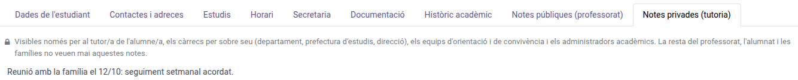

[Català](../../ca/teachers/student-notes.md) | [Castellano](../../es/teachers/student-notes.md) | [English](student-notes.md)

---

# A Student's Public and Private Notes

**Required role:** Teacher (public notes) · The student's tutor, the chiefs above them, Guidance, Coexistence or Academic administrator (private notes)

---

## Where they are

Educational Community → Students → *[open the student]*. The student's file has two notes tabs:

| Tab | Who sees it | What it is for |
|-----|-------------|----------------|
| **Public notes (teachers)** | Every teacher | Information useful to any teacher who has the student in class. |
| **Private notes (tutoring)** | The student's tutor, their Seminar or Department Chief, the Head of Studies of their branch, the Director, the Guidance team, the Coexistence team and the academic administrators | Sensitive tutoring follow-up that the rest of the teachers must not see. |

Each tab reminds you, in a short line above the notes, who can see them. Students and families never see either of them, not even from the portal.

If you are not part of that student's tutoring team, the **Private notes (tutoring)** tab simply does not appear.

---

## Writing in them

Open the tab, type the text and save the file.

- **Public notes:** editable by whoever can edit the student's file (their tutor, the Secretary's office, the Head of Studies and the administrators). The rest of the teachers only read them.
- **Private notes:** editable by everyone who can see them, including Guidance and Coexistence even when they are not the student's tutor.

When a group changes tutor, the new tutor starts seeing their students' private notes and the previous one stops seeing them.
