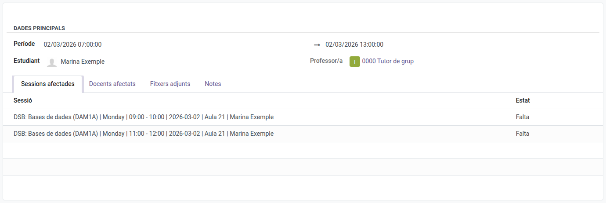
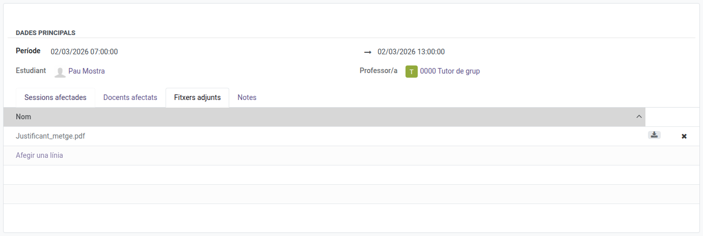
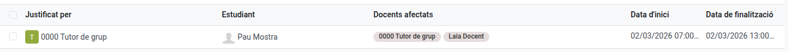

[Català](../../ca/tutors/attendance-justifications.md) | [Castellano](../../es/tutors/attendance-justifications.md) | [English](attendance-justifications.md)

---

# Justifying Your Students' Absences

A justification covers a period (start and end date and time) for one student of your group. Every absence within that period becomes a **Justified Miss**, whichever teacher recorded it.

**Required role:** Tutor

---

## Recording a justification

1. Go to **Student's Attendances → Justifications** and click **New**.
2. In **Student**, pick the student. Only the students of your group are listed.
3. In **Period**, set the start and end date and time.
4. The **Affected sessions** tab lists the sessions within the period where the student has an absence, from every teacher.
5. Click **Save**. The absences in the list become **Justified Miss**.

A student cannot have two justifications with overlapping periods.

### Days still to come

The period can include future days (for example, a planned hospital stay). When a teacher takes attendance in a session within that period, the student already appears as **Justified Miss**, and the session is added to the justification's **Affected sessions**.

---

## Attaching the document

1. Open the justification from the **Justifications** list.
2. In the **Attached files** tab, click **Add a line** and, in the window that opens, **New**.
3. Click **Upload your file**, choose the file (for example, the medical certificate) and save.

The download icon opens the file; the cross removes it from the justification. Use the **Notes** tab to add a comment.

---

## Checking, changing or deleting a justification

**Student's Attendances → Justifications** lists your students' justifications, with the teachers of the affected sessions.

- **Changing the period:** open the justification, change the **Period** and save. Absences left outside it go back to **Miss**, and the new ones become **Justified Miss**.
- **Deleting it:** the absences it covered go back to **Miss**.
- The **Student** cannot be changed once saved: delete the justification and create a new one.

---

[← Back to Tutor manuals](index.md)
