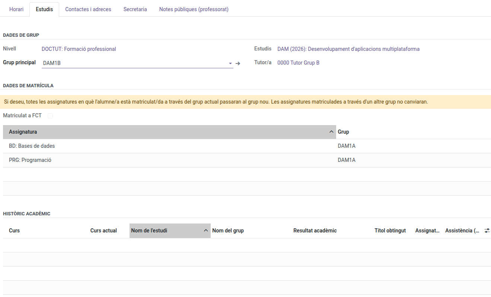

[Català](../../ca/tutors/change-student-group.md) | [Castellano](../../es/tutors/change-student-group.md) | [English](change-student-group.md)

---

# Changing a Student's Group

Sometimes a student needs to move from one group to another (e.g. from group A to group B) within the same study. As their tutor, you can do this yourself from the student's own form.

**Required role:** Tutor

---

## How to change a student's group

1. Open the student's form (**Educational Community → Students**, your own tutored students).
2. Go to the **Studies** tab.
3. Change the **Main Group** field to the destination group. Only groups equivalent to the current one are offered: same study, course and shift (for example, from SMX1A to SMX1B, but not to SMX1C, an afternoon group, nor to DAM2B). Any other change has to be made by the secretary's office.
4. A yellow warning appears at the top of the enrollment data, reminding you that saving will move the student's subjects to the new group. Save when ready.

   

## What happens automatically

Any subject the student was enrolled in through the **old** group moves automatically to the **new** group — you do not need to re-enroll them subject by subject. Their attendance schedule and any open evaluation round update accordingly.

A subject with a [custom schedule](custom-schedule.md) keeps its slots, and a not-in-person one stays so: they don't depend on the main group.

A subject the student was already enrolled in through a **different** group (for example, a reinforcement group) is left untouched — only the enrollments that were actually in the old main group move.

**If the move is rejected:** this means a subject in the old group already has grades recorded for this student. Contact an administrator to resolve this before moving the student.

---

[← Back to Tutors manuals](index.md)
