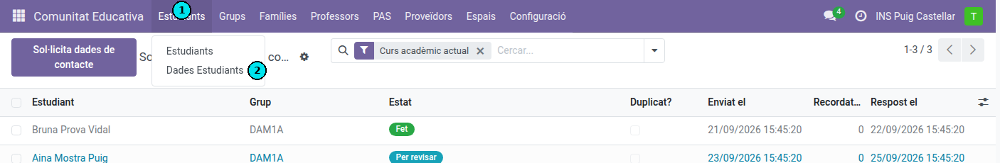
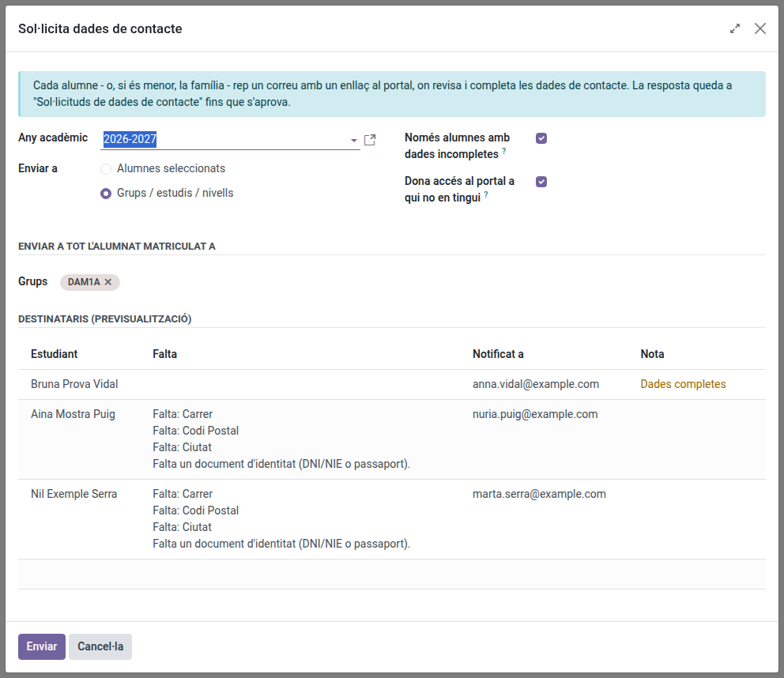
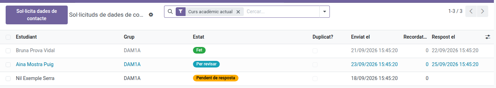
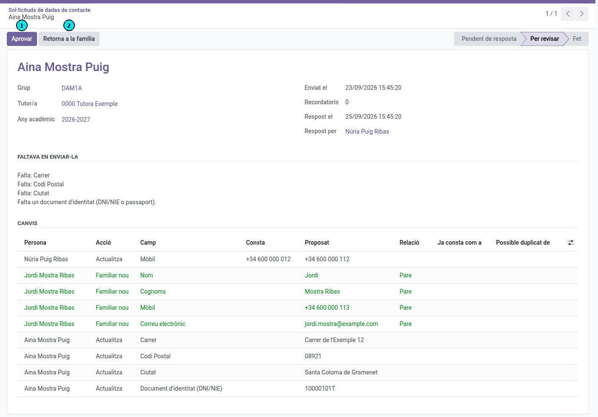

[Català](../../ca/tutors/contact-data-requests.md) | [Castellano](../../es/tutors/contact-data-requests.md) | [English](contact-data-requests.md)

---

# Contact data requests: asking families to update their details

How to ask students and families to review their contact details from the portal, follow up who has answered, and approve the changes.

Available to group tutors (for their own students), the secretariat and the Head of Studies (for every student).

---

## Contents

1. [Sending a request](#sending-a-request)
2. [Following up the answers](#following-up-the-answers)
3. [Approving the changes](#approving-the-changes)
4. [Returning an answer to the family](#returning-an-answer-to-the-family)
5. [Sending a reminder](#sending-a-reminder)

---

## Sending a request

1. Go to **Educational Community → Students (1) → Student Data (2)** and click **Request contact data**. You can also open it from the ⚙ menu of the students list, a student's form, the groups list or a group's form.
2. Choose who receives it:
   - **Groups / studies / levels**: pick the groups. Tutors can only pick their own groups.
   - **Selected students**: pick the students one by one.
3. Leave **Only students with incomplete data** ticked to skip the students who already have every required detail.
4. Leave **Grant portal access to whoever lacks it** ticked: the request is answered from the portal.
5. Check the **Recipients (preview)**: what is missing and who receives the email. A student marked **Nobody reachable by email** has nobody with an email on file: call the family by phone.
6. Click **Send** and wait: the message *Processing the requests…* stays on screen until everything is sent. Do not close the window.

Each student, or the family of a minor, receives an email with a link to the portal. A minor's own portal account only consults, so the request goes to their family, who answer it.

## Following up the answers

In **Educational Community → Students → Student Data**:

- **Pending answer**: sent, not answered yet.
- **To review**: the family has answered.
- **Done**: approved, or the family confirmed the details as they were.

Use the filters **Pending answer**, **To review**, **Pending for more than a week** and **Possible duplicate**, and group by **Group**.

## Approving the changes

1. Open a request in **To review**. The **Changes** list shows, for each person, the value on file and the proposed one.
2. If the request shows the **possible duplicate** warning, check in **Families** whether the new family contact is the person shown in **Possible duplicate of**.
3. Click **Approve** (1).

If a change adds a family contact, the **Also linked to** column lists the family's other children it is linked to as well: approving does it.

To approve several at once, select them in the list and click **Approve**.

## Returning an answer to the family

1. Open the request and click **Return to the family** (2).
2. Write what they have to correct and click **Return**.

The family receives an email with the reason and can send the details again from the portal.

## Sending a reminder

Select the requests in **Pending answer** and click **Send reminder**. The **Reminders** column counts how many have been sent.
