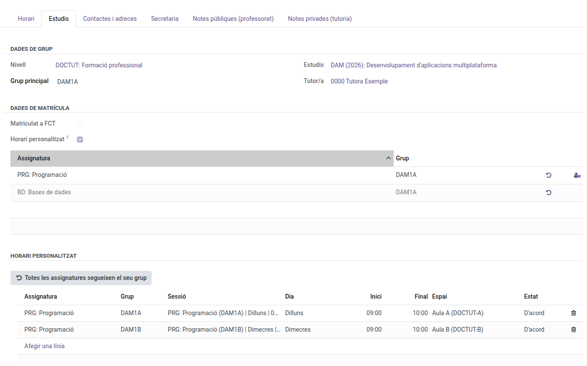
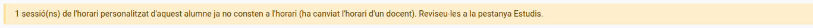
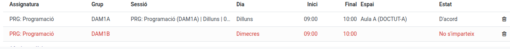

[Català](../../ca/tutors/custom-schedule.md) | [Castellano](../../es/tutors/custom-schedule.md) | [English](custom-schedule.md)

---

# A Student's Custom Schedule

Sometimes a student doesn't take every session of a subject with their group: they are repeating part of the module, they work and some hours overlap, or they recover it with another group (even one of another study of the same level). The **custom schedule** sets exactly which sessions they attend, subject by subject. Roll-call lists, the student's schedule and the attendance reports follow it automatically.

**Required role:** Tutor (also the chiefs above the tutor, the secretary's office and administration)

The enrollment itself (which subjects the student takes and the group they are graded in) can only be changed by the secretary's office and administration. Customizing the schedule doesn't touch it: the student stays enrolled and graded in their group.

---

## Turning the custom schedule on

1. Open the student's form and go to the **Studies** tab.
2. Tick **Custom schedule**. Some buttons appear next to each subject and, below, the **Custom schedule** section.

## Each subject's buttons

| Button | What it does |
|--------|--------------|
| ↺ **Follow the group again** | The student attends every session of their group again. Only shown when the subject is customized or not in person. |
| ⚙ **Customize the sessions** | Copies the sessions the student now takes with their group as editable slots. Nothing changes until you edit them. |
| 👤✕ **Not in person** | The student stays enrolled and graded, but attends no session of this subject. The row turns grey. |

## Splitting a subject between two groups

1. Press **Customize** on the subject. Its sessions appear in the **Custom schedule** section.
2. Delete (bin) the sessions the student won't attend with their group.
3. Press **Add a line**, pick the **Subject**, the **Group** they will take that hour with and the **Session**. Only groups of the same level (or reinforcement groups) that teach the subject are offered, and only real sessions of that group.
4. Save.

From then on the student appears on the roll-call of the chosen sessions, and only those.

## When a session no longer exists

If a teacher changes their schedule and a chosen session moves to another time, the slot stops applying: the student isn't added to the new session and a warning appears at the top of the form.

In the **Custom schedule** section the slot shows in red with the status **Not taught**. Delete it and add the right session. A room-only change doesn't affect the slot.

## Undoing everything

The **Every subject follows its group** button removes every customization of the student (slots and not in person) and unticks the custom schedule. It asks for confirmation first.

## Roll-call lists

The student list of each weekly session can no longer be edited by hand: it always comes from the enrollments and this custom schedule. For a one-off change on a single day (a student not sitting that day's exam), keep doing it on the roll-call.

---

[← Back to Tutors manuals](index.md)
