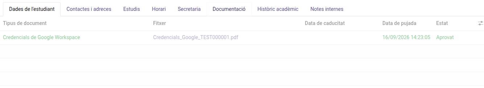
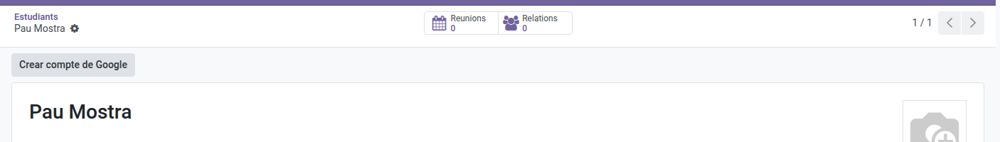
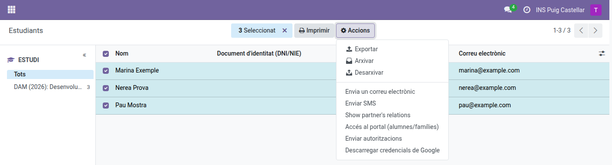

[Català](../../ca/tutors/google-credentials.md) | [Castellano](../../es/tutors/google-credentials.md) | [English](google-credentials.md)

---

# Your Students' Google Credentials

You can create the Google Workspace account of the students you tutor, view and download the PDF with their credentials, and reset their password.

**Required role:** Tutor. Your Seminar Chief, Department Chief and Head of Studies can do the same for your students, and the Director for every tutor's, following the same steps.

---

## Downloading a student's credentials

1. Open the student's form and go to the **Documentation** tab.
2. On the **Google Workspace credentials** row, click the file name in the **File** column. The PDF opens in a new tab, where you can print or save it.

If the list is empty, the student has no Google account yet: create it as explained below.

In the **Documentation** tab you only see the Google credentials of the students you tutor. The other documents (ID card, IBAN, medical card…) are handled by the secretary's office.

---

## Creating a student's Google account

The account is normally created automatically when the student is enrolled. If a student of yours has none yet (usually because some of their details were missing at the time), you can create it yourself:

1. Open the student's form.
2. In the header, click **Create Google account**.

The student receives the credentials at their personal email address and the credentials PDF is saved in the **Documentation** tab. The first time they sign in to Google, the student has to change the password.

The button is only shown while the student has no Google account. If the student's IDALU, first name, surname or personal email is missing, a message tells you which data is missing and the account is not created: ask the secretary's office to complete it.

---

## Resetting a student's Google password

1. Open the student's form.
2. In the header, click **Reset Google password**.

3. Confirm the message that appears.

The student receives the new password at their personal email address and a new credentials PDF is saved in the **Documentation** tab. The previous password stops working and its PDF is marked **Cancelled**. The first time they sign in to Google, the student has to change the password.

The button is only shown if the student has an active Google account. If you cannot see it, the student has none yet: create it as explained above.

---

## Downloading the credentials of several students at once

1. Go to **Educational Community → Students** and switch to the list view.
2. Tick the students you want (the header checkbox ticks them all).
3. Open the **Actions** menu and click **Download Google credentials**.

A ZIP file is downloaded with one PDF per student, named after the student. If none of the selected students has credentials, a warning is shown and nothing is downloaded. Only the students you tutor are included.

> **Note:** the same **Download Google credentials** action is also available from a single student's own form, using the same **Actions** ⚙ menu — though for just one student, downloading the PDF directly from the **Documentation** tab above is quicker.

---

[← Back to Tutor manuals](index.md)
