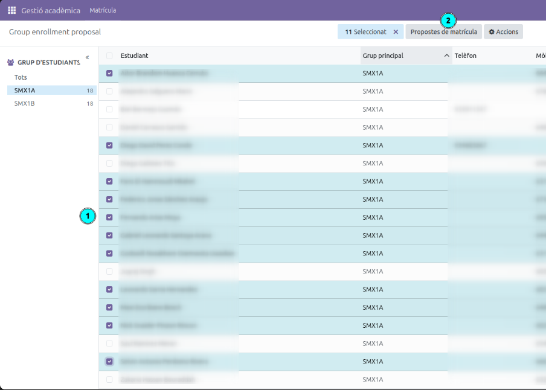
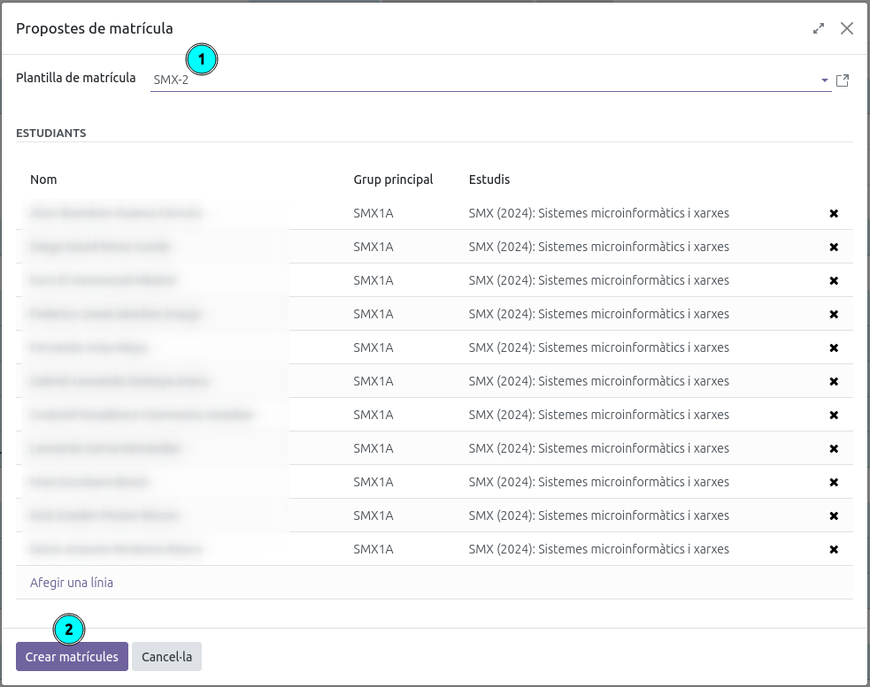
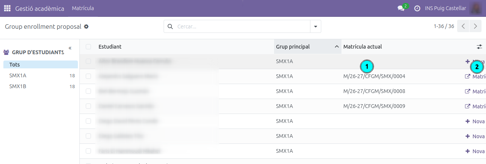
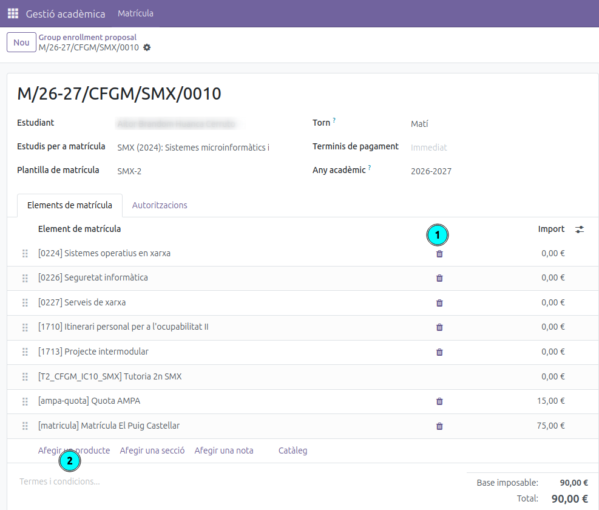

[Català](../../ca/tutors/propostes-matricula.md) | [Castellano](../../es/tutors/propostes-matricula.md) | [English](propostes-matricula.md)

---

# How to Generate Enrollment Proposals for Students

This guide explains how, after the 3rd evaluation meeting, the tutor can generate enrollment proposals for the next course for students.

---

## Table of Contents

1. [Access](#access)
2. [Step 1 — Select approved students](#step-1--select-approved-students)
3. [Step 2 — Select enrollment template](#step-2--select-enrollment-template)
4. [View generated pre-enrollments](#view-generated-pre-enrollments)
5. [Propose special enrollments](#propose-special-enrollments)
6. [Enrollment process](#enrollment-process)

---

## Access

**Academic Management → Enrollment → Enrollment Proposals**

---

## Step 1 — Select Approved Students

In the left panel **(1)**, select the group of students you want to work with (for example, SMX1A).

In the list, check the checkbox for all students who have passed the course and for whom you want to propose enrollment in the next course. Students who already have an active enrollment appear with the enrollment number in the **Current Enrollment** column.

Once you have made your selection, click the **Enrollment Proposals** button in the top bar **(2)**.

> **Tip:** You can filter by group in the left panel to work group by group and avoid mixing students from different groups.

---

## Step 2 — Select Enrollment Template

A dialog will open with the selected students.

1. In the **Enrollment Template** dropdown **(1)**, select the template corresponding to the next course (for example, *SMX-2* for the second year of SMX).
2. Review the list of included students. If you need to exclude any student, click the ✕ in their row.
3. Click **Create Enrollments** **(2)** to generate the pre-enrollments.

---

## View Generated Pre-enrollments

Once generated, you can view the list of pre-enrollments from the same view **Academic Management → Enrollment → Enrollment Proposals**. Students who already have a pre-enrollment created will show their enrollment number in the **Current Enrollment** column **(1)**. Click the button on the right **(2)** to open the details of each pre-enrollment.

---

## Propose Special Enrollments

This option is **for students who are not enrolling in a full course** but in individual subjects.

The procedure is as follows:

1. **Assign the template most similar to the student's situation**, following the same procedure as [Step 2](#step-2--select-enrollment-template). Select the template that best matches what the student will need to take.
2. **Open the student's pre-enrollment**, as explained in the [View generated pre-enrollments](#view-generated-pre-enrollments) section.
3. **Adjust the subjects**: remove the ones the student should not take **(1)** and add the ones they are missing **(2)** until the pre-enrollment reflects exactly the subjects they need to complete.

---

## Enrollment Process

Enrollments will be created in **draft** status and will be forwarded to the secretariat. The secretariat will review them and send them to families for confirmation through the student portal.

---

[← Back to tutors index](index.md)
