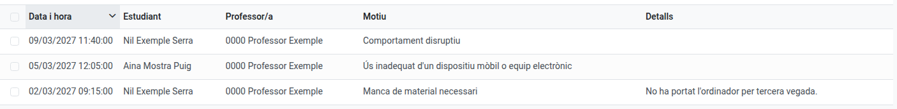
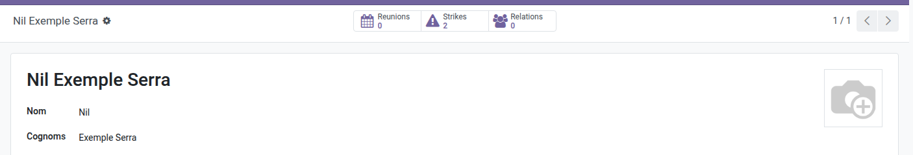

[Català](../../ca/tutors/strike.md) | [Castellano](../../es/tutors/strike.md) | [English](strike.md)

---

# Strikes: Consulting Your Group's Records

As a group tutor, you're notified by email whenever any of your students receives a strike, from any teacher. This page explains where to consult that history.

**Required role:** Tutor

---

## Consulting Strikes

- **Convivencia → Strikes** lists every strike you have issued yourself, plus every strike issued to any student in your group(s) — regardless of which teacher put it.

  
- From a student's own form, a **Strikes** button appears in the header (only when the student has at least one) showing their accumulated count — click it to see the full history for that student.

  

You do not need to do anything else: the notification email you receive on every strike already tells you who issued it, when, why, and whether the student was kicked out of class or not.

---

[← Back to Tutors manuals](index.md)
