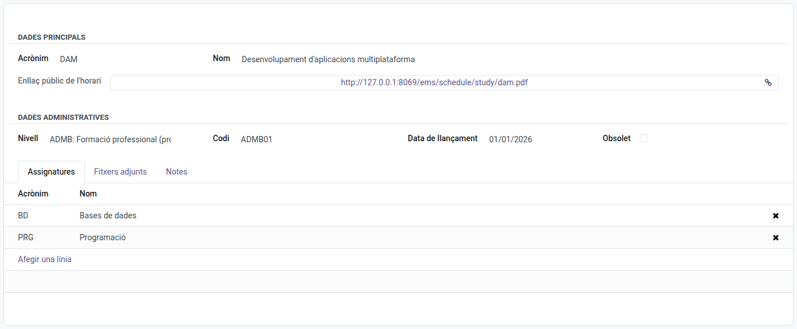

[Català](../../ca/admin/curriculum-studies.md) | [Castellano](curriculum-studies.md) | [English](../../en/admin/curriculum-studies.md)

---

# Estudios

Los estudios representan los **programas de estudio concretos** que ofrece el centro (p. ej., DAM, DAW, ASIX). Cada estudio pertenece a un nivel y agrupa las asignaturas que lo componen, junto con sus documentos curriculares oficiales.

**Rol requerido:** Administrador

---

## Acceso

Navega a: **Comunidad Educativa → Configuración → Currículum → Estudios**

---

## Consultar todos los estudios

Al abrir el menú se muestra una lista de todos los estudios ordenada por código. Cada fila muestra el código, el acrónimo y el nombre.

---

## Crear un estudio

1. Haz clic en **Nuevo**.
2. Rellena los campos obligatorios:
   - **Acrónimo** *(obligatorio)*: Código corto que se utiliza en todo el sistema (p. ej., `DAM`, `DAW`).
   - **Nombre** *(obligatorio)*: Nombre descriptivo completo.
   - **Nivel** *(recomendado)*: El nivel educativo al que pertenece este estudio.
   - **Código** *(obligatorio)*: Código oficial, debe ser único (p. ej., `CFGS_ICB0`).
   - **Fecha de publicación** *(obligatorio)*: Fecha de publicación del currículum.
   - **Obsoleto**: Déjalo sin marcar para un estudio activo; márcalo para retirar un estudio sin eliminarlo.
3. En la pestaña **Asignaturas**, añade las asignaturas que componen este estudio.
4. En la pestaña **Archivos adjuntos**, adjunta los documentos de referencia curricular (publicaciones oficiales, documentos de orientación, etc.).
5. Opcionalmente, añade notas libres en la pestaña **Notas**.
6. Haz clic en **Guardar** (o usa las migas de pan para navegar — Odoo guarda automáticamente).

---

## Editar un estudio

1. Abre el estudio desde la lista.
2. Haz clic en cualquier campo para editarlo en línea, o haz clic en **Editar** si es necesario.
3. Realiza los cambios.
4. Haz clic en **Guardar**.

---

## Enlace público a los horarios del estudio

Cada estudio con grupos activos tiene un enlace público a un único PDF con el horario semanal de
todos ellos, uno detrás de otro por curso y grupo (p. ej. SMX1A, SMX1B... y después SMX2A,
SMX2B...). Cualquier persona puede abrirlo sin iniciar sesión en EMS, así que la web del centro
puede enlazar un PDF por estudio.

1. Abre **Comunidad Educativa → Configuración → Currículum → Estudios → [un estudio]**.
2. En el campo **Enlace público del horario** (p. ej. `.../ems/schedule/study/smx.pdf`), haz clic
   en el enlace para abrir el PDF en una pestaña nueva, o haz clic en el botón de la derecha para
   copiarlo.

El PDF incluye siempre los grupos activos del estudio en cada momento, cada uno con el horario tal
como aparece en su propio enlace público (ver [El horario semanal de un grupo](group-schedule.md#enlace-público-al-pdf-del-horario)),
así que no hace falta sustituir el enlace cuando los grupos cambian de un curso a otro. El enlace
se construye a partir del acrónimo del estudio: si el acrónimo cambia, el enlace también cambia.

---

## Retirar un estudio

Los estudios raramente se eliminan, ya que hacerlo se bloquea en cuanto otros registros (matrículas, grupos, calificaciones) los referencian. Para dejar de ofrecer un estudio manteniendo su historial:

1. Abre el estudio.
2. Marca el campo **Obsoleto**.
3. Haz clic en **Guardar**.

---

## Eliminar un estudio

1. Selecciona el estudio en la lista (marca la casilla de la izquierda).
2. Haz clic en el menú **Acción** (⚙) y selecciona **Eliminar**.
3. Confirma la eliminación en el diálogo.

> **Aviso:** No se puede eliminar un estudio si tiene registros vinculados en otras partes del sistema (matrículas, grupos, planificación...). En ese caso, usa **Obsoleto** en su lugar.

---

[← Volver al índice de Administrador](index.md)
