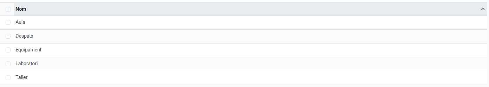
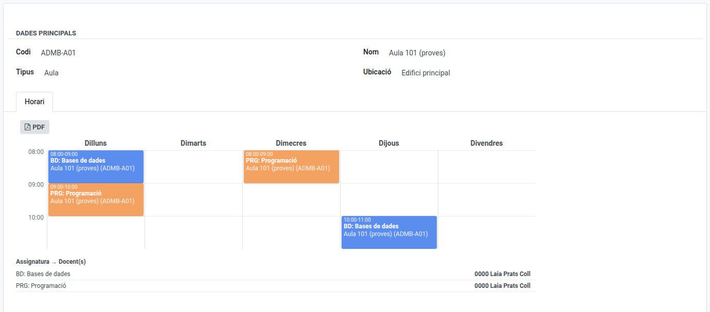

[Català](../../ca/admin/facilities.md) | [Castellano](facilities.md) | [English](../../en/admin/facilities.md)

---

# Espacios y tipos de espacio

Los espacios son las aulas físicas del centro (aulas, laboratorios, talleres...), cada uno asignado a un **Tipo** y una **Ubicación** (sede/edificio). Se usan en toda la aplicación allí donde una sesión, grupo, acta u horario necesita una sala. Cada espacio tiene también su propio **horario de ocupación** semanal — consulta [El horario de ocupación de un aula](space-schedule.md).

**Rol requerido:** Administrador (Profesorado y Secretaría pueden ver un espacio, pero no crearlo, editarlo ni eliminarlo).

---

## Acceso

- **Tipos de espacio**: **Comunidad Educativa → Configuración → Tipos de espacio**
- **Espacios**: **Comunidad Educativa → Configuración → Espacios**

---

## Crear un tipo de espacio

1. Haz clic en **Nuevo**.
2. Rellena el **Nombre** (p. ej., "Aula", "Laboratorio de informática").
3. Haz clic en **Guardar**.

---

## Crear un espacio

1. Haz clic en **Nuevo**. El **Tipo** y la **Ubicación** ya vienen precargados con "Aula" y "Edificio principal" — cámbialos si este espacio es diferente.
2. Rellena:
   - **Código** *(obligatorio)*: debe ser único dentro de su Ubicación — el mismo código se puede reutilizar en sedes diferentes.
   - **Nombre** *(obligatorio)*.
   - **Tipo** *(obligatorio)*: elige un Tipo de espacio.
   - **Ubicación** *(obligatorio)*: a qué sede/edificio pertenece este espacio.
3. Haz clic en **Guardar**.

Una vez creado el espacio, están disponibles una pestaña **Horario** y un chat (para notas internas, mensajes y actividades).

---

## Editar o eliminar

Ábrelo desde su lista, edita cualquier campo y guarda — o selecciónalo en la lista y usa el menú **Acción** (⚙) para eliminarlo. Un Tipo de espacio o Espacio en uso activo (referenciado por una sesión, grupo, acta u horario) no se puede eliminar hasta que se eliminen esas referencias.

---

[← Volver al índice de Administrador](index.md)
