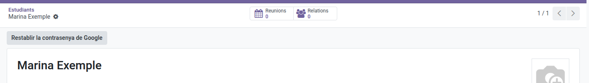

[Català](../../ca/admin/student-google-password.md) | [Castellano](student-google-password.md) | [English](../../en/admin/student-google-password.md)

---

# Restablecer la contraseña de Google de un alumno

Cuando un alumno ha perdido la contraseña de su cuenta de Google Workspace, puedes asignarle una nueva y generar sus credenciales.

**Rol necesario:** Administrador o Coordinador/a TAC

---

## Restablecer la contraseña

1. Abre la ficha del alumno (**Comunidad educativa → Estudiantes**).
2. En la cabecera, pulsa **Restablecer contraseña de Google**. El botón solo aparece si el alumno tiene la cuenta de Google activa.
3. Confirma el mensaje.

La contraseña anterior deja de funcionar al instante. El alumno tendrá que cambiarla la primera vez que entre con la nueva.

---

## Las credenciales nuevas

- En la pestaña **Documentación** de la ficha aparece un PDF nuevo de **Credenciales de Google Workspace**. El anterior queda como **Cancelado**.
- Si el alumno tiene correo personal, también las recibe por correo.
- El chat de la ficha registra quién ha restablecido la contraseña.

Para descargar el PDF, pulsa el nombre del archivo en la pestaña **Documentación**. Para descargar las credenciales de varios alumnos a la vez, en la lista de **Estudiantes** márcalos y haz **Acciones → Descargar credenciales de Google**.

---

[← Volver al índice de Administrador](index.md)
