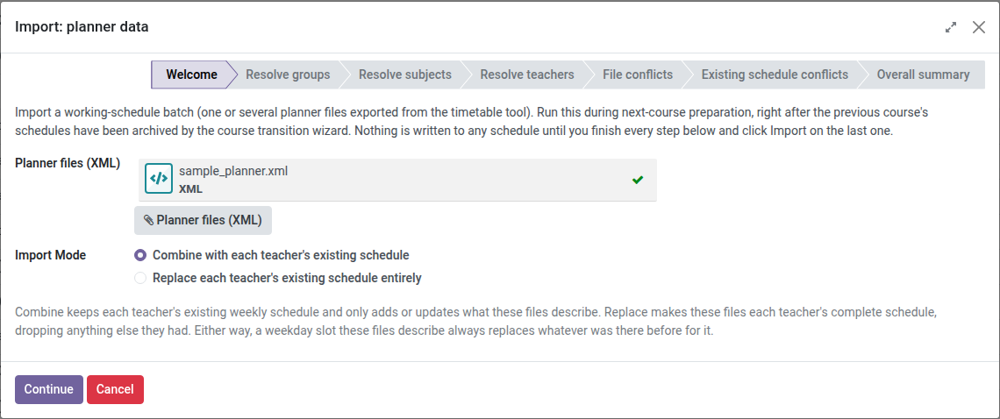
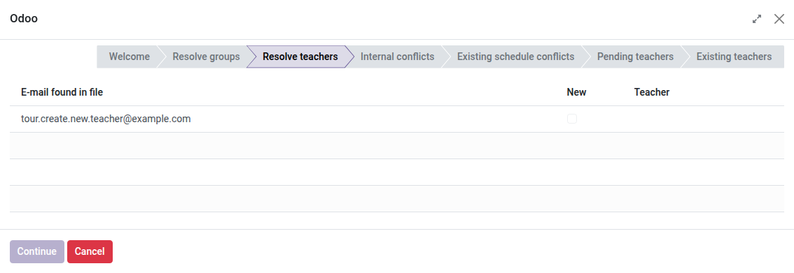
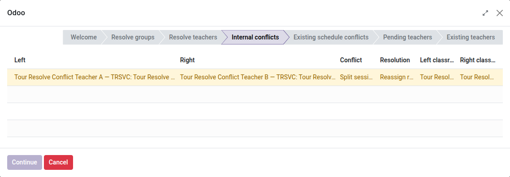

[Català](../../ca/admin/working-schedules.md) | [Castellano](working-schedules.md) | [English](../../en/admin/working-schedules.md)

---

# Horarios de los docentes y marcos horarios

Gestiona el horario semanal de cada docente desde su propia ficha de empleado, y configura las plantillas de horario ("marcos horarios") con los que empiezan los docentes nuevos.

**Rol necesario:** Jefe de departamento o superior (Jefe de departamento, Jefe de estudios, Director, Administrador) puede editar horarios y usar el asistente de importación; el resto de roles solo pueden ver su propio horario, en modo lectura, pero cualquiera puede exportar un horario a PDF.

---

## Conceptos

- **Marco horario**: una plantilla semanal reutilizable (franjas, patios, reuniones de coordinación) para un nivel de estudios — por ejemplo, un marco para la ESO, otro para BTX, otro compartido por los ciclos formativos. Los marcos nunca llevan asignaturas reales asignadas.
- **Horario de un docente**: su propio calendario personal, creado a partir de un marco y luego rellenado con sus asignaturas/grupos reales. Nunca se comparte con otro docente.
- **Marco horario predeterminado**: el marco que se utiliza automáticamente para empezar el horario de cualquier docente nuevo.
- **Grupo de refuerzo**: un grupo de alumnos que mezcla estudiantes de diferentes grupos habituales (e incluso de diferentes estudios) para una clase de refuerzo concreta — no tiene tutor ni delegado, pero aparece en el horario de un docente como cualquier otro grupo. Ver "Grupos de refuerzo" más abajo.

---

## Acceso

- Marcos horarios: **Configuración → Profesorado → Marcos horarios**
- Ajuste del marco predeterminado: **Configuración → Empleados → "Marco horario predeterminado"**
- El horario de un docente: **Empleados → [abrir el docente] → pestaña Horario**
- Importación de horarios desde un archivo: **Configuración → Profesorado → Horarios de trabajo** → menú ⚙️ (engranaje) → **Import: planner data**

---

## Configurar un marco horario

1. Ve a **Configuración → Profesorado → Marcos horarios** y crea uno nuevo (o abre uno existente).
2. Establece su **Nombre** y, si es específico de un nivel de estudios, su **Nivel**.
3. Añade sus franjas semanales en las líneas de asistencia de abajo: día, hora de inicio/fin y, opcionalmente, un nombre. Usa horas exactas — las franjas no necesitan estar alineadas a la hora en punto (p. ej. `10:25–11:25`).
4. Para los patios y las reuniones de coordinación, usa el campo **no lectiva** de esa línea (p. ej. "Patio", "Reunión de coordinación") en lugar de dejarla en blanco — son compromisos reales que heredará cualquier docente que siga ese marco.

> Un marco es solo una plantilla: nunca tiene asignaturas ni grupos asignados a sus propias franjas.

---

## Co-docencia

Si dos docentes imparten realmente la misma clase juntos (misma asignatura, mismo grupo, misma aula, misma hora), EMS lo trata como una **única** clase compartida en lugar de dos independientes: ambos docentes aparecen como titulares de esa franja, y solo hay **una** sesión de asistencia para ella — cualquiera de los dos puede marcarla, y ambos ven el mismo resultado.

Esto se detecta automáticamente, tanto si el horario se ha construido a mano como si se ha importado:
- **Edición manual de un horario**: si asignas un docente a una franja que coincide exactamente (misma asignatura, grupo, aula, día y hora) con una franja ya asignada a otro docente, EMS las fusiona en una franja compartida en lugar de mostrar un error de conflicto de aula. Si más adelante se retira un docente de esa franja mientras su co-docente la mantiene, la franja compartida simplemente vuelve a ser solo de ese co-docente.
- **Importación de horarios**: si un archivo del planificador asigna exactamente la misma clase a dos docentes, importarlo produce una única franja compartida, igual que si la hubierais configurado a mano.

Una franja compartida no se ve diferente por lo demás: simplemente aparece, de forma idéntica, en la pestaña **Horario** de cada uno de sus titulares.

---

## Establecer el marco horario predeterminado

1. Ve a **Configuración → Empleados**.
2. En **Marco horario predeterminado**, elige el marco con el que debería empezar cualquier docente *nuevo*.
3. Guarda.

Este campo es obligatorio — el módulo trae un marco predeterminado genérico para que nunca quede vacío, pero es recomendable apuntarlo al marco que corresponda al nivel más habitual de tu centro.

---

## Gestionar los tipos de hora no lectiva

La lista de motivos no lectivos (Patio, Guardia, Reunión de coordinación...) que se muestra allí donde una franja no es una asignatura es configurable, así que puedes añadir uno nuevo tú mismo si el planificador externo de tu centro empieza a enviar un código que EMS todavía no conoce — sin necesidad de ningún desarrollador.

1. Ve a **Configuración → Profesorado → Tipos de hora no lectiva**.
2. Haz clic en **Nuevo**, establece un **Código** corto (debe coincidir exactamente con el que usa el planificador externo para esa actividad) y un **Nombre** (lo que verán los docentes y los informes).
3. Opcionalmente, márcalo como **Es un descanso** (se descarta por completo del resumen de horas semanales, igual que el patio) o **Siempre es un compromiso de horario fijo** (siempre se cuenta en la columna "Otras horas en horario fijo", como una guardia).
4. Guarda. El nuevo tipo queda disponible de inmediato en el desplegable "no lectiva" al editar un horario, y se reconoce la próxima vez que importes un fichero del planificador que use su código.

---

## El horario de un docente nuevo

Al crear un empleado nuevo de tipo **Profesor**, EMS automáticamente:
- le crea un calendario de trabajo personal (nunca compartido con nadie más),
- lo apunta al marco horario predeterminado del centro.

Todavía no hace falta asignar nada — abre su pestaña **Horario** y usa **Editar** para empezar a rellenar asignaturas, siguiendo la sección "Editar el horario de un docente" más abajo. Si más adelante le cambias el nombre, el calendario se renombra automáticamente; si lo eliminas, su calendario personal se elimina automáticamente también.

---

## Ver el horario de un docente

1. Abre la ficha de empleado del docente.
2. Ve a la pestaña **Horario**.

Cada bloque muestra su hora exacta de inicio y fin, la asignatura/grupo o el motivo no lectivo, y el aula (según el aula por defecto del grupo). Las franjas todavía sin asignar simplemente no muestran ningún bloque — la estructura del marco (patios, reuniones) ya indica que se espera algo ahí.

Debajo de la cuadrícula, una pequeña tabla resumen muestra el total de horas semanales del docente en dos columnas:
- **Horas lectivas semanales**: una fila por nivel de estudios (p. ej. CFGS, CFGM, ESO), una fila por cada grupo de refuerzo impartido (estos no pertenecen a un único nivel), más cualquier actividad no lectiva que no aparezca en la otra columna.
- **Otras horas en horario fijo**: guardias (cualquier día) y reuniones de coordinación específicamente los miércoles.

El patio nunca se cuenta en ninguna de las dos columnas. Una franja que solo se solapa parcialmente con una hora igualmente cuenta como una hora completa. Cada columna muestra su propio total, seguido del total general (24 horas para un docente a tiempo completo). Este resumen siempre refleja el horario guardado, por lo que desaparece mientras lo estás editando y vuelve a aparecer (actualizado) al guardarlo.

---

## Editar el horario de un docente

1. Abre la pestaña **Horario** del docente y haz clic en **Editar**.
2. Cada fila es una franja semanal real (con su hora exacta, editable con los dos campos de hora de la izquierda) — elige una **asignatura** y un **grupo**, o un motivo **no lectivo**, en los desplegables de la columna de cada día.
3. Para cambiar la hora de una franja: edita directamente el campo de inicio o de fin (mover el inicio mantiene la duración de la franja).
4. Para eliminar una franja: usa el icono de papelera junto a su hora.
5. Para añadir una franja que el marco no tenía (p. ej. un docente que combina el horario de dos niveles): haz clic en **Añadir franja** al final de la columna de horas, establece su hora, y rellénala para los días que correspondan.
6. Haz clic en **Guardar** para aplicar los cambios, o en **Cancelar** para descartarlo todo y dejar el horario intacto.

> Si dejas sin asignar una franja añadida a mano y guardas, simplemente se descarta — solo se conservan las asignaciones reales. Si vuelves a abrir **Editar** más adelante, las franjas propias del marco reaparecen como huecos por rellenar, pero una franja manual descartada no.

---

## Importar horarios de trabajo desde un archivo

Si tu centro ya exporta horarios desde una herramienta externa de planificación (XML), usa el importador general en lugar de construir los horarios a mano — cada archivo ya puede describir varios docentes a la vez (emparejados por correo electrónico), y puedes adjuntar más de un archivo en una misma ejecución. Ya no existe un importador por docente individual: un docente que se incorpora a mitad de curso recibe su horario mediante **Nuevo** en su propia pestaña **Horario** (ver "Empezar el horario de un docente a partir de un marco o de otro docente" más abajo) o a mano, nunca con una subida de archivo para un solo docente.

1. Ve a **Configuración → Profesorado → Horarios de trabajo**.
2. Abre el menú ⚙️ (engranaje) sobre la lista y elige **Import: planner data**.
3. En la pantalla de **Bienvenida**, adjunta uno o más archivos XML y haz clic en **Continuar** — todavía no se escribe nada en este punto, ni tampoco se comprueba nada del contenido de los archivos.

   
4. Si los archivos mencionan algún nombre de grupo que EMS no ha podido emparejar automáticamente, una pantalla de **Resolver grupos** los lista uno a uno: elige el grupo real en el desplegable de cada fila (o crea uno al vuelo, igual que en cualquier otro campo de grupo) y haz clic en **Continuar**. Si todos los grupos se reconocieron automáticamente, verás un mensaje de confirmación en lugar de una lista. El botón **Continuar** aparece atenuado hasta que todas las filas tengan un grupo elegido.
5. Si los archivos mencionan un correo de docente que EMS no ha encontrado, una pantalla de **Resolver docentes** los lista, con **Nuevo** marcado por defecto (asumiendo un docente genuinamente nunca contratado) - déjalo marcado para crear un nuevo docente pendiente de identificar para ese correo en el paso final de Importar, igual que un código de puesto aún no cubierto (ver "Docentes aún no contratados" más abajo), con la diferencia de que se conserva el correo del archivo, precargado como **Correo de trabajo** editable a mano (**Asignar correo corporativo manualmente** marcado) en lugar de generarse automáticamente, ya que todavía no se ha confirmado; o bien, si en realidad es un error/desajuste de un docente ya existente, desmarca **Nuevo** y elige el docente real en el desplegable (desmarcarlo es lo que lo desbloquea). Si todos los correos se reconocieron, verás un mensaje de confirmación. El botón **Continuar** también aparece atenuado aquí hasta que todas las filas tengan un docente elegido o **Nuevo** marcado.

   
6. Si dos docentes distintos del mismo lote acaban programados en la misma aula a la misma hora, una pantalla de **Conflictos del archivo** lista cada pareja (las dos columnas "Archivo" son entradas del archivo que estás importando) con una forma de resolverlo: **"Confirmar"** si realmente comparten esa clase (opción por defecto cuando es la misma asignatura y grupo - solo se ofrece para este caso exacto, no aparece en absoluto en los demás); **"Reasignar aulas"** para un choque real de aula - una clase desdoblada ("Sesión desdoblada") que necesita dos aulas distintas (misma asignatura, grupos distintos) o dos clases completamente distintas que coinciden por casualidad (asignaturas distintas, "Conflicto de aula") - elige el aula real para cada lado, ya que ambos empiezan con la misma aula que provoca el conflicto (el aula ya asignada a cada grupo); o **"Prevalece la izquierda"/"Prevalece la derecha"** para simplemente mantener un lado y descartar el otro. Cada fila se tiñe según la urgencia: amarillo para una fila de co-docencia/clase desdoblada que solo pide una confirmación rápida, rojo para un choque de aula real que exige una decisión de verdad. Si no hay nada que resolver, verás un mensaje de confirmación. El botón **Continuar** aparece atenuado hasta que todas las filas tengan una resolución real (para "Reasignar aulas", eso significa que las dos aulas deben ser realmente distintas).

   
7. Si alguna entrada del archivo coincide con un aula+hora ya usada activamente por el horario existente de otra persona, una pantalla de **Conflictos con horarios existentes** lista cada una (con el mismo teñido amarillo/rojo) - aquí las columnas se llaman **"Archivo"** (la nueva entrada) y **"Base de datos"** (la sesión ya existente), en lugar de las dos "Archivo" de la pantalla anterior - con las mismas opciones de resolución que "Conflictos del archivo" más arriba. Elegir **"Prevalece la izquierda"** archiva la sesión existente (liberando el hueco para la nueva); elegir **"Prevalece la derecha"** descarta la nueva entrada en su lugar, dejando la sesión existente intacta. Un caso tiene un valor por defecto distinto: un docente ya con doble reserva en el *tiempo* contra su propio horario existente, en un aula genuinamente distinta (no es un choque de aula en absoluto - reasignar aulas no soluciona que un docente tenga que estar en dos sitios a la vez), por defecto usa **"Prevalece la izquierda"** sin selectores de aula, en lugar de "Reasignar aulas". Si no hay nada que resolver, verás un mensaje de confirmación.
8. Haz clic en **Continuar** en las pantallas restantes (todavía no construidas como pantallas propias).
9. En el paso final, haz clic en **Importar**. Este es el momento en que todo se escribe de verdad, y donde cualquier problema pendiente (un aula que falta) se reporta indicando exactamente qué hay que corregir.

> Hazlo durante la preparación del próximo curso, una vez que los horarios del curso anterior ya hayan sido archivados por el asistente de "Configurar el próximo curso" — ejecutarlo contra un curso ya en marcha puede generar conflictos que luego habrá que resolver a mano.

Si alguno de los docentes encontrados en los archivos ya tiene un horario, se actualiza in situ (no se reemplaza desde cero) al hacer clic en **Importar** — las asignaciones de asignaturas y las plantillas de asistencia existentes se mantienen sincronizadas con el archivo nuevo.

---

## Docentes aún no contratados (pendientes de identificar)

A veces llegan horarios nuevos antes de que todos los puestos estén cubiertos — tu herramienta de planificación nombra esas filas con un código provisional (`X1`, `X2`...) en lugar del correo real de un docente. Importar un archivo así ya no falla en esas filas:

> Este mismo mecanismo de pendiente de identificar también cubre un correo real que no coincide con ningún docente existente — marca **Nuevo** para esa fila en la pantalla de **Resolver docentes** en lugar de elegir uno (ver el paso 5 de "Importar horarios de trabajo desde un archivo" más arriba). La única diferencia respecto a un código provisional es que se conserva el correo del archivo, precargado como **Correo de trabajo** editable (**Asignar correo corporativo manualmente** marcado), en lugar de dejarlo para que un futuro "Generar cuenta de Google" lo asigne automáticamente.

1. Adjunta el archivo y haz clic a través del asistente como de costumbre (ver "Importar horarios de trabajo desde un archivo" más arriba) — un código provisional no se trata como un problema en ningún paso.
2. Haz clic en **Importar** en el paso final. Se crea un nuevo registro de empleado para cada código aún no identificado, ya nombrado p. ej. "Profesor pendiente (X1)", con **su horario, asignaturas y listas de asistencia ya configurados** exactamente como si fuera un docente conocido.
3. Estos registros muestran una etiqueta **"Pendiente de identificar"** en la lista/kanban de docentes y una cinta en su propia ficha, para que sean fáciles de encontrar (usa el filtro/agrupación **Pendiente de identificar** en la lista de docentes) y fáciles de distinguir de un docente real ya identificado.

Cuando se cubre el puesto:

1. Abre la ficha del empleado pendiente.
2. Sustituye el **Nombre** provisional por el nombre real del docente, y rellena su **Correo personal**.
3. Haz clic en **Generar cuenta Google**, exactamente igual que para cualquier docente nuevo.

Ese único clic crea la cuenta Google Workspace/el acceso a EMS del docente **y** confirma su identidad — la etiqueta "Pendiente de identificar" desaparece, y no hace falta rehacer nada del horario, las asignaturas o las listas de asistencia ya importados.

Reimportar un archivo actualizado para un puesto todavía sin cubrir (el mismo código provisional) actualiza el horario de ese mismo docente pendiente en el mismo registro, igual que reimportar el archivo de un docente ya identificado — nunca crea un segundo registro duplicado para el mismo código.

---

## Empezar el horario de un docente a partir de un marco o de otro docente

Usa esto para reiniciar a un docente con un marco distinto (p. ej. ahora imparte otro nivel), o para configurar un **sustituto** con el mismo horario que el docente al que está cubriendo:

1. Abre la pestaña **Horario** del docente y haz clic en **Nuevo**.
2. Elige un **marco horario** (empieza en blanco, siguiendo las franjas de ese marco) o **otro docente** (copia sus asignaturas/grupos reales — ideal para sustituciones).
3. Haz clic en **Cargar** — verás el horario cargado en modo edición.
4. Ajusta lo que haga falta y haz clic en **Guardar** para aplicarlo, o en **Cancelar** para descartarlo y mantener el horario anterior del docente intacto.

> **Nuevo** sustituye todo el horario — nada de lo anterior se conserva salvo que también aparezca en lo que acabas de cargar. Cancelar antes de guardar deja todo exactamente como estaba.

---

## Grupos de refuerzo

Un grupo de refuerzo es un **grupo** de alumnos (el mismo registro de "Grupos" que un grupo habitual) utilizado para una clase de refuerzo/apoyo que mezcla alumnos de diferentes grupos habituales, e incluso de diferentes estudios — p. ej. un pequeño grupo de refuerzo de matemáticas con alumnos de tres grupos de primer curso distintos.

1. Ve a **Configuración → Alumnado → Grupos** y crea uno nuevo.
2. Establece su **Tipo de grupo** como **Refuerzo**. Esto oculta los campos Nivel/Estudio/Curso/Acrónimo/Tutor/Delegado (un grupo de refuerzo no tiene ninguno de ellos) y te permite escribir directamente el **Nombre** del grupo — haz que coincida exactamente con lo que exporta tu planificador externo para ese grupo, ya que el importador de horarios lo localiza por nombre exacto.
3. Establece su **Aula**, igual que cualquier otro grupo — sigue siendo necesaria para que el horario se importe correctamente.
4. En la pestaña **Alumnos**, añade los alumnos que asisten a esta clase de refuerzo, independientemente del grupo habitual o el estudio al que pertenezcan. Esto **no** cambia el grupo principal de ningún alumno.
5. Guarda.

Una vez creado, un grupo de refuerzo se utiliza en el horario de un docente exactamente igual que cualquier otro grupo — asígnalo manualmente en la pestaña Horario, o deja que el importador de ficheros lo localice por el nombre.

---

## Exportar el horario de un docente a PDF

1. Abre la pestaña **Horario** del docente y haz clic en **PDF**.
2. Se genera y descarga un horario semanal imprimible — una fila por franja, una columna por día, y cada celda muestra la asignatura/grupo o el motivo no lectivo y el aula.

El documento empieza con el nombre del docente y el curso actual, seguido de su departamento (si tiene uno asignado) y su(s) rol(es) — la línea de un tutor también muestra qué grupo tutoriza, y la de un jefe de departamento muestra de qué departamento.

Esta opción también está disponible desde el menú **Imprimir** de la propia ficha del empleado, por si necesitas exportar el horario de varios docentes desde una vista de lista.

---

[← Volver al índice principal](index.md)
