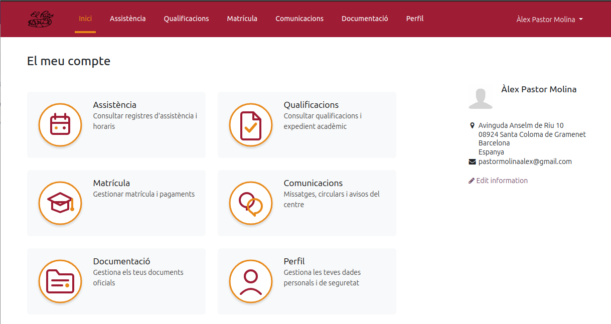
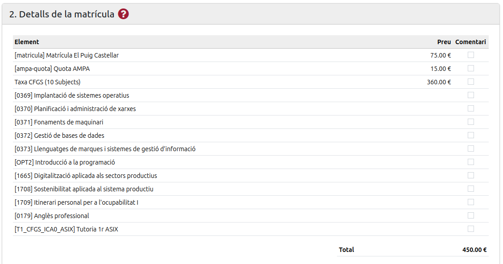
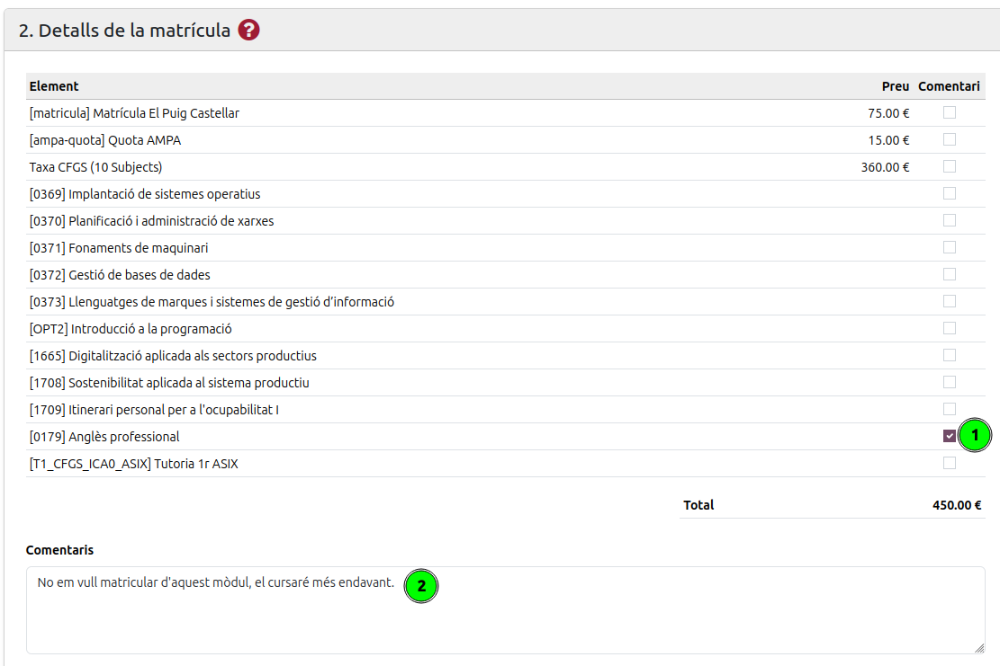
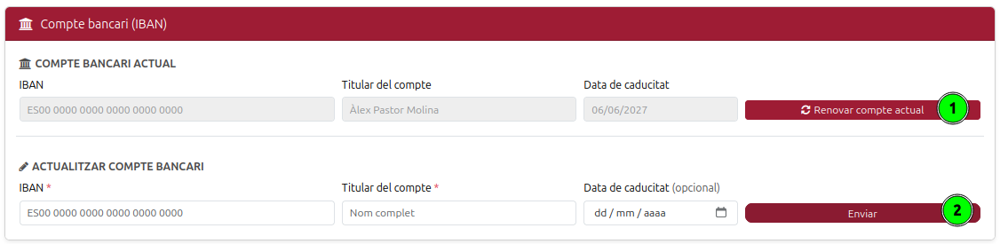
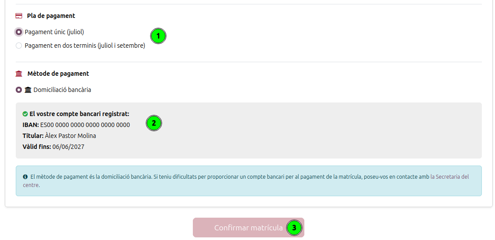
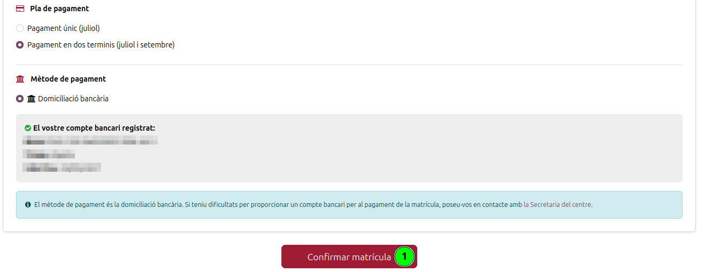

[Català](../../ca/families/manual-confirmacio-matricula.md) | [Castellano](manual-confirmacio-matricula.md) | [English](../../en/families/manual-confirmacio-matricula.md)

---

# Guía para confirmar la propuesta de matrícula

Esta guía explica, paso a paso, cómo deben confirmar las familias (o el alumnado) la **propuesta de matrícula** que el centro les envía por correo electrónico, usando el portal educativo del instituto.

---

## Índice

1. [Antes de empezar: el correo de propuesta](#antes-de-empezar-el-correo-de-propuesta)
2. [Paso 1 — Acceso al portal y al apartado Matrícula](#paso-1--acceso-al-portal-y-al-apartado-matrícula)
3. [Paso 2 — Responder las autorizaciones](#paso-2--responder-las-autorizaciones)
4. [Paso 3 — Revisar los detalles de la matrícula](#paso-3--revisar-los-detalles-de-la-matrícula)
5. [Paso 4 — (Opcional) Enviar un comentario a Secretaría](#paso-4--opcional-enviar-un-comentario-a-secretaría)
6. [Paso 5 — Elegir el plan y el método de pago](#paso-5--elegir-el-plan-y-el-método-de-pago)
7. [Paso 6 — Registrar la cuenta bancaria (IBAN)](#paso-6--registrar-la-cuenta-bancaria-iban)
8. [Paso 7 — Confirmar la matrícula](#paso-7--confirmar-la-matrícula)

---

## Antes de empezar: el correo de propuesta

Cuando la propuesta de matrícula para el próximo curso está disponible, recibiréis un **correo electrónico** del centro (INS Puig Castellar) en la dirección que facilitasteis. El mensaje os informa de que la matrícula ya se puede tramitar y os indica los pasos a seguir.

Para iniciar el trámite, haced clic en el enlace **mi matrícula** del correo, o bien acceded directamente al portal del centro tal como se explica en el Paso 1.

> **Nota:** para poder entrar al portal hay que tener la cuenta activada. Si todavía no la habéis activado, consultad primero la guía [Acceso y activación del portal del alumnado](manual-portal-alumne.md).

---

## Paso 1 — Acceso al portal y al apartado Matrícula

Una vez que habéis iniciado sesión, llegaréis a la página de inicio del portal (*Mi cuenta*). Desde el menú superior o desde las tarjetas centrales, haced clic en **Matrícula**.

En el apartado **Matrícula** se os mostrará la propuesta que el centro os ha preparado, con todas las secciones para revisar y confirmar.

> **Si no veis ninguna propuesta:** si al entrar en Matrícula aparece el mensaje *«No se ha encontrado ningún proceso de matrícula activo»*, significa que de momento no tenéis ninguna propuesta pendiente (porque todavía no se os ha enviado). En caso de duda, poneos en contacto con la Secretaría del centro.

---

## Paso 2 — Responder las autorizaciones

La primera sección, **1. Autorizaciones**, contiene los documentos y consentimientos que hay que responder antes de poder confirmar la matrícula (autorización de uso de imagen y sonido, carta de compromiso educativo, protección de datos, etc.).

Cada autorización aparece con el estado **Pendiente**. Para responderla, haced clic en el botón **Respuesta** de la fila correspondiente **(1)**.

Se abrirá una ventana con el texto completo de la autorización. Leedlo con atención y, si procede, rellenad los campos que se os pidan (algunos son obligatorios y van marcados con un asterisco `*`). A continuación:

* Pulsad **Aceptar autorización** para dar vuestro consentimiento.
* Pulsad **Rechazar** si la autorización lo permite y no queréis dar consentimiento.

> **Importante:** debéis responder **todas las autorizaciones obligatorias** (deben quedar en estado *Aceptado*). Mientras quede alguna autorización obligatoria pendiente, el botón de confirmación de la matrícula permanecerá desactivado.

---

## Paso 3 — Revisar los detalles de la matrícula

En la sección **2. Detalles de la matrícula** encontraréis el desglose de todos los conceptos (matrícula, cuota del AMPA, tasas, módulos o materias...) con su **precio** y el **total** a pagar.

Revisad que toda la información sea correcta.

* Si estáis **de acuerdo** con todo, podéis continuar con el pago (Paso 5).
* Si tenéis **alguna duda o queréis comunicar una incidencia** sobre algún concepto, seguid el Paso 4.

---

## Paso 4 — (Opcional) Enviar un comentario a Secretaría

Si queréis consultar o comentar alguno de los conceptos **antes de confirmar**, podéis enviar un mensaje a Secretaría desde el mismo portal:

1. Marcad la casilla **(1)** de la columna *Comentario* a la derecha de la línea o líneas que queréis consultar.
2. Al marcar una casilla, se abrirá el cuadro **Comentarios** **(2)**, donde debéis escribir vuestra duda u observación.

3. Cuando hay alguna línea marcada, el botón de confirmar se sustituye por el botón **Comentarios para secretaría** **(3)**. Pulsadlo para enviar la consulta.

> **Tened en cuenta que:**
> * Enviar un comentario **no confirma** la matrícula: solo hace llegar vuestra consulta a Secretaría.
> * La Secretaría revisará vuestro mensaje y os responderá. Encontraréis todo el historial de mensajes en la sección **3. Comunicaciones**, dentro de la misma página de matrícula.
> * Cuando la cuestión esté resuelta, podréis volver a entrar y confirmar la matrícula con normalidad.

---

## Paso 5 — Elegir el plan y el método de pago

En la parte inferior de la sección de detalles debéis indicar cómo queréis pagar la matrícula.

**Plan de pago.** Elegid una de las opciones disponibles:

* **Pago único (julio).**
* **Pago en dos plazos (julio y septiembre).** Si elegís esta opción, se mostrará el desglose de los dos pagos.

> La opción de *Pago en dos plazos* **solo está disponible** si la matrícula incluye **Tasas** (CFGS). *Las Tasas son el único concepto fraccionable en dos pagos de la matrícula.*

**Método de pago.** El centro utiliza la **domiciliación bancaria**. Para poder seleccionar esta opción hay que tener una **cuenta bancaria (IBAN) registrada**. Si todavía no habéis dado de alta ninguna, veréis un aviso como el de la imagen, que os invita a enviar vuestro IBAN antes de continuar (ved el Paso 6).

> Si tenéis dificultades para facilitar una cuenta bancaria, poneos en contacto con la Secretaría del centro.

---

## Paso 6 — Registrar la cuenta bancaria (IBAN)

Para dar de alta la cuenta bancaria, id al apartado **Documentación** del menú superior. En la sección **Cuenta bancaria (IBAN)** rellenad el formulario **Actualizar cuenta bancaria**:

* **IBAN** de la cuenta.
* **Titular de la cuenta** (nombre completo).
* **Fecha de caducidad** (opcional).

A continuación, pulsad **Enviar**.

Si ya teníais una cuenta registrada de otro curso, en esta misma sección podréis:

1. **Renovar cuenta actual** **(1)** — si queréis mantener la misma cuenta y actualizar su validez.
2. **Actualizar cuenta bancaria** **(2)** — si queréis introducir una cuenta nueva (rellenad los datos y pulsad *Enviar*).

Una vez registrado el IBAN, volved al apartado **Matrícula** para finalizar el trámite.

---

## Paso 7 — Confirmar la matrícula

De vuelta en **Matrícula**, comprobad que todo esté correcto:

1. El **plan de pago** elegido **(1)**.
2. La **cuenta bancaria registrada**, que ahora aparece confirmada con el IBAN, el titular y la validez **(2)**.

El botón **Confirmar matrícula** **(3)** se mantiene desactivado (en color claro) hasta que se cumplen **todas** estas condiciones:

* Todas las autorizaciones obligatorias están **aceptadas**.
* Habéis seleccionado un **plan de pago**.
* Tenéis una **cuenta bancaria (IBAN) válida** registrada.

Cuando se cumplen todas, el botón **Confirmar matrícula** se activa (color granate). Pulsadlo para finalizar el trámite.

> Una vez confirmada, la matrícula queda registrada y la página pasa a modo de solo lectura, con la información de la matrícula. Si más adelante necesitáis hacer algún cambio, deberéis contactar con la [Secretaría del centro](https://elpuig.xeill.net/el-centre/secretaria).

---

[← Volver al índice de familias](index.md)
