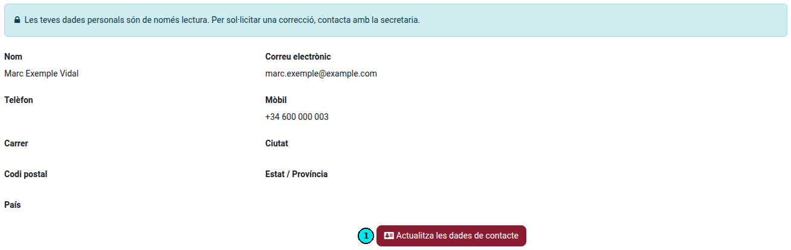
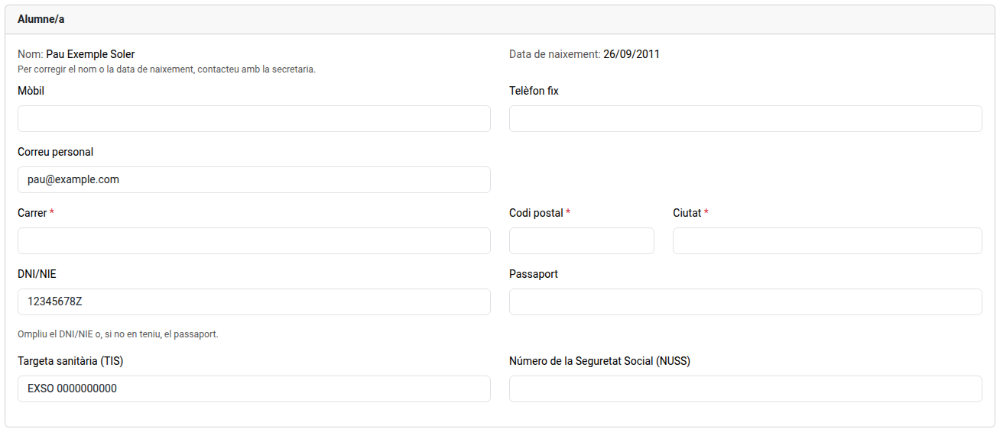
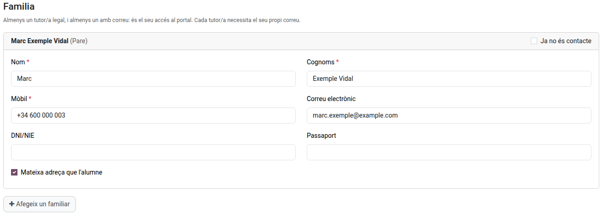
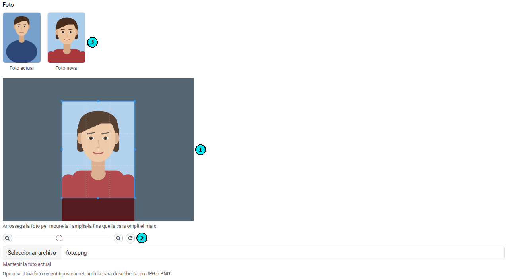
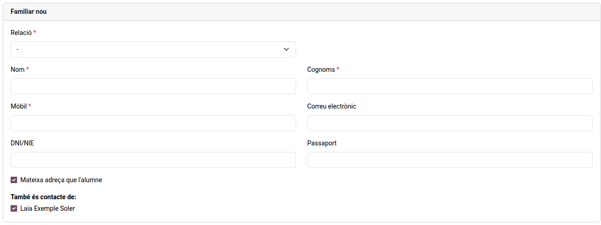
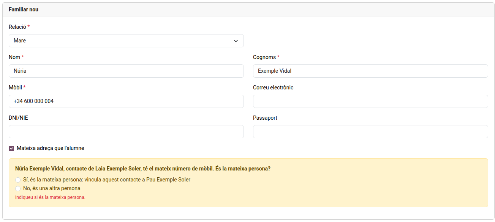
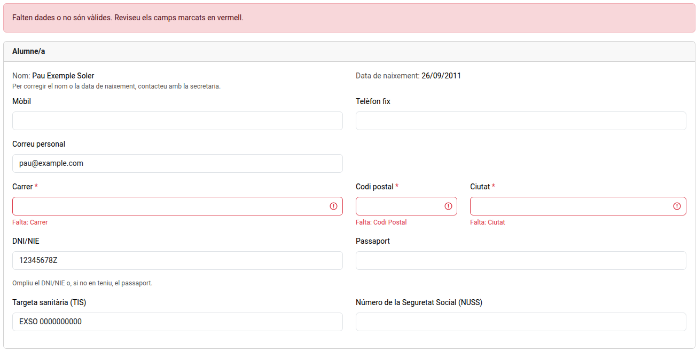

[Català](../../ca/families/manual-dades-contacte.md) | [Castellano](manual-dades-contacte.md) | [English](../../en/families/manual-dades-contacte.md)

---

# Revisar los datos de contacto

Cómo revisar y completar los datos de contacto del alumno y de la familia desde el portal del alumnado.

---

## Abrir los datos de contacto

Abrid el portal, haced clic en **Perfil** y después en **Actualizar los datos de contacto** (1). Cuando el centro os los ha pedido, el aviso de arriba del todo de la página de inicio también tiene un botón **Revisar**, y el correo del centro lleva un enlace a la misma página.

Solo ve el botón quien responde por el alumno: la familia de un alumno menor de 18 años, o un alumno mayor de edad desde su propia cuenta. Un alumno menor de 18 años que entra con su propia cuenta puede consultar el portal, pero no enviar los datos: lo hace su familia.

Si tenéis más de un hijo o hija en el centro, elegid primero el alumno en el menú de arriba a la derecha.

## Rellenar los datos

- **Alumno/a**: son obligatorios la calle, el código postal y la ciudad, y el DNI/NIE o, si no tiene, el pasaporte. Un alumno mayor de edad también necesita un correo personal: es su acceso al portal. El móvil, el teléfono fijo, la tarjeta sanitaria (TIS) y el número de la Seguridad Social (NUSS) son opcionales.
- **Correos**: indicad direcciones personales. No se acepta una dirección del dominio del centro, como el correo escolar del alumno.

- **Familia** (obligatoria para un alumno menor de 18 años): cada familiar necesita nombre, apellidos y móvil. Al menos uno debe tener correo, y cada uno el suyo.
- **Misma dirección que el alumno**: desmarcadlo para indicar una dirección distinta para ese familiar.
- **Añadir un familiar**: añade uno nuevo. Elegid la relación y rellenad sus datos.
- **Ya no es contacto**: marcadlo para un familiar con quien ya no se debe contactar.
- El nombre y la fecha de nacimiento del alumno no se pueden cambiar aquí: para corregirlos, contactad con la secretaría.

## Foto del alumno

La foto es opcional. Sirve para que el profesorado reconozca al alumno en las listas de clase.

1. En el bloque **Foto**, haced clic en el botón para elegir un archivo y elegid una foto reciente en JPG o PNG, con la cara descubierta.
2. La foto se abre en un marco vertical (1). Arrastradla para moverla y ampliadla hasta que la cara llene el marco: con la barra, con los botones de lupa o con la rueda del ratón (en el móvil, pellizcando). El botón de la flecha gira la foto (2).
3. Junto a la **Foto actual** veis cómo quedará la **Foto nueva** (3). Solo se envía la parte que queda dentro del marco.

Para no cambiar la foto, haced clic en **Mantener la foto actual**. La foto nueva, como el resto de cambios, se aplica cuando el centro la revisa.

## Varios hijos

Un familiar que añadís también se ofrece para vuestros otros hijos e hijas del centro: en **También es contacto de**, dejad marcados los hijos de los que es contacto. Cuando el centro lo aprueba, queda vinculado a todos, y no hace falta añadirlo de nuevo para cada hijo.

Si el familiar nuevo tiene el mismo DNI/NIE o móvil que un contacto de otro de vuestros hijos, el formulario lo indica antes de enviar. Elegid **Sí, es la misma persona** para vincular ese contacto también a este hijo, en lugar de añadir uno nuevo, o **No, es otra persona**. Con el mismo DNI/NIE la respuesta solo puede ser que sí: si no es la misma persona, corregid el documento.

## Enviar

Haced clic en **Enviar**. Si falta un campo o no es válido, aparece marcado en rojo: corregidlo y volved a enviar.

El centro revisa los cambios antes de aplicarlos. Mientras tanto, podéis volver a abrir la página, corregirlos y volver a enviarlos. Si el centro os los devuelve, recibís un correo que indica qué hay que corregir.
