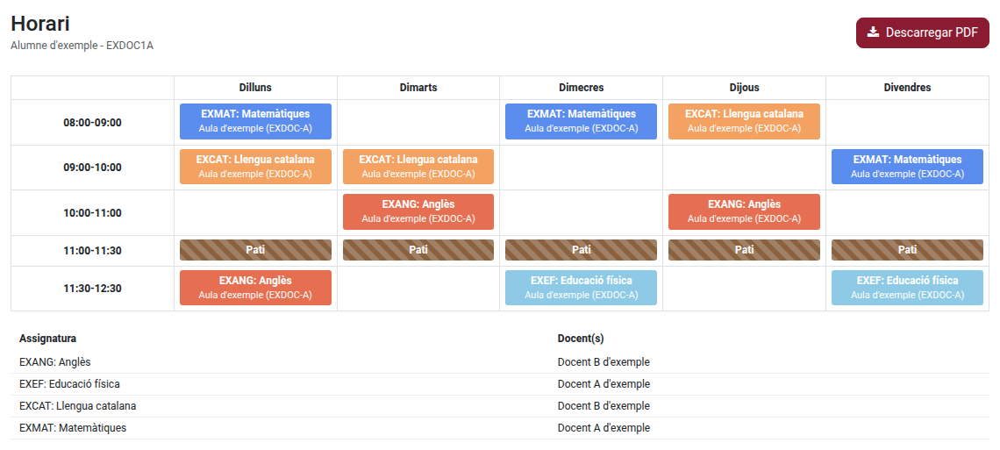

[Català](../../ca/families/manual-horari.md) | [Castellano](manual-horari.md) | [English](../../en/families/manual-horari.md)

---

# Consultar el horario de clases del alumno

Consultad el horario semanal de clases del alumno —asignaturas, aulas, patios y docentes— y
descargadlo en PDF desde el portal del alumno.

---

## Acceso

En la página de inicio del portal, haced clic en la tarjeta **Asistencia**.

Si sois una familia con más de un hijo o hija en el centro, primero elegid al alumno en la barra
superior del portal: el horario que se muestra es siempre el del alumno seleccionado.

---

## Leer el horario

La cuadrícula muestra una columna por día, de lunes a viernes, y una fila por franja de clase.
Cada bloque indica la asignatura y el aula. Debajo de la cuadrícula, una tabla muestra cada
asignatura y el docente o docentes que la imparten.

En el móvil, deslizad la cuadrícula hacia los lados para ver todos los días.

---

## Descargar el horario en PDF

Haced clic en **Descargar PDF** para guardar una copia imprimible del mismo horario.

---

[← Volver al índice general](index.md)
