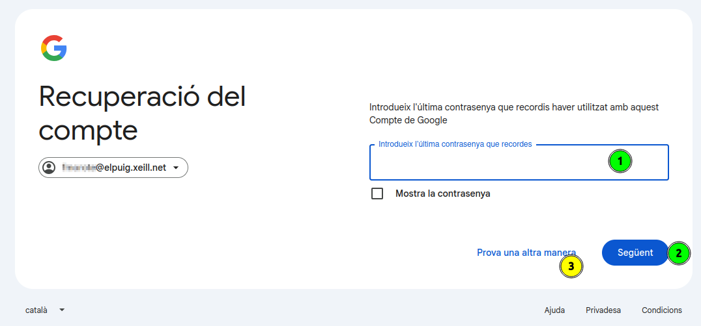

[Català](../../ca/families/manual-recuperacio-contrasenya-correu.md) | [Castellano](manual-recuperacio-contrasenya-correu.md) | [English](../../en/families/manual-recuperacio-contrasenya-correu.md)

---

# Guía de recuperación de la contraseña del correo del instituto (@elpuig.xeill.net)

Esta guía explica paso a paso cómo recuperar la contraseña de la cuenta de correo del instituto (`@elpuig.xeill.net`) cuando la has olvidado o ha dejado de funcionar.

La cuenta de correo del instituto es una cuenta de **Google (Gmail)**, por lo que la recuperación se realiza a través del asistente oficial de Google.

> **Importante:** para poder recuperar la contraseña es necesario tener un **número de teléfono de recuperación** asociado a la cuenta. Es el teléfono que facilitaste cuando se creó la cuenta. Si no tienes acceso a ese teléfono, contacta con la secretaría del instituto.

---

## Índice

1. [Paso 1 — Inicia sesión con tu correo](#paso-1--inicia-sesión-con-tu-correo)
2. [Paso 2 — Haz clic en «¿Has olvidado la contraseña?»](#paso-2--haz-clic-en-has-olvidado-la-contraseña)
3. [Paso 3 — Pantalla de recuperación de la cuenta](#paso-3--pantalla-de-recuperación-de-la-cuenta)
4. [Paso 4 — Confirma el número de teléfono](#paso-4--confirma-el-número-de-teléfono)
5. [Paso 5 — Introduce el código de verificación](#paso-5--introduce-el-código-de-verificación)
6. [Paso 6 — Actualiza la contraseña](#paso-6--actualiza-la-contraseña)
7. [Paso 7 — Crea la nueva contraseña](#paso-7--crea-la-nueva-contraseña)

---

## Paso 1 — Inicia sesión con tu correo

Abre el navegador y accede a [Gmail](https://mail.google.com) (o a cualquier servicio de Google). En la pantalla de inicio de sesión:

1. Escribe la dirección de correo completa del instituto (`usuario@elpuig.xeill.net`).
2. Haz clic en el botón **Siguiente (1)**.

---

## Paso 2 — Haz clic en «¿Has olvidado la contraseña?»

En la pantalla donde te pide la contraseña, no hace falta que escribas nada. Para iniciar el proceso de recuperación:

1. Haz clic en el enlace **¿Has olvidado la contraseña? (1)**.

---

## Paso 3 — Pantalla de recuperación de la cuenta

Google abrirá el asistente de **Recuperación de la cuenta**. Te pedirá la última contraseña que recuerdes:

1. Si recuerdas alguna, escríbela en el campo **Introduce la última contraseña que recuerdes (1)** y haz clic en **Siguiente (2)**.
2. Si no recuerdas ninguna, haz clic en **Probar de otra manera (3)** para continuar con otra opción de verificación.

> En ambos casos, el objetivo es llegar a la verificación mediante el número de teléfono del paso siguiente.

---

## Paso 4 — Confirma el número de teléfono

Para asegurarse de que eres tú, Google te pedirá que confirmes el **número de teléfono** asociado a la cuenta (verás los últimos dígitos como pista):

1. Comprueba que el **prefijo del país (1)** sea el correcto (España).
2. Escribe el **número de teléfono completo (2)** asociado a la cuenta.
3. Haz clic en **Enviar (3)** para recibir el código de verificación por SMS.

> Si no tienes acceso a ese teléfono, no podrás continuar por tu cuenta: contacta con la **secretaría del instituto** para que te ayuden a restablecer el acceso.

---

## Paso 5 — Introduce el código de verificación

Recibirás un mensaje de texto (SMS) con un **código de verificación de 6 dígitos** en el número indicado:

1. Escribe el código recibido en el campo **Introduce el código (1)** (el prefijo `G-` ya aparece escrito).
2. Haz clic en **Siguiente (2)**.

> Si no recibes el mensaje en unos minutos, puedes hacer clic en **Volver a enviarlo** para solicitar un código nuevo.

---

## Paso 6 — Actualiza la contraseña

Una vez verificada la identidad, Google te dará la bienvenida de nuevo y te ofrecerá actualizar la contraseña:

1. Haz clic en el enlace **Actualizar la contraseña (1)** para definir una nueva.

---

## Paso 7 — Crea la nueva contraseña

Finalmente, define la nueva contraseña de la cuenta:

1. Escribe la nueva contraseña en el campo **Crea una contraseña (1)**. Debe tener **un mínimo de 8 caracteres** y es recomendable que no la utilices en ningún otro sitio web.
2. Vuelve a escribirla en el campo **Confirma (2)** para evitar errores de tecleo.
3. Haz clic en **Guardar la contraseña (3)**.

Una vez guardada, ya puedes acceder al correo del instituto con la nueva contraseña.

---

[← Volver al índice de familias](index.md)
