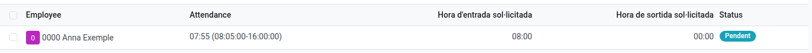

[Català](../../ca/head_of_studies/attendance-corrections.md) | [Castellano](attendance-corrections.md) | [English](../../en/head_of_studies/attendance-corrections.md)

---

# Decidir sobre solicitudes de corrección de fichajes

Los profesores pueden solicitar una corrección de una hora de entrada/salida de su propio fichaje. Esta página explica cómo decidir sobre las solicitudes que te llegan, y cómo hacer una solicitud en nombre de otra persona. Consulta el [manual de Profesores](../teachers/attendance-corrections.md) para ver cómo se hace la solicitud.

**Rol necesario:** Jefatura de Estudios, Jefatura de Estudios Adjunta, Dirección o Administrador

---

## Crear una solicitud en nombre de otra persona

A diferencia de un profesor o profesora, que solo puede solicitar una corrección de su propio fichaje, tú puedes hacerlo para **cualquier** empleado o empleada:

1. Abre el fichaje de esa persona (por ejemplo, desde **Fichajes de empleados → Asistencia → Resumen**, o desde su ficha).
2. Haz clic en **Solicitar corrección** en la cabecera — el mismo botón y formulario que usaría un profesor o profesora para su propio fichaje.
3. Rellena la hora de entrada/salida solicitada y el motivo, y **Guarda**.

La solicitud sigue el mismo proceso de revisión que cualquier otra — incluido, si tú no eres quien debe decidir, que se envíe a quien corresponda.

---

## Decidir una solicitud

Si te han enviado una solicitud (la verás como una actividad pendiente, y también aparecerá en **Fichajes de empleados → Asistencia → Solicitudes de corrección**):

1. Abre la solicitud — desde la actividad, desde **Fichajes de empleados → Asistencia → Solicitudes de corrección**, o desde el botón **Correcciones** del propio fichaje.

   > La lista muestra solo las solicitudes **Pendientes** por defecto, para no tener que revisar las que ya tienen una decisión. Quita el filtro **Pendiente** (o cambia al filtro **Aceptada**/**Rechazada**) para ver el resto.

   
2. Revisa la hora original frente a la solicitada, y el motivo indicado.

   > Una solicitud que solo muestra una hora de entrada solicitada, sin salida, es normal cuando el profesor o profesora todavía estaba fichado/a y dentro de su horario laboral en el momento de pedir la corrección — no es una solicitud incompleta.
3. Haz clic en **Aceptar** para aplicar la corrección al fichaje, o en **Rechazar** para dejarlo sin cambios (o restaurarlo, si estás deshaciendo una aceptación anterior). Puedes dejar una nota opcional para el profesor o profesora.
4. El profesor o profesora que hizo la solicitud recibe una notificación automática con tu decisión.

> ¿Te has equivocado? Los botones **Aceptar** y **Rechazar** siguen disponibles después de decidir, así que puedes cambiar de opinión en cualquier momento — pulsar el otro botón revierte la decisión anterior.

> Cualquier Jefatura de Estudios, Adjunto/a, Dirección o Administrador puede decidir sobre cualquier solicitud pendiente — en esta primera versión no está restringido solo a "tus" profesores.

---

[← Volver a los manuales de Jefatura de Estudios](index.md)
