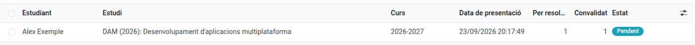
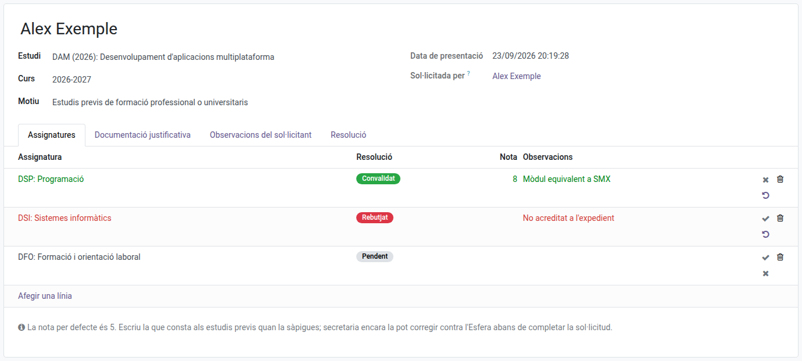

[Català](../../ca/head_of_studies/convalidations.md) | [Castellano](convalidations.md) | [English](../../en/head_of_studies/convalidations.md)

---

# Convalidaciones: validar las solicitudes

Valida las convalidaciones de módulos que el alumnado de formación profesional solicita desde el portal, y ponles la nota. Una vez validadas, secretaría las registra en Esfera y las completa.

**Rol necesario:** Jefatura de Estudios, Jefatura de Estudios Adjunta o Dirección.

---

## El circuito

| Estado | Quién actúa |
|--------|-------------|
| **Pendiente** | El alumno ha hecho la solicitud y la tienes que revisar tú. |
| **En proceso** | La has validado; está en manos de secretaría. |
| **Completada** | Secretaría la ha registrado en Esfera. El alumno ya ve la nota. |
| **Rechazada** | La puedes rechazar tú, mientras está pendiente, o secretaría, una vez validada. |
| **Anulada** | El alumno la ha anulado desde el portal. |

---

## Acceso

Navega a: **Gestión académica → Convalidaciones**

La lista se abre con las solicitudes **Pendientes de jefatura de estudios** y **Pendientes de secretaría**. Quita los filtros para verlas todas, o usa **Completadas**, **Rechazadas** y **Anuladas**.

Para ver las solicitudes de un alumno, abre su ficha y haz clic en el botón **Convalidaciones**.

Si tienes configurada la tarea **Revisar solicitud de convalidación** en **Gestión académica → Configuración → Asignación de tareas**, cada solicitud nueva aparece también en tu bandeja de actividades.

---

## Revisar una solicitud

Abre la solicitud desde la lista. El formulario muestra:

- **Estudio**, **Curso** y **Motivo** de la solicitud.
- Bajo el nombre del alumno, el aviso **Tiene una titulación obtenida en el centro** cuando en el historial académico consta un título obtenido aquí.
- Pestaña **Asignaturas**: una línea por cada módulo solicitado, con la resolución, la nota y las observaciones.
- Pestaña **Documentación justificativa**: los archivos adjuntados por el alumno.
- Pestaña **Observaciones del solicitante**: lo que ha escrito el alumno o la familia.
- Pestaña **Resolución**: observaciones para el alumno, que se envían con la resolución.

---

## Resolver los módulos y ponerles la nota

En cada línea de la pestaña **Asignaturas**, usa los botones de la derecha:

| Botón | Resultado |
|-------|-----------|
| ✔ (Convalidar) | El módulo queda convalidado. |
| ✖ (Rechazar) | El módulo no se convalida. |
| ↺ (Volver a pendiente) | Deshace la resolución de la línea. |

Para convalidar de una vez todos los módulos que siguen pendientes, haz clic en **Convalidar los módulos pendientes**.

En la columna **Nota** de cada módulo convalidado hay un 5 por defecto: escribe la nota que consta en los estudios previos. Secretaría todavía puede corregirla contra Esfera antes de completar la solicitud.

En la columna **Observaciones** escribe de dónde sale la resolución, por ejemplo *Aprobada por el Departamento de Educación con expediente n.º 1234*. El alumno la ve con la resolución.

---

## Pedir documentación al alumno

Haz clic en **Pedir información**, escribe qué necesitas y envíalo. El alumno (o la familia, si es menor) recibe un correo y puede responder y adjuntar los documentos desde el portal, en la misma solicitud. La solicitud se queda donde estaba.

---

## Validar o rechazar la solicitud

Cuando todos los módulos estén resueltos, haz clic en **Validar**:

- Si hay alguno convalidado, la solicitud pasa a **En proceso** y secretaría recibe la tarea de registrarla en Esfera.
- Si los has rechazado todos, la solicitud queda **Rechazada** y el alumno recibe la resolución por correo.

**Rechazar** cierra la solicitud entera e informa al alumno.

La nota no llega a las calificaciones del alumno hasta que secretaría completa la solicitud. A partir de ese momento, cada módulo convalidado muestra la nota con la marca **CV** en las pantallas de calificaciones y en el historial académico.

---

## Registrar una solicitud en papel

1. Haz clic en **Nuevo**.
2. Elige el **Estudiante**, el **Estudio** y el **Motivo**.
3. En la pestaña **Asignaturas**, haz clic en **Agregar una línea** y elige cada módulo.
4. En la pestaña **Documentación justificativa**, sube los documentos.
5. Haz clic en **Guardar**.

---

## Anular y reabrir

- **Anular la solicitud** está disponible mientras la solicitud es **Pendiente**.
- **Reabrir** devuelve una solicitud anulada a **Pendiente**.

---

## Estudios que admiten convalidaciones

Solo pueden recibir solicitudes los estudios de los niveles que tienen marcado **Admite convalidaciones** (por defecto, CFGM y CFGS). Consulta [Niveles](../admin/curriculum-levels.md).

---

[← Volver al índice de Jefatura de Estudios](index.md)
