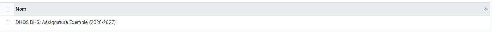
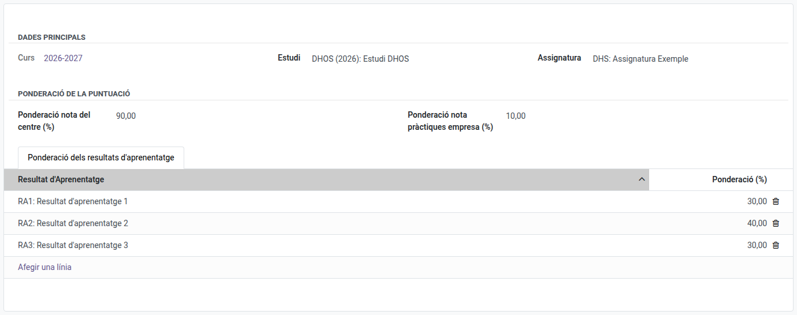

[Català](../../ca/head_of_studies/planning.md) | [Castellano](planning.md) | [English](../../en/head_of_studies/planning.md)

---

# Programaciones docentes: definir las ponderaciones de la calificación

Esta guía explica cómo el jefe de estudios y el jefe de estudios adjunto crean y editan las
**programaciones docentes**: la configuración con la que se calculan las notas de cada módulo.

---

## Contenido

1. [Acceso](#acceso)
2. [Qué es una programación](#qué-es-una-programación)
3. [Encontrar una programación](#encontrar-una-programación)
4. [Editar una programación](#editar-una-programación)
5. [Crear una programación](#crear-una-programación)
6. [Qué no puedes hacer](#qué-no-puedes-hacer)

---

## Acceso

**Planificación y calificación → Programaciones docentes**

Puedes ver y editar todas las programaciones del centro. El profesorado solo puede consultar las
de las asignaturas que imparte, sin modificarlas.

## Qué es una programación

Una programación es la configuración de la calificación de una asignatura, en un estudio, para
un curso académico concreto:

- **Ponderación nota del centro (%)** y **Ponderación nota prácticas empresa (%)**: qué parte de
  la nota final sale de la evaluación del centro y cuál de las prácticas en la empresa. Deben
  sumar 100.
- **Ponderación de los resultados de aprendizaje**: dentro de la parte del centro, qué peso tiene
  cada resultado de aprendizaje (RA). También deben sumar 100.

Las pantallas de calificación del profesorado la usan para calcular la nota del centro y la nota
final de cada módulo, y una revisión de notas de un curso cerrado usa la programación de ese
mismo curso.

Una programación pertenece a un curso, que se muestra en el campo **Curso** (solo lectura).
Cambiar los pesos de este curso nunca cambia cómo se calcularon las notas de un curso pasado.
Cuando la transición de curso pasa un estudio al curso siguiente, copia automáticamente sus
programaciones al curso nuevo, de modo que solo hay que editar las que cambian.

## Encontrar una programación

La lista se abre con dos filtros activados:

- **Mostrar solamente los míos**: solo las asignaturas que impartes tú. Quita esta faceta de la
  barra de búsqueda para ver todas las programaciones del centro.
- **Mostrar solamente el curso actual**: solo las programaciones del curso académico actual.
  Quítala para llegar a las de los cursos anteriores.

Cada programación lleva el nombre de su estudio, su asignatura y su curso.

## Editar una programación

1. Abre la programación.
2. Cambia la **Ponderación nota del centro (%)** y la **Ponderación nota prácticas empresa (%)**,
   si hace falta.
3. En la pestaña **Ponderación de los resultados de aprendizaje**, cambia la **Ponderación (%)**
   de cada resultado de aprendizaje. Para añadir uno que no está (por ejemplo, uno que se ha
   añadido al currículo del módulo), haz clic en **Añadir una línea**; para quitar uno, haz
   clic en la papelera al final de su fila.
4. Guarda. Si alguna de las dos parejas de valores no suma 100, la programación no se guarda y
   un mensaje te indica cuál debes corregir.

El panel de historial junto al formulario registra cada cambio: quién ha cambiado el estudio, la
asignatura, el curso o las ponderaciones del centro y de la empresa, y cuándo.

## Crear una programación

1. Haz clic en **Nuevo**.
2. Elige el **Estudio** y después la **Asignatura** (solo se ofrecen las de ese estudio). La
   programación se crea en el curso actual.
3. Los resultados de aprendizaje de la asignatura se rellenan automáticamente, con el peso
   repartido a partes iguales. Ajústalos si hace falta.
4. Guarda.

Cada estudio y asignatura solo puede tener una programación por curso.

## Qué no puedes hacer

- **Eliminar una programación**: solo puede hacerlo la administración académica.
- **Cambiar el curso de una programación**: siempre es el curso en el que se creó.

---

[← Volver al índice de jefatura de estudios](index.md)
