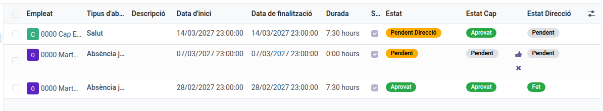

[Català](../../ca/secretary/absences.md) | [Castellano](absences.md) | [English](../../en/secretary/absences.md)

---

# Aprobar las ausencias del personal PAS

**Rol necesario:** responsable del área ASP

---

## Quién aprueba al PAS

Las ausencias del personal de administración y servicios las aprueba quien figura como **responsable del área** del departamento ASP.

Pertenecer a secretaría no da ese permiso: el resto del equipo pide sus ausencias como cualquier otra persona del centro y no aprueba ninguna.

---

## Aprobar o rechazar

**Asistencia del personal > Ausencias > Administración > Ausencias**.

Ahí salen solo las solicitudes de tu área, en estado **Pendiente** mientras esperan decisión.

Tienes acceso al motivo escrito y al justificante de tu gente, y puedes ajustar los campos **Suma las horas al informe mensual**, **Se tramita por ATRI** y **¿Día entero?**, además de corregir el tipo de ausencia.

**Rechazar es definitivo**, y pide confirmación antes: una vez rechazas una solicitud, ni tú ni la persona podéis devolverla a *Pendiente*, así que tendría que hacer una nueva. El justificante, en cambio, se puede adjuntar en cualquier momento, también en una solicitud ya aprobada.

Aprobar es tu mitad: Dirección también aprueba cada ausencia, en la columna **Estado Dirección**, que ves pero no puedes modificar. La columna **Estado** combina las dos.

El detalle de estos campos y de los dos informes está en el manual de [Jefatura de Estudios](../head_of_studies/absences.md), y se aplica igual a tu área.

---

## Tus propias ausencias

Se piden como las de cualquier otra persona — consulta [Solicitar una ausencia](../teachers/absences.md). Al ser responsable de área, tu solicitud la resuelve Dirección.
