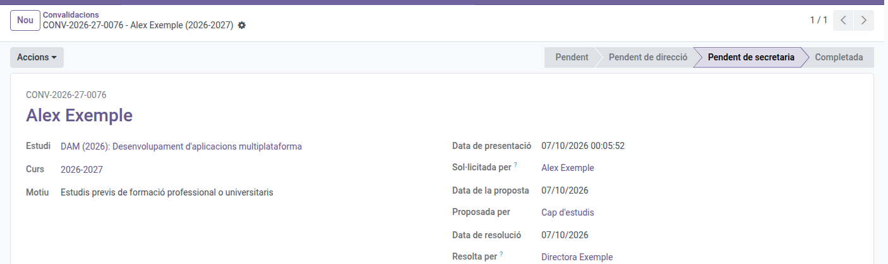

[Català](../../ca/secretary/convalidations.md) | [Castellano](convalidations.md) | [English](../../en/secretary/convalidations.md)

---

# Convalidaciones: registrar las resoluciones

Registra en Esfera las convalidaciones ya resueltas y ciérralas en el EMS, para que el alumno reciba la resolución y vea la nota.

**Rol necesario:** Secretaría.

---

## Cuándo te toca a ti

Una solicitud llega a secretaría cuando ya está resuelta y pasa al estado **Pendiente de secretaría**. Puede llegar por dos caminos:

- **Resuelta por el centro:** Dirección ha emitido la resolución oficial. El PDF de la resolución está en el campo **Resolución** del formulario.
- **Resuelta por el Ministerio:** Jefatura de Estudios ha registrado el resultado del Ministerio. Si la ha subido, la resolución del Ministerio también está en el campo **Resolución**.

Cada solicitud resuelta aparece en la bandeja de actividades (🕒) de todo el personal de secretaría. Cuando alguien la registra, la tarea desaparece de la bandeja de todos.

---

## Acceso

Navega a: **Gestión académica → Convalidaciones** y aplica el filtro **Pendiente de secretaría**. También puedes buscar una solicitud por su **número de registro** (por ejemplo CONV-2026-27-0001).

Para ver las solicitudes de un alumno, abre su ficha y haz clic en el botón **Convalidaciones**.

---

## Registrar una resolución

1. Abre la solicitud.
2. Haz clic en el nombre del fichero del campo **Resolución** para abrir el PDF en una pestaña nueva, y comprueba en la pestaña **Asignaturas** qué módulos están convalidados y con qué nota.
3. Registra la resolución en Esfera.
4. En **Acciones**, elige **Registrada en Esfera** y confirma.

La resolución ya es oficial: ni los módulos, ni las notas, ni los motivos de denegación se pueden cambiar.

Al registrarla:

- La solicitud queda **Completada** si hay algún módulo convalidado, o **Rechazada** si no hay ninguno.
- El alumno recibe un correo con la resolución y el PDF adjunto. También lo recibe la familia si el alumno es menor de edad o si ha autorizado compartir la información con ella.
- El alumno deja de cursar cada módulo convalidado: se le borra la matrícula del módulo, de modo que sale de las listas de asistencia y de la sesión de notas abierta, aunque el profesor ya le hubiera puesto alguna nota.
- El profesorado del módulo y el tutor del grupo reciben una actividad **Asignatura convalidada** en la bandeja (🕒).
- El historial académico recoge el módulo como aprobado, con la nota, la marca **CV** y el número de registro.

---

## Registrar una solicitud recibida en papel

1. Haz clic en **Nuevo**.
2. Elige el **Estudiante**, el **Estudio**, el **Curso** y el **Motivo**, y escribe las observaciones del solicitante si las hay.
3. En la pestaña **Asignaturas**, añade una línea por cada módulo solicitado.
4. En la pestaña **Documentación justificativa**, sube los documentos.
5. Haz clic en **Guardar**.

La solicitud queda **Pendiente**, a la espera de que la revise Jefatura de Estudios. Una vez guardada, el alumno, el estudio, el curso, el motivo y las observaciones ya no se pueden cambiar.

Puedes registrar una solicitud, y tramitar cualquiera, en cualquier momento: el periodo de solicitud del portal (ver [Configuración de convalidaciones](../admin/convalidation-settings.md)) solo limita las solicitudes nuevas del alumnado y las familias.

---

[← Volver al índice de Secretaría](index.md)
