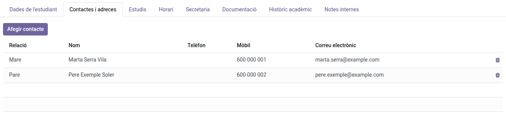
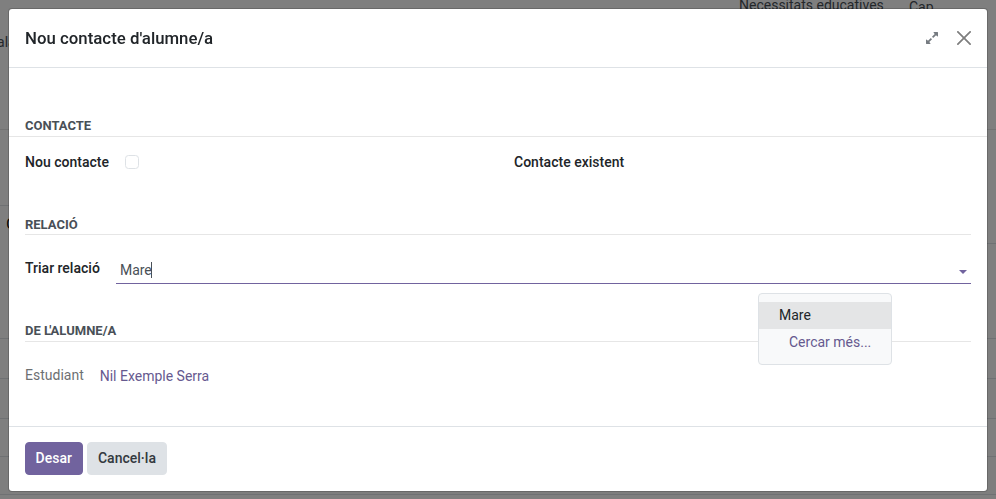
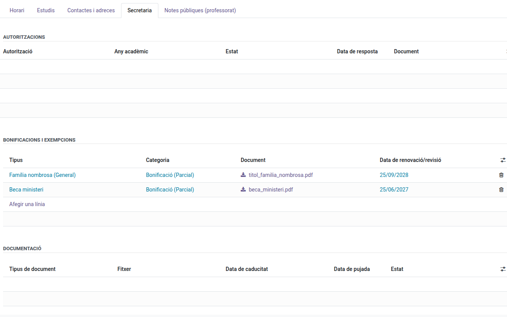

[Català](../../ca/secretary/student-contacts.md) | [Castellano](student-contacts.md) | [English](../../en/secretary/student-contacts.md)

---

# Gestión de contactos de alumnado y familia

Esta guía explica cómo gestionar los contactos de tipo **alumno, familia, aspirante y proveedor**: cómo cambia el tipo de contacto a medida que avanza por el centro, cómo vincular un familiar a un alumno y cómo registrar bonificaciones y exenciones.

---

## Contenido

1. [Tipos de contacto](#tipos-de-contacto)
2. [Añadir un contacto familiar a un alumno](#añadir-un-contacto-familiar-a-un-alumno)
3. [Matricular a un alumno en asignaturas](#matricular-a-un-alumno-en-asignaturas)
4. [Bonificaciones y exenciones](#bonificaciones-y-exenciones)
5. [Filtros aplicados al abrir la lista de alumnado](#filtros-aplicados-al-abrir-la-lista-de-alumnado)
6. [Columnas que se muestran en la vista de lista de alumnado](#columnas-que-se-muestran-en-la-vista-de-lista-de-alumnado)
7. [Campos que solo ven admin/secretaría/Jefatura de Estudios/tutores](#campos-que-solo-ven-adminsecretaríajefatura-de-estudiostutores)

---

## Tipos de contacto

Cada persona o entidad en EMS es un contacto con un **tipo**: Alumno, Familia, Aspirante, Extitulado, Baja o Proveedor. El tipo de un contacto cambia automáticamente a medida que avanza por su recorrido habitual — un aspirante pasa a alumno una vez admitido, un alumno pasa a extitulado (si se ha graduado) o baja (si no lo ha hecho) al marcharse, y ambos pueden volver a ser alumno en una nueva matrícula. Añadir un contacto nuevo bajo un alumno o proveedor existente (desde la pestaña "Contactos y direcciones") le asigna automáticamente el tipo Familia o Proveedor — nunca hace falta elegirlo manualmente ahí.

**ID de estudiante (IDALU).** Rellene el campo **ID de estudiante** (pestaña **Datos del estudiante**) al crear un alumno: EMS no guarda un alumno nuevo sin él. Cada IDALU pertenece a un único contacto de todo el centro, archivados incluidos — si escribe uno que ya está en uso, EMS le indica qué contacto lo tiene (por ejemplo, un antiguo alumno que vuelve): abra esa ficha en lugar de crear una nueva. Una vez un alumno tiene ID de estudiante, se puede corregir, pero ya no se puede volver a dejar vacío.

Una ficha de alumno que ya existía sin ID de estudiante sigue funcionando con normalidad — edición, cambio de curso, baja, graduación — no hace falta rellenarlo a mano solo porque falte; EMS lo guardará la próxima vez que disponga de uno para ese alumno.

> **Desde la versión 18.0.0.25.0:** el ID de estudiante es obligatorio para los alumnos nuevos y único para todos los contactos.

> Cómo marcar una graduación o tramitar una baja, y todo lo que ocurre con los datos de un alumno al hacerlo, se documenta en [Marcar una graduación y tramitar una baja](graduation-withdrawal.md).

## Añadir un contacto familiar a un alumno

Abre la ficha del alumno y, en la pestaña **Contactos y direcciones**, haz clic en **Añadir contacto**:

- Elige la **relación** (Padre, Madre, Tutor legal, Hermano/a…).
- Puedes elegir un contacto **ya existente** en EMS, o rellenar los datos de uno **nuevo** — un contacto nuevo necesita como mínimo un nombre o apellido, un documento de identificación (DNI/NIE o pasaporte) y una vía de contacto (teléfono, móvil o correo).
- Guarda. La nueva relación aparece inmediatamente en la lista de contactos del alumno, con la dirección del alumno precargada (editable si el familiar vive en otro lugar).

La misma relación también aparece en la ficha del familiar, indicando con qué alumno(s) está relacionado.

> **Desde la 18.0.0.26.0:** cualquier dirección de correo introducida en un contacto (personal o del alumno/corporativa) debe tener un formato válido (`nombre@dominio`) — EMS no permite guardar un valor que no lo sea, como un número de teléfono escrito por error en el campo equivocado.

El **correo personal** de un alumno, aspirante o familiar no puede ser una dirección del dominio del centro (por ejemplo, `@elpuig.xeill.net`): esa es la cuenta corporativa, que EMS crea y gestiona por sí mismo (se muestra como **Correo corporativo**). EMS no permite guardarlo y pide una dirección personal.

**Para quitar un familiar**, pulsa el icono de la papelera de su fila y confirma con **Aceptar**. El familiar deja de estar vinculado al alumno. Si no queda relacionado con ningún otro alumno y no tiene usuario (acceso al portal), también se borra su contacto; si no, se conserva.

## Matricular a un alumno en asignaturas

El grupo principal de un alumno (pestaña **Estudios**) no lo matricula por sí solo en ninguna asignatura — es un paso independiente, justo debajo, en la misma pestaña: añade una línea por asignatura, eligiendo la asignatura y el grupo en el que se imparte (normalmente el grupo principal del alumno, pero uno distinto si cursa la asignatura en otro grupo, por ejemplo un grupo de refuerzo). Una vez añadida una asignatura aquí, el alumno empieza a aparecer en las hojas de asistencia y en las sesiones de evaluación de esa asignatura. Una asignatura ya añadida no se puede volver a elegir — desaparece automáticamente de la lista de selección.

Eliminar una línea de asignatura queda bloqueado una vez que el alumno ya tiene notas registradas para ella, para evitar perder trabajo evaluado sin querer — desmatricula antes de que se introduzca ninguna nota si hace falta corregir un error.

**Cambiar el grupo principal de un alumno también mueve sus matrículas por asignatura.** Si cambias el campo **Grupo principal** (pestaña Estudios), cualquier matrícula que estuviera en el grupo antiguo pasa automáticamente al grupo nuevo — una asignatura ya matriculada a través de un grupo distinto (por ejemplo, un grupo de refuerzo) se mantiene igual. Esto se rechaza, por el mismo motivo que arriba, si alguna asignatura del grupo antiguo ya tiene notas registradas. El tutor/a del grupo también puede hacerlo, para sus propios alumnos tutorizados — ver [Cambiar el grupo de un alumno](../tutors/change-student-group.md).

**Cambiar el estudio de un alumno actualiza sus matrículas por asignatura a partir de la plantilla de matrícula del nuevo estudio.** Cambia el campo **Estudios** en sí (no solo el Grupo principal) y, al guardar, EMS elige automáticamente el primer grupo del nuevo estudio (por orden alfabético) como nuevo Grupo principal y regenera las líneas de matrícula por asignatura a partir de la plantilla de matrícula configurada para ese estudio y curso — las mismas asignaturas que ofrecería una propuesta de matrícula para ese estudio/curso. Si el nuevo estudio todavía no tiene ningún grupo, no se matricula nada automáticamente hasta que se cree uno; añade entonces las líneas de asignatura a mano. Las matrículas antiguas que no formen parte de la nueva plantilla se eliminan, salvo las que ya tengan notas registradas — esas se mantienen tal cual y se anotan en el registro de mensajes (chatter) del alumno para que las revises a mano. Si el alumno ya tenía Grupo principal y cambias **Estudios** y **Grupo principal** a la vez en el mismo guardado, sus matrículas antiguas se mueven al grupo nuevo en lugar de regenerarse a partir de la plantilla — ver "Cambiar el grupo principal de un alumno" justo arriba.

**La misma colocación automática también ocurre al colocar a un alumno por primera vez** — ya sea al crear la ficha de un alumno nuevo, o al rellenar el campo **Estudios** de un alumno o solicitante existente que nunca había tenido Grupo principal. Pon **Estudios** (dejando el Grupo principal vacío) y, al guardar, EMS elige automáticamente el Grupo principal y genera las matrículas por asignatura a partir de la plantilla de ese estudio — sin ningún paso adicional. **También puedes rellenar tú mismo el Grupo principal en el mismo guardado** (la forma habitual de completar la pestaña Estudios en orden) — como no hay ningún grupo anterior del que mover matrículas, EMS igualmente genera las matrículas por asignatura a partir de la plantilla, usando el Grupo principal que hayas elegido.

## Bonificaciones y exenciones

Los **beneficios** de cuota de un alumno (bonificaciones, que descuentan parte de la cuota de matrícula, y exenciones, que la eximen totalmente) se registran en la pestaña **Secretaría** de la ficha del alumno:

- Añade una línea por beneficio, eligiendo su **tipo** (familia numerosa, familia monoparental, beca del ministerio, discapacidad, otros) y adjuntando el **documento justificativo**.
- La **fecha de renovación/revisión** se precarga automáticamente (9 meses para una beca, 2 años para el resto) pero se puede ajustar.
- El distintivo de **Beneficios** del alumno (visible en la ficha) refleja el beneficio de mayor prioridad registrado: una exención siempre tiene preferencia sobre una bonificación.

Que un beneficio cambie realmente la cuota de matrícula depende del estado de la matrícula correspondiente: un beneficio registrado **antes** de que la matrícula se confirme se aplica a ella inmediatamente; uno registrado **después de confirmarla** no modifica retroactivamente su importe — hay que volver a aplicarlo explícitamente (desde la matrícula). Consulta el manual de la matrícula para esa acción.

## Filtros aplicados al abrir la lista de alumnado

La barra de búsqueda se abre con dos filtros ya aplicados: **Alumnado**, que oculta al alumnado antiguo, y **Mi alumnado**, que limita la lista a los grupos de quien esté conectado. Como secretaría y administración no están asignadas a ningún grupo, **Mi alumnado** no te oculta nada — con el filtro puesto la lista muestra igualmente todo el alumnado. Quita cualquiera de los dos filtros haciendo clic en su **×**.

## Columnas que se muestran en la vista de lista de alumnado

Cambiar la pantalla de Alumnado de vista Kanban a vista de Lista muestra, por defecto, la mayoría de campos ya usados en la exportación oficial de datos de alumnado del centro (documento de identidad/DNI-NIE, fecha de nacimiento, si el alumno es mayor de edad, número de la seguridad social, nacionalidad, dirección y código postal), más los cuatro distintivos de autorización (derechos de imagen, salidas escolares, datos de salud, compartir con la familia). Cualquier columna se puede ocultar — haz clic en el icono a la derecha de las cabeceras de columna y desmarca las que no necesites; la elección se recuerda para tu próxima visita.

## Campos que solo ven admin/secretaría/Jefatura de Estudios/tutores

Los datos personales (documentos, información médica, necesidades educativas especiales, autorizaciones…) quedan ocultos para cualquier persona que no sea admin, secretaría, Jefatura de Estudios/Jefatura de Estudios Adjunta/Dirección, ni el tutor propio del alumno. Jefatura de Estudios/Jefatura de Estudios Adjunta/Dirección tienen el mismo acceso completo que secretaría aquí, para **cualquier** alumno de todo el centro, no solo sus propios tutorizados. Un tutor también puede editar la ficha de un alumno que tutoriza y la de sus familiares, pero ve un conjunto de campos editables más reducido que secretaría/admin/Jefatura de Estudios. También puede añadir y quitar los contactos familiares de los alumnos que tutoriza. Orientación ve y edita las necesidades educativas especiales de cualquier alumno.

---

[← Volver al índice de Secretaría](index.md)
