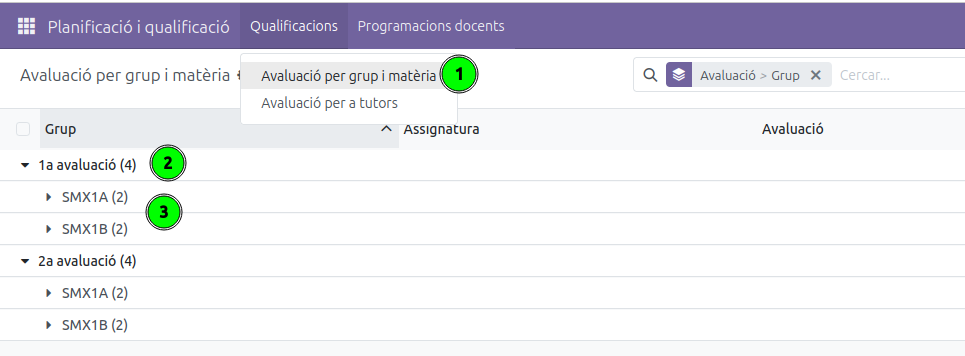
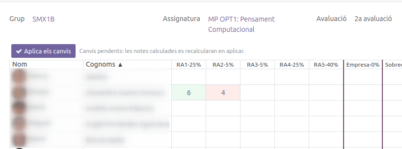
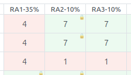
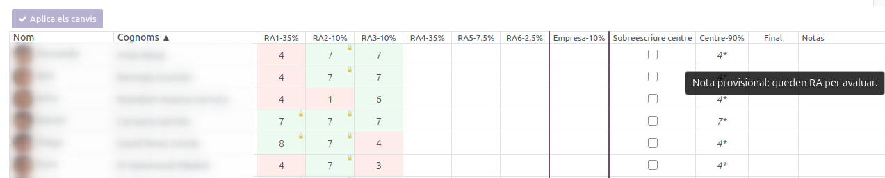
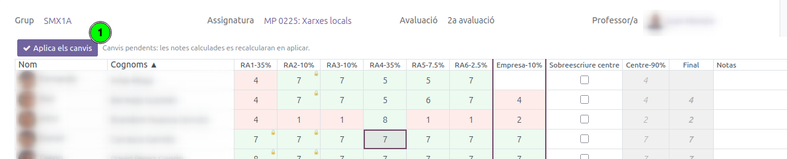
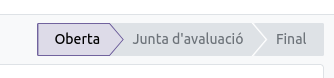

[Català](../../ca/teachers/qualificacions.md) | [Castellano](qualificacions.md) | [English](../../en/teachers/qualificacions.md)

---

# Evaluación: Introducir calificaciones por RAs

Esta guía explica cómo el profesorado introduce y consulta las notas de sus módulos en la vista **Evaluación por grupo y materia**, donde cada alumno se califica **resultado de aprendizaje (RA) por RA** y el sistema calcula la nota del módulo.

---

## Índice

1. [Acceso](#acceso)
2. [Encontrar tu sesión de evaluación](#encontrar-tu-sesión-de-evaluación)
3. [La cuadrícula de calificaciones](#la-cuadrícula-de-calificaciones)
4. [Introducir las notas de los RA](#introducir-las-notas-de-los-ra)
5. [RA bloqueados](#ra-bloqueados)
6. [Las columnas de nota del módulo](#las-columnas-de-nota-del-módulo)
7. [Notas provisionales](#notas-provisionales)
8. [Aplicar los cambios](#aplicar-los-cambios)
9. [Estados de la evaluación](#estados-de-la-evaluación)
10. [Cómo se calcula la nota](#cómo-se-calcula-la-nota)

---

## Acceso

**Planificación y calificación → Calificaciones → Evaluación por grupo y materia**

---

## Encontrar tu sesión de evaluación

La vista muestra la lista de **sesiones de evaluación** agrupada primero por **Evaluación** (1a, 2a…) y después por **Grupo**, para que localices rápidamente la que buscas.

Cada sesión corresponde a una combinación de **grupo + módulo + evaluación**. Despliega la evaluación y el grupo y haz clic en la fila de tu módulo para abrirla.

> **Consejo:** Puedes filtrar o buscar por grupo, módulo o evaluación en la barra superior. La columna **Estado** muestra si la sesión está abierta, en junta o finalizada (véase [Estados de la evaluación](#estados-de-la-evaluación)).

---

## La cuadrícula de calificaciones

Al abrir la sesión se muestra una cuadrícula tipo hoja de cálculo:

- **Filas:** un alumno por fila, con foto, nombre y apellidos.
- **Columnas de RA:** una columna por cada resultado de aprendizaje del módulo, con su acrónimo y su peso (por ejemplo, **RA1-60%**).
- **Columna Empresa:** la nota de prácticas en empresa (parte externa), cuando el módulo la tiene.
- **Columnas de nota del módulo:** **Sobrescribir centro**, **Centro**, **Final** y **Comentarios** (véase [Las columnas de nota del módulo](#las-columnas-de-nota-del-módulo)).

Los colores de las celdas te ayudan a leerla de un vistazo:

- **Verde:** nota igual o superior a 5 (aprobado).
- **Rojo:** nota inferior a 5 (suspenso).
- **Blanco:** todavía sin informar.

---

## Introducir las notas de los RA

La cuadrícula funciona como una hoja de cálculo. Para introducir las notas:

- **Escribir:** haz clic en una celda y empieza a teclear, o haz doble clic (o pulsa **Enter**) para editar su valor.
- **Moverte:** usa las **flechas** del teclado; con **Enter** bajas a la fila siguiente y con **Tab** pasas a la columna de la derecha.
- **Borrar:** selecciona la celda y pulsa **Supr**.
- **Pegar desde una hoja de cálculo:** copia un bloque de notas (por ejemplo desde un Excel o Google Sheets) y pégalo (**Ctrl+V**) sobre la celda de inicio; el bloque se rellena automáticamente hacia abajo y hacia la derecha.

Las notas son números enteros del **0 al 10**.

> **Importante:** Los cambios que haces en la cuadrícula **no se guardan** hasta que pulsas **Aplicar los cambios** (véase [Aplicar los cambios](#aplicar-los-cambios)).

---

## RA bloqueados

Si un alumno **ya aprobó un RA en una evaluación anterior** (nota igual o superior a 5), ese RA no se puede volver a evaluar. La celda aparece en **verde con un candado** y muestra la nota que ya tenía; no se puede editar, borrar ni pegar encima.

Los RA que en una evaluación anterior quedaron **suspensos** (nota inferior a 5) sí se pueden volver a evaluar: la celda parte de la nota anterior pero la puedes modificar.

---

## Las columnas de nota del módulo

A la derecha de las columnas de RA están las columnas que resumen la nota del módulo:

| Columna | Significado |
|---------|-------------|
| **Empresa** | Nota de prácticas en empresa (parte externa). Se informa manualmente, como un RA más. |
| **Sobrescribir centro** | Casilla para **sobrescribir la nota del centro**. Al marcarla, puedes fijar manualmente la nota del centro en lugar de dejar que se calcule a partir de los RA. |
| **Centro** | **Nota del centro**, calculada automáticamente a partir de los RA según sus pesos. |
| **Final** | **Nota final** del módulo, que combina la nota del centro y la de empresa según los porcentajes de la planificación. |
| **Comentarios** | Observación libre por alumno (opcional). |

---

## Notas provisionales

Mientras **queden RA por evaluar**, la nota del centro (y la final) se muestran **en cursiva y con un asterisco** (`*`). Significa que es una nota **provisional**: se ha calculado solo con los RA ya evaluados y puede cambiar cuando informes los que faltan.

Cuando todos los RA están evaluados, la nota deja de ser provisional y se muestra en formato normal.

---

## Aplicar los cambios

La cuadrícula trabaja con un **borrador local**: todo lo que escribes, pegas o borras se guarda temporalmente y no se envía al sistema hasta que pulsas el botón **Aplicar los cambios**.

- Mientras haya cambios pendientes, las columnas calculadas (Centro, Final) se muestran en **gris** hasta que aplicas.
- Al pulsar **Aplicar los cambios**, se guarda todo de golpe y el sistema recalcula las notas del módulo.
- Si intentas **salir de la vista sin aplicar**, el sistema te avisa para que no pierdas el trabajo.

---

## Estados de la evaluación

Cada sesión de evaluación tiene un **estado** que determina quién la puede editar:

| Estado | Quién puede editar |
|--------|--------------------|
| **Abierta** | El profesorado y el tutor del grupo pueden introducir y modificar notas. |
| **Junta de evaluación** | Solo el **tutor del grupo** (y la administración) puede editar; el profesorado solo consulta. |
| **Finalizada** | Solo la **administración**. |

El estado lo cambia la administración. Si la sesión está en junta o finalizada y no tienes permiso, verás las notas pero no las podrás modificar.

---

## Cómo se calcula la nota

- **Nota del centro:** media ponderada de los RA **evaluados** según sus pesos, en escala del 0 al 10. Si falta algún RA por evaluar, se calcula solo con los evaluados y es **provisional**. Si algún RA evaluado está suspenso (inferior a 5), la nota del centro queda **limitada a 4** (no se puede aprobar el módulo con un RA suspenso o pendiente).
- **Nota de prácticas en empresa:** se informa manualmente en la columna **Empresa**.
- **Nota final:** combina la nota del centro y la de empresa según los porcentajes de la planificación. Para aprobar el módulo hay que **aprobar ambas partes**; si una parte está suspensa, la nota final queda limitada a 4.
- **Sobrescribir la nota del centro:** si marcas la casilla **Sobrescribir centro**, puedes fijar manualmente la nota del centro en lugar de dejar que se calcule a partir de los RA.

---

[← Volver al índice de profesores](index.md)
