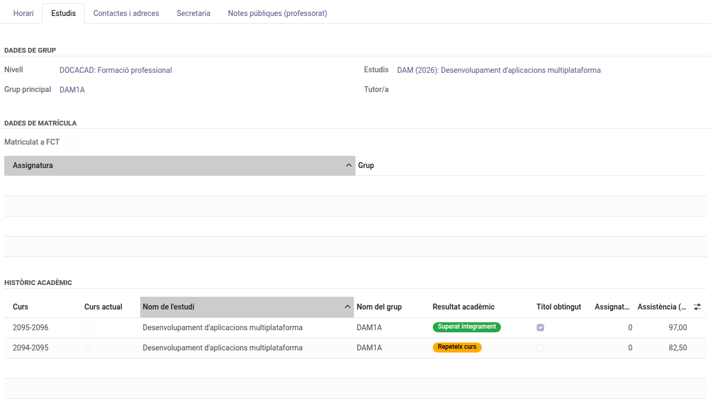

[Català](../../ca/teachers/student-academic-data.md) | [Castellano](student-academic-data.md) | [English](../../en/teachers/student-academic-data.md)

---

# Consultar los datos académicos de un alumno

**Rol necesario:** Profesor (historial académico) · Orientación o Coordinador/a de convivencia (el resto de datos)

---

## Consultar el historial académico de un alumno

El historial académico es el registro congelado, curso a curso, de la trayectoria de un alumno: curso, estudios, grupo, tutor, resultado académico, título obtenido y porcentaje de asistencia. Cualquier profesor puede consultar el historial de cualquier alumno.

**Desde la ficha del alumno:** Comunidad Educativa → Alumnos → *[abre el alumno]* → pestaña **Historial académico**.

**Desde su propio menú:** Planificación y Calificación → Notas → **Historial académico**. La lista se abre agrupada por curso: haz clic en un curso para desplegarlo, o escribe el nombre del alumno en el buscador.

Es solo de lectura. Para corregir un registro, contacta con la Secretaría o con el Administrador.

Si un alumno tiene alguna asignatura convalidada durante el curso actual, el historial ya muestra un registro marcado como **Curso actual** con la nota de la convalidación y la marca **CV**. El resto del curso se añade cuando se cierra.

---

## Consultar los datos de cualquier alumno (Orientación y Convivencia)

Con el rol de **Coordinador/a de orientación** o de **Coordinador/a de convivencia**, consultas los datos de todo el alumnado del centro, no solo los de tus tutorandos:

- **Notas** — Planificación y Calificación → Notas → Evaluación por grupo y materia.
- **Historial académico** — tal como se ha descrito arriba.
- **Asistencia diaria y justificaciones** — Asistencia del alumnado.
- **Incidencias de asistencia** — Asistencia del alumnado → Incidencias.
- **Faltas de convivencia** — Convivencia.
- **Ficha del alumno** — Comunidad Educativa → Alumnos, incluida la pestaña **Secretaría** (bonificaciones, exenciones y autorizaciones de matrícula).

Todo es solo de lectura, salvo las necesidades educativas especiales para Orientación (ver el apartado siguiente), y no incluye facturas ni pagos.

---

## Indicar las necesidades educativas especiales de un alumno (Orientación)

Con el rol de **Coordinador/a de orientación**, indicas la tipología de necesidades educativas especiales (NEE) de cualquier alumno o solicitante del centro:

1. Comunidad Educativa → Alumnos → *[abre el alumno]*.
2. En la pestaña **Datos del estudiante**, en el campo **Necesidades educativas especiales**, elige **NEE-A** o **NEE-B**, o déjalo vacío si el alumno no tiene.
3. Pulsa **Guardar**.

En un solicitante, el campo está en la pestaña **Datos del solicitante**. El resto de la ficha sigue siendo de solo lectura.

---

## Encontrar un alumno

Gestión académica → Matrícula → **Alumnos** y escribe el nombre en el buscador. La lista muestra a todo el alumnado del centro.
