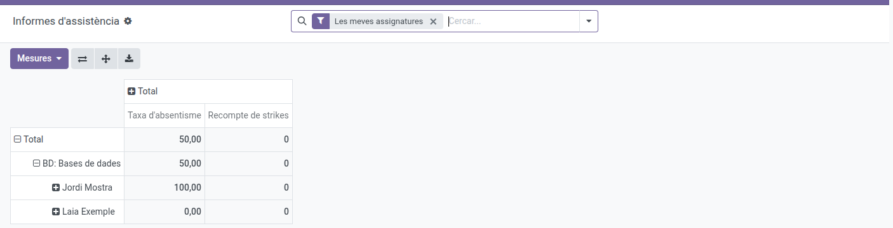
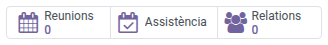
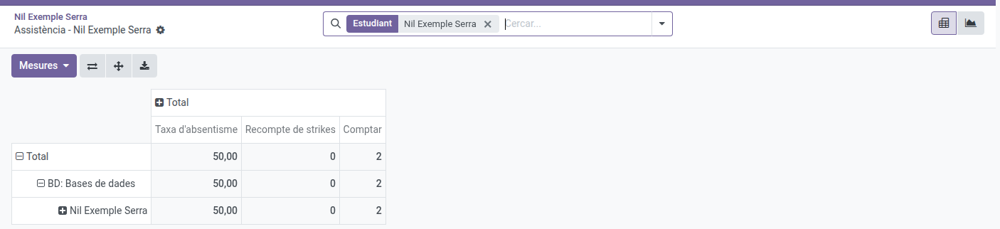
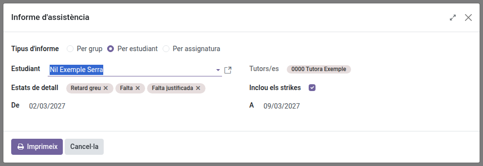

[Català](../../ca/tutors/attendance-reports.md) | [Castellano](attendance-reports.md) | [English](../../en/tutors/attendance-reports.md)

---

# Informes de asistencia

**Asistencia → Informes** abre la pantalla de **Informes de asistencia**: una tabla dinámica que puedes explorar y exportar tú mismo, además de 3 informes PDF imprimibles (por grupo, por alumno, por asignatura) accesibles desde su cabecera.

**Rol necesario:** Profesor/a (los tutores de grupo usan los mismos informes que cualquier profesor)

---

## Explorar los informes de asistencia

1. Ve a **Asistencia → Informes**. Se abre directamente con una **tabla dinámica** con el filtro **Mis asignaturas** activado, que muestra solo las asignaturas que impartes. Quita ese filtro (la **×** de la barra de búsqueda) para ver **todos tus tutorizados en todas las asignaturas**, las imparta quien las imparta, junto con tus alumnos.
2. La tabla agrupa por **asignatura y luego por alumno**. Haz clic en el icono **Expandir todo** (arriba a la derecha, junto a Invertir ejes) dos veces: una para desplegar las asignaturas y otra para desplegar los alumnos de cada asignatura. El número principal es el **% de faltas por alumno** — el **Recuento** (número de sesiones contabilizadas) y el **Recuento de strikes** se muestran al lado, así puedes saber si un 33% sale de 3 sesiones o de 30, y si viene acompañado de strikes disciplinarios.

   
3. Usa la barra de búsqueda para filtrar más (por alumno, grupo, asignatura o estado), y **Agrupar por** para cambiar cómo se pliega la tabla.
4. Usa el icono de **hoja de cálculo/descarga** de la cabecera para exportar la tabla dinámica actual a Excel.
5. Cambia a la vista de **gráfico** (iconos arriba a la derecha) para ver un resumen visual — por defecto muestra el **% de absentismo por asignatura**, así puedes detectar de un vistazo qué asignaturas tienen más absentismo. El gráfico muestra una medida a la vez — usa el desplegable **Medidas** de su cabecera para cambiar a **Recuento de strikes** si quieres ver los strikes disciplinarios por asignatura.

---

## Desde la ficha del alumno

Para consultar la asistencia de un solo alumno, abre su ficha y haz clic en el botón **Asistencia** de la parte superior, junto a **Reuniones** y **Relaciones**. Se abre la misma tabla dinámica, ya filtrada por ese alumno (el filtro **Alumno** de la barra de búsqueda, que puedes quitar con su **×**). De un alumno que tutorizas verás **todas las asignaturas**, las imparta quien las imparta; de cualquier otro alumno, solo las que le impartes tú. La vista de gráfico y los informes PDF funcionan exactamente como se describe en este manual.

---

## Imprimir un informe PDF

En la pantalla de **Informes de asistencia**, haz clic en el icono **⚙ (engranaje)** de la cabecera y elige **Imprimir informe de asistencia**. En el formulario, elige el **Tipo de informe** — por grupo, por alumno o por asignatura — y los campos se adaptan a tu elección.

**Informe de asistencia (por grupo):**
1. Selecciona un **Grupo** — el desplegable muestra los grupos donde das clase y los grupos que tutorizas.
2. El **Tutor/a** y las fechas **Desde**/**Hasta** se rellenan automáticamente a partir del grupo y su rango de sesiones.
3. Haz clic en **Imprimir**. El PDF se abre con un resumen global de asistencia/absencia, un recuento por estado y las notas de sesión registradas durante el periodo. Para un grupo que tutorizas incluye **todas las asignaturas**, sea quien sea el docente de la sesión; para el resto de grupos, solo las sesiones que has impartido tú.

**Informe de asistencia (por alumno):**
1. Selecciona un **Alumno** — el desplegable muestra los alumnos matriculados en una asignatura que **impartes** y **todos tus tutorizados**, aunque no les impartas ninguna asignatura.
2. El **Tutor/a** y las fechas **Desde**/**Hasta** se rellenan automáticamente a partir del alumno y su rango de sesiones.
3. Haz clic en **Imprimir**. El PDF se abre con un resumen global de asistencia/absencia, un recuento por estado y las notas de sesión registradas durante el periodo. Para tus tutorizados incluye **todas las asignaturas**, sea quien sea el docente de la sesión; para el resto de alumnos, solo las sesiones que has impartido tú.

   

El Jefe de departamento o de seminario, el Jefe de estudios que tienes por encima y el Director ven lo mismo que tú: tus tutorizados en la pantalla de **Informes** y los informes PDF completos de tus tutorizados y de los grupos que tutorizas.

**Informe de asistencia (por asignatura):**
1. Selecciona una **Asignatura** — el desplegable muestra las asignaturas que impartes y todas las que se imparten en un grupo que tutorizas.
2. El campo **Grupos** se rellena automáticamente con todos los grupos donde impartes esa asignatura y los grupos que tutorizas donde se imparte, y **Tutores** muestra sus tutores como referencia (aquí es donde realmente puedes ver quién tutoriza cada grupo — sin tener que elegir tú primero el grupo). Si solo quieres algunos de esos grupos en el informe, quita el resto del campo **Grupos** — se queda editable.
3. Las fechas **Desde**/**Hasta** se rellenan automáticamente para cubrir todo el rango de sesiones de tu selección.
4. Haz clic en **Imprimir**. El PDF se abre con un resumen global de asistencia/absencia, un recuento por estado y las notas de sesión registradas durante el periodo. Para los grupos que tutorizas incluye todas las sesiones de la asignatura, las haya impartido quien las haya impartido.

**Para cualquier tipo de informe**, dos controles gobiernan el detalle por línea en el PDF:
- **Estados de detalle** — qué estados aparecen en las tablas "Detalles". Por defecto solo incluye estados
  de ausencia (**Falta**, **Falta justificada**, **Retraso grave**) para que el informe se mantenga de un
  tamaño razonable; añade más y aparece un aviso de que el informe puede volverse lento de generar o fallar
  para selecciones grandes.
- **Incluir los strikes** (activado por defecto) — añade tablas de los strikes disciplinarios del periodo.

El PDF descargado lleva el nombre del informe y del alumno, grupo o asignatura seleccionados (p. ej. `Informe de asistencia_ por estudiante_Nombre_Apellido.pdf`), para poder distinguir varias descargas.

> Para una vista más amplia, por curso, de la asistencia de un tutorizado a lo largo de todo su historial, consulta [Historial académico de tus alumnos](academic-history.md).

---

[← Volver a los manuales de Tutores](index.md)
