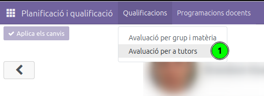
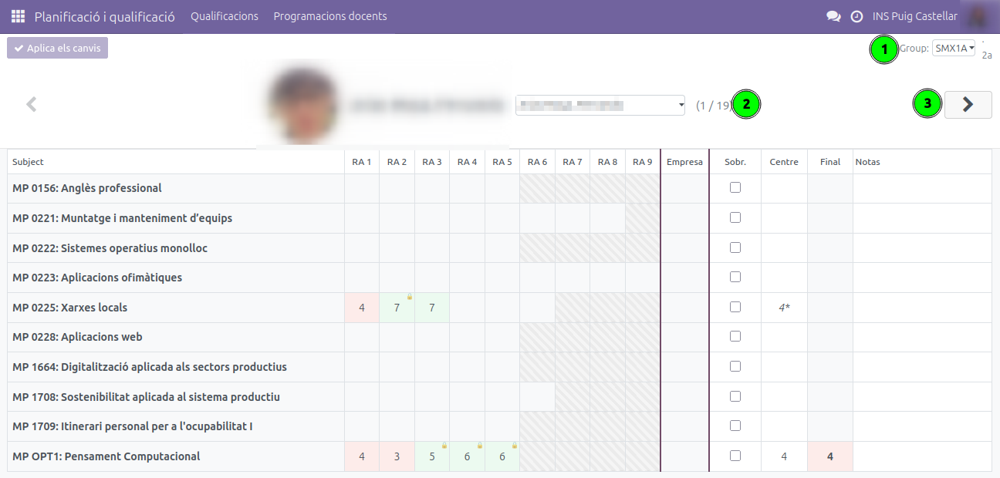
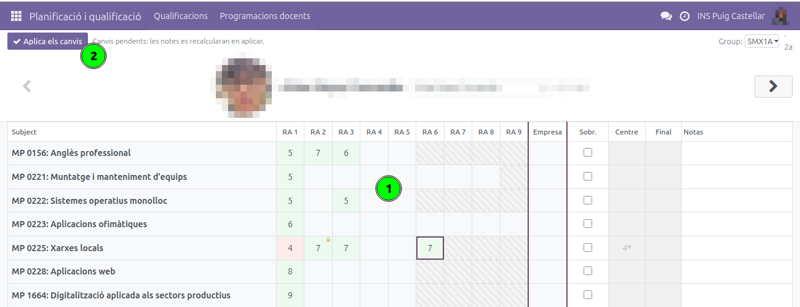

[Català](../../ca/tutors/junta-avaluacio.md) | [Castellano](junta-avaluacio.md) | [English](../../en/tutors/junta-avaluacio.md)

---

# Junta de evaluación: revisar las calificaciones por alumno

Esta guía explica cómo el tutor revisa y ajusta las calificaciones de los alumnos de su grupo en la vista **Evaluación para tutores**, pensada para la **junta de evaluación**: muestra **un alumno cada vez** con **todas sus asignaturas**, para que puedas ver y cerrar su evaluación de conjunto.

---

## Índice

1. [Acceso](#acceso)
2. [La vista de evaluación para tutores](#la-vista-de-evaluación-para-tutores)
3. [Navegar entre los alumnos](#navegar-entre-los-alumnos)
4. [Seleccionar el grupo](#seleccionar-el-grupo)
5. [Revisar y ajustar las calificaciones](#revisar-y-ajustar-las-calificaciones)
6. [RA bloqueados y notas provisionales](#ra-bloqueados-y-notas-provisionales)
7. [Aplicar los cambios](#aplicar-los-cambios)
8. [Cómo se calcula la nota](#cómo-se-calcula-la-nota)

---

## Acceso

**Planificación y calificación → Calificaciones → Evaluación para tutores** **(1)**

> El grupo y la evaluación se eligen automáticamente: la vista carga el grupo que tutorizas y la evaluación abierta actual, así que al entrar ya ves al primer alumno.

---

## La vista de evaluación para tutores

La vista muestra **un alumno cada vez** (foto y nombre en la parte superior) con **todas las asignaturas en las que está matriculado**:

- **Filas:** una asignatura por fila (por ejemplo, *MP 0225: Redes locales*).
- **Columnas de RA:** **RA 1, RA 2… por posición**. Como cada asignatura tiene sus propios resultados de aprendizaje, las columnas son genéricas; pasa el ratón por encima de una celda para ver el acrónimo y el peso del RA. Las celdas **sombreadas con rayas** corresponden a asignaturas que **no tienen ese RA** y no se pueden editar.
- **Empresa:** nota de prácticas en empresa (parte externa), cuando la asignatura la tiene.
- **Sobr.**, **Centro**, **Final** y **Comentarios:** las columnas de resumen de la nota del módulo, igual que en la vista de profesores (véase [Cómo se calcula la nota](#cómo-se-calcula-la-nota)).

En la imagen:

- **(1)** Selector de **grupo** (arriba a la derecha) y, al lado, la evaluación actual (por ejemplo, *2a*).
- **(2)** **Selector de alumno**: desplegable para elegir directamente un alumno del grupo (al lado, el contador *1 / 19* indica en cuál estás y cuántos hay).
- **(3)** **Flecha** para pasar al alumno siguiente.

---

## Navegar entre los alumnos

Para moverte de un alumno a otro:

- Usa las **flechas** **◀ ▶** de la parte superior **(3)**.
- O elige el alumno directamente en el **desplegable** que hay junto al nombre **(2)**.
- También puedes usar las teclas **◀ ▶** del teclado cuando **no** estás editando ninguna celda.

El **contador** (*1 / 19*) te indica en qué alumno estás y cuántos hay en el grupo.

---

## Seleccionar el grupo

Si tutorizas **más de un grupo** con una evaluación abierta, elígelo en el selector **Group** **(1)** de la parte superior derecha. La evaluación (por ejemplo, *2a*) se selecciona automáticamente.

Si solo tutorizas un grupo, no hace falta tocar el selector.

---

## Revisar y ajustar las calificaciones

La cuadrícula funciona como una hoja de cálculo, igual que la vista de profesores:

- **Editar:** haz clic en una celda y empieza a teclear, o haz doble clic (o pulsa **Enter**).
- **Moverte:** usa las **flechas** del teclado; con **Enter** bajas de fila y con **Tab** pasas de columna.
- **Borrar:** selecciona la celda y pulsa **Supr**.

En la imagen, **(1)** muestra una celda seleccionada para editar.

> **Quién puede editar durante la junta:** cuando la evaluación está en estado **Junta de evaluación**, **solo el tutor del grupo** (y la administración) puede modificar las notas; el profesorado solo consulta. Es el momento de revisar y cerrar la calificación de cada alumno asignatura por asignatura. Si la evaluación ya está **finalizada**, verás las notas pero no las podrás modificar.

---

## RA bloqueados y notas provisionales

Igual que en la vista de profesores:

- **Colores:** **verde** (nota ≥ 5, aprobado), **rojo** (nota < 5, suspenso), **blanco** (sin informar).
- **RA bloqueados:** un RA **ya aprobado en una evaluación anterior** aparece en **verde con un candado** y no se puede modificar.
- **Notas provisionales:** mientras queden RA por evaluar, la nota del centro (y la final) se muestran **en cursiva y con un asterisco** (`*`); son provisionales y cambiarán cuando se informen los RA que faltan.

---

## Aplicar los cambios

Los cambios se guardan en un **borrador local** y no se guardan hasta que pulsas **Aplicar los cambios** **(2)**.

- Mientras haya cambios pendientes aparece el aviso **«Cambios pendientes: las notas se recalcularán al aplicar.»** y las columnas calculadas (Centro, Final) se muestran en **gris**.
- Al pulsar **Aplicar los cambios**, se guarda todo de golpe y el sistema recalcula las notas del módulo.
- Si intentas **cambiar de grupo o salir de la vista sin aplicar**, el sistema te avisa para que no pierdas el trabajo.

---

## Cómo se calcula la nota

- **Nota del centro:** media ponderada de los RA **evaluados** según sus pesos (0–10). Si falta alguno, es **provisional**; si algún RA evaluado está suspenso, queda **limitada a 4**.
- **Nota de prácticas en empresa:** se informa en la columna **Empresa**.
- **Nota final:** combina la nota del centro y la de empresa según los porcentajes de la planificación. Para aprobar hay que **aprobar ambas partes**; si una está suspensa, la final queda limitada a 4.
- **Sobrescribir la nota del centro:** marcando la casilla **Sobr.** puedes fijar manualmente la nota del centro en lugar de dejar que se calcule a partir de los RA.

---

[← Volver al índice de tutores](index.md)
