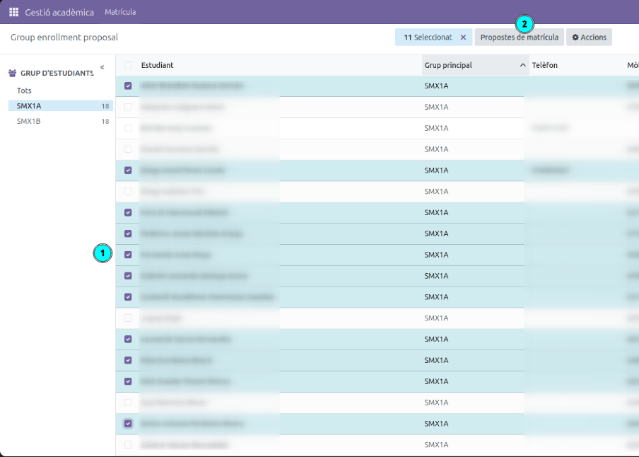
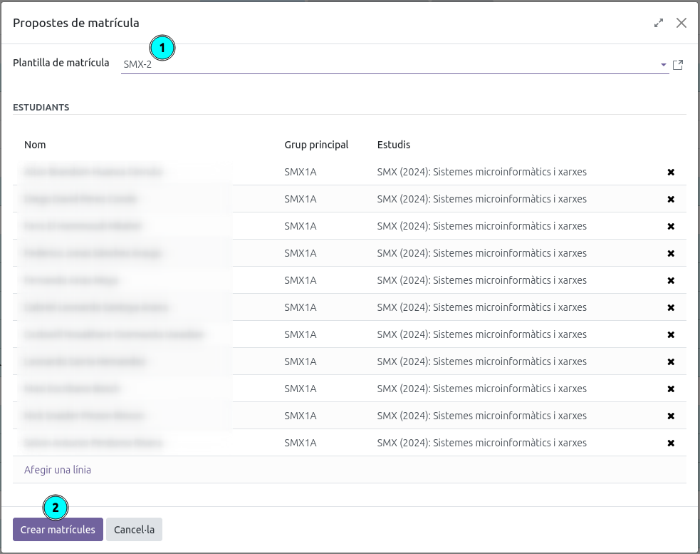
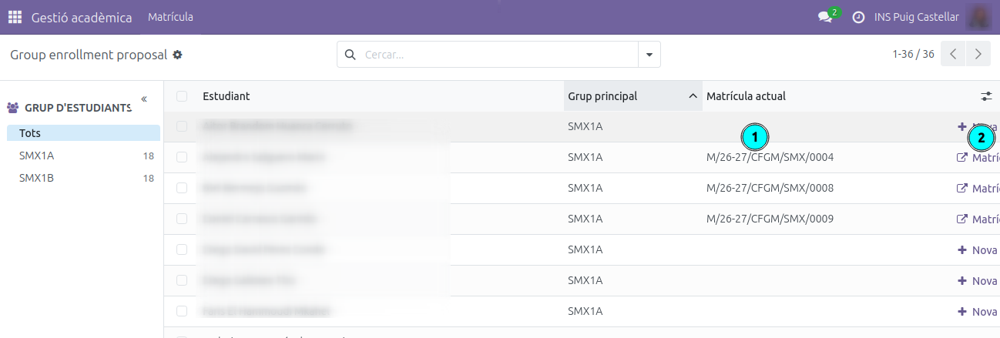
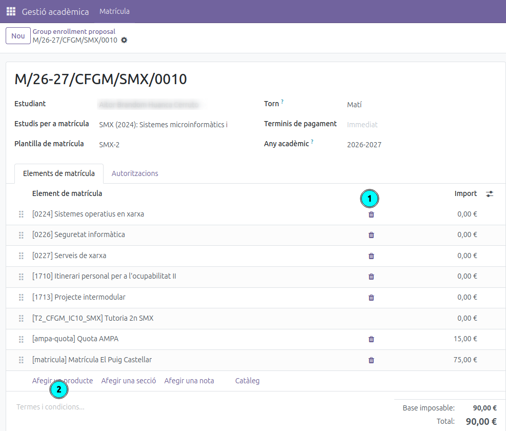

[Català](../../ca/tutors/propostes-matricula.md) | [Español](propostes-matricula.md) | [English](../../en/tutors/propostes-matricula.md)

---

# Cómo generar propuestas de matrícula para los alumnos

Esta guía explica cómo, después de la junta de la 3ª evaluación, el tutor puede generar las propuestas de matrícula del curso siguiente para los alumnos.

---

## Índice

1. [Acceso](#acceso)
2. [Paso 1 — Seleccionar los alumnos aprobados](#paso-1--seleccionar-los-alumnos-aprobados)
3. [Paso 2 — Seleccionar plantilla de matrícula](#paso-2--seleccionar-plantilla-de-matrícula)
4. [Consultar las pre-matrículas creadas](#consultar-las-pre-matrículas-creadas)
5. [Proponer matrículas especiales](#proponer-matrículas-especiales)
6. [Proceso de matriculación](#proceso-de-matriculación)

---

## Acceso

**Gestión académica → Matrícula → Propuestas de matrícula**

---

## Paso 1 — Seleccionar los alumnos aprobados

En el panel izquierdo **(1)**, selecciona el grupo de estudiantes con el que deseas trabajar (por ejemplo, SMX1A).

En la lista, marca con la casilla de verificación todos los alumnos que han superado el curso y a los que deseas proponer la matrícula del curso siguiente. Los alumnos que ya tienen una matrícula activa aparecen con el número de matrícula en la columna **Matrícula actual**.

Una vez realizada la selección, haz clic en el botón **Propuestas de matrícula** en la barra superior **(2)**.

> **Consejo:** Puedes filtrar por grupo en el panel izquierdo para trabajar grupo a grupo y no mezclar alumnos de grupos diferentes.

---

## Paso 2 — Seleccionar plantilla de matrícula

Se abrirá un diálogo con los alumnos seleccionados.

1. En el desplegable **Plantilla de matrícula** **(1)**, selecciona la plantilla correspondiente al curso siguiente (por ejemplo, *SMX-2* para el segundo curso de SMX).
2. Revisa la lista de estudiantes incluidos. Si necesitas excluir algún alumno, haz clic en la ✕ de su fila.
3. Haz clic en **Crear matrículas** **(2)** para generar las pre-matrículas.

---

## Consultar las pre-matrículas creadas

Una vez generadas, puedes ver el listado de pre-matrículas desde la misma vista **Gestión académica → Matrícula → Propuestas de matrícula**. Los alumnos que ya tienen una pre-matrícula creada mostrarán su número en la columna **Matrícula actual** **(1)**. Haz clic en el botón de la derecha **(2)** para abrir el detalle de cada pre-matrícula.

---

## Proponer matrículas especiales

Esta opción es **para los alumnos que no se matriculan de un curso completo** sino de asignaturas sueltas.

El procedimiento es el siguiente:

1. **Asignar la plantilla más similar a la situación del alumno**, siguiendo el mismo procedimiento del [Paso 2](#paso-2--seleccionar-plantilla-de-matrícula). Selecciona la plantilla que más se asemeje a lo que el alumno deberá cursar.
2. **Abrir la pre-matrícula del alumno**, tal como se explica en el apartado [Consultar las pre-matrículas creadas](#consultar-las-pre-matrículas-creadas).
3. **Ajustar las asignaturas**: elimina las que el alumno no debe cursar **(1)** y añade las que le falten **(2)** hasta que la pre-matrícula refleje exactamente las asignaturas que debe hacer.

---

## Proceso de matriculación

Las matrículas se crearán en estado **borrador** y pasarán a secretaría. Será secretaría quien las revisará y las enviará a las familias para que las confirmen a través del portal del alumnado.

---

[← Volver al índice de tutores](index.md)
