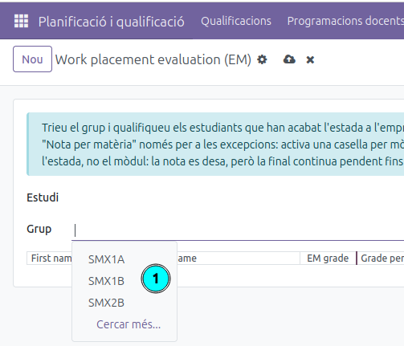
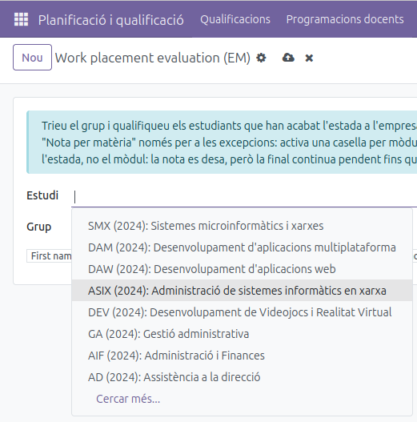
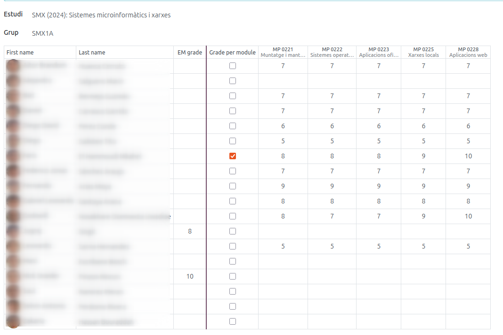

[Català](../../ca/tutors/work-placement-grade.md) | [Castellano](work-placement-grade.md) | [English](../../en/tutors/work-placement-grade.md)

---

# Poner la nota de las prácticas de empresa (EM)

El alumnado no termina las prácticas de empresa a la vez: cada estudiante empieza en una fecha distinta y hace un número de horas distinto. En cuanto uno de tus estudiantes acaba, ya puedes ponerle la nota de las prácticas: no hace falta esperar al resto del grupo ni a la junta de evaluación.

La nota que pongas se aplica a **todos los módulos de ese estudiante que tengan peso de prácticas** (habitualmente 90% centro + 10% prácticas), tanto a los módulos del curso en marcha como a los de cursos anteriores que quedaron con la nota final pendiente precisamente porque las prácticas aún no se habían hecho.

---

## Dónde se encuentra

**Planificación y calificaciones → Calificaciones → Evaluación prácticas de empresa (EM)**.

## Cómo poner la nota

1. Elige el **Grupo**. Como **tutor/a** lo eliges directamente: solo se te ofrecen los grupos que tutorizas.

   

   La **secretaría** y la **administración** llegan a cualquier grupo del centro, así que les conviene elegir primero el **Estudio** para acotar la lista de grupos:

   
2. La matriz muestra una fila por estudiante, con su foto, nombre y apellidos — como la pantalla de evaluación que ya conoces.
3. Escribe la nota en la casilla **Nota de las prácticas de empresa** de los estudiantes que han terminado las prácticas. Esa única nota va a **todos sus módulos** con peso de prácticas.
4. Pulsa **Aplicar cambios**.

La rejilla funciona como una hoja de cálculo: las flechas y el Enter mueven de casilla en casilla, el Tab salta a la siguiente, y puedes **pegar una columna de notas directamente desde una hoja de cálculo** (haz clic en la primera casilla y pega). Una casilla vacía nunca se escribe: recuerda que un 0 es una nota real, así que en blanco significa "aún sin nota de prácticas".

### Una nota distinta en cada módulo

Marca **Nota por materia** en la fila de ese estudiante: la nota única se desactiva y se activa una casilla por módulo, de forma que puedes calificar cada módulo por separado. Las columnas de módulo llevan el código del módulo en la cabecera, con su nombre debajo.

La cabecera de cada columna de módulo te dice a dónde va su nota:

- **Curso actual:** un módulo del curso en marcha. La nota final del módulo se recalcula al instante con la nota de centro ya registrada.
- **Curso anterior:** un módulo de un curso anterior, ya en el histórico académico del estudiante, que esperaba las prácticas para cerrar su nota final. La final se completa con los pesos que tenía ese módulo en aquel momento.

Los módulos sin peso de prácticas no aparecen nunca aquí: su nota final no depende de las prácticas.

## Una nota inferior a 5: se repiten las prácticas, no el módulo

Unas prácticas suspendidas nunca suspenden el módulo. El módulo sigue **superado** (eso lo deciden los RA), la nota que has puesto se guarda como constancia, y la nota final sigue **pendiente** hasta que el estudiante vuelva a hacer las prácticas. Cuando las haga, vuelve a calificarlas aquí y la final se completará.

## Detalles

- Un módulo ya calificado se puede corregir igualmente: pon la nota nueva y vuelve a aplicar.
- Poner la nota de las prácticas funciona aunque la sesión de evaluación esté finalizada; de hecho es el caso normal, porque las prácticas suelen acabar después de la junta.
- El alumnado que ya no está (bajas y graduados) no aparece nunca: ha dejado el centro y su histórico está cerrado.

## Para secretaría: cerrar las finales pendientes de cursos anteriores

La secretaría y la administración usan esta misma pantalla, sin restricción de grupo. Es la vía para cerrar las notas finales que aún quedan pendientes de cursos anteriores — un estudiante que superó todos los RA de un módulo pero cuya nota final no se pudo calcular porque aún no había hecho las prácticas.

Para localizarlas: **Planificación y calificaciones → Calificaciones → Histórico académico**, filtro **Finales pendientes de prácticas**. Cada línea es un módulo de un curso pasado que espera la nota de prácticas — exactamente las casillas que la matriz ofrece bajo una cabecera de **Curso anterior**, y completa su nota final con los pesos congelados en el registro del histórico.

---

[← Volver al índice](index.md)
