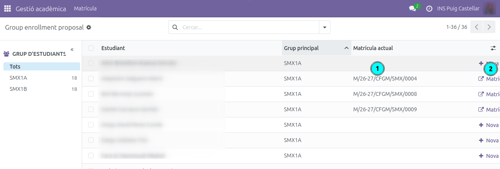

# Com generar propostes de matrícula per als alumnes

Aquesta guia explica com, després de la junta de la 3a avaluació, el tutor pot generar les propostes de matrícula del curs següent per als alumnes que han superat el curs.

---

## Índex

1. [Accés](#accés)
2. [Pas 1 — Seleccionar els alumnes aprovats](#pas-1--seleccionar-els-alumnes-aprovats)
3. [Pas 2 — Seleccionar plantilla de matrícula](#pas-2--seleccionar-plantilla-de-matrícula)
4. [Consultar les pre-matrícules creades](#consultar-les-pre-matrícules-creades)
5. [Procés de matriculació](#procés-de-matriculació)

---

## Accés

**Gestió acadèmica → Matrícula → Propostes de matrícula**

---

## Pas 1 — Seleccionar els alumnes aprovats

Al panell esquerre **(1)**, selecciona el grup d'estudiants amb el qual vols treballar (per exemple, SMX1A).

A la llista, marca amb la casella de verificació tots els alumnes que han superat el curs i als quals vols proposar la matrícula del curs següent. Els alumnes que ja tenen una matrícula activa apareixen amb el número de matrícula a la columna **Matrícula actual**.

Un cop feta la selecció, fes clic al botó **Propostes de matrícula** a la barra superior **(2)**.

> **Consell:** Pots filtrar per grup al panell esquerre per treballar grup a grup i no barrejar alumnes de grups diferents.

---

## Pas 2 — Seleccionar plantilla de matrícula

S'obrirà un diàleg amb els alumnes seleccionats.

1. Al desplegable **Plantilla de matrícula** **(1)**, selecciona la plantilla corresponent al curs següent (per exemple, *SMX-2* per al segon curs de SMX).
2. Revisa la llista d'estudiants inclosos. Si cal excloure algun alumne, fes clic a la ✕ de la seva fila.
3. Fes clic a **Crear matrícules** **(2)** per generar les pre-matrícules.

---

## Consultar les pre-matrícules creades

Un cop generades, pots veure el llistat de pre-matrícules des de la mateixa vista **Gestió acadèmica → Matrícula → Propostes de matrícula**. Els alumnes que ja tenen una pre-matrícula creada mostraran el seu número a la columna **Matrícula actual** **(1)**. Fes clic al botó de la dreta **(2)** per obrir el detall de cada pre-matrícula.

---

## Procés de matriculació

Les matrícules es crearan en estat **esborrany** i passaran a secretaria. Serà secretaria qui les revisarà i les enviarà a les famílies perquè les confirmin a través del portal.
