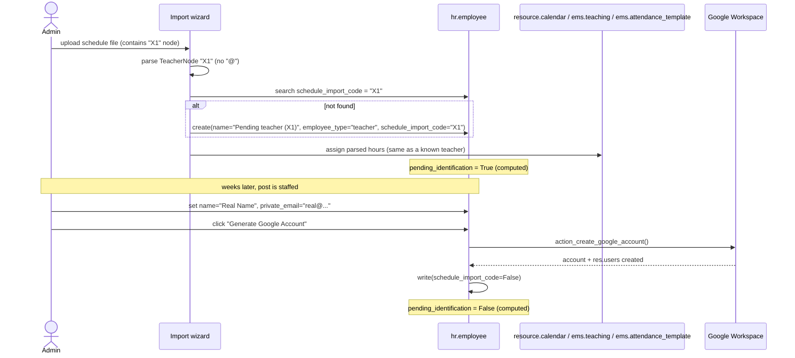

# PLAN — Pending-identification teachers from schedule import

> **Status: design plan, not implemented.** Written 2026-07-28 to be picked up on a
> dedicated branch. Nothing in this document has been built yet — treat every file/line
> reference below as "as of the `284-dton-...` branch at the time this was written"; verify
> against current code before implementing, since the branch may have moved on.
>
> Lives under `plans/` per `CLAUDE.md`'s "Design plans" convention — delete this file once
> the work lands (or is abandoned), folding anything still relevant into the real
> `docs/en/developers/` and `docs/{en,ca,es}/admin/` docs listed below.

## Problem

The school passes new timetables before all teaching posts are staffed. Rows for
not-yet-hired teachers carry a placeholder code (`X1`, `X2`, `X3`, ...) instead of a real
email address. Today, [`ems.working_schedules_import_wizard`](/models/employees/working_schedule.py)
matches every `<TeacherNode>` strictly by `hr.employee.work_email` and **hard-fails** the
whole import the moment one entry can't be matched:

```python
teacher = self.env["hr.employee"].search([("work_email", "=", email)])
if not teacher.id:
    raise ValidationError("Teacher with email '%s' not found." % email)
```

(`working_schedule.py:396-402`; same information surfaces earlier, non-fatally, as a
blocking `blocking_error_message` in the onchange preview, `working_schedule.py:344-359`.)

This means the whole schedule import is blocked (or must be manually pre-edited to drop
those rows) until every post is staffed — losing the schedule data for the teachers who
*are* already known, and requiring a second full import later for the placeholder rows.

## Desired behaviour

1. Rows whose "email" field isn't actually an email (no `@`) are **not** an error. The
   importer creates a minimal `hr.employee` record for each one, tagged as
   **pending identification**, and assigns its parsed schedule/teaching/attendance data to
   that record exactly as it would for a real teacher.
2. Re-importing the same or an updated schedule file later (same term) must match the
   **same** placeholder record again by its code — not create a duplicate — so the
   schedule keeps updating in place until the post is staffed.
3. When the real teacher is hired, an admin opens that employee record, fills in the real
   `name` and `private_email`, and clicks the existing **"Generate Google Account"**
   button ([`action_create_google_account`](/models/employees/google_workspace_integration.py:247)).
   That single action should also clear the "pending identification" marker — no separate
   "confirm identity" step. Schedule, `ems.teaching`, and `ems.attendance_template`/
   `ems.attendance_schedule` rows are already attached to the record, so nothing else needs
   to be redone.

## Terminology and detection (confirmed with the developer, 2026-07-28)

- Label: **"Pending identification"** (`Pendiente de identificar`) — not "temporary"
  (clashes with `contract_type_id`'s existing temporary/permanent contract semantics) and
  not "pending assignment" (the schedule *is* assigned immediately; only the person's
  identity is pending).
- Detection rule: **any `TeacherNode` "email" value without an `@` is treated as a
  pending-identification code**, regardless of its exact shape (`X1`, `SUB3`, `TBD-2`, ...).
  No configurable prefix pattern — simpler, and future-proof against however the
  scheduling software names unstaffed slots. A value *with* `@` that still doesn't match
  any employee keeps today's behaviour: hard error (real typo/unknown address, not a
  placeholder).

## Data model changes

Add to `ems_employee` in [`models/employees/employee.py`](/models/employees/employee.py)
(identity concern, not a Google-Workspace concern — keep it in the model that owns
identity fields, not in `google_workspace_integration.py`):

```python
schedule_import_code = fields.Char(
    string="Schedule import code",
    copy=False,
    help="Raw placeholder code (e.g. 'X1') from a working-schedule import, "
         "kept only while the teacher's real identity is still unknown.",
)
pending_identification = fields.Boolean(
    string="Pending identification",
    compute="_compute_pending_identification",
    store=True,
)

@api.depends("schedule_import_code")
def _compute_pending_identification(self):
    for employee in self:
        employee.pending_identification = bool(employee.schedule_import_code)
```

Single source of truth: `schedule_import_code` set ⇒ pending; cleared ⇒ resolved. No
separate boolean to keep in sync by hand (DRY — see coding standards in `CLAUDE.md`).

No `_sql_constraints` block anything here — research confirmed there's no existing
constraint on `hr.employee` that would reject a record with a placeholder name and blank
`work_email`/`private_email` (only native Odoo's `user_uniq` on `(user_id, company_id)`,
irrelevant until a `res.users` is actually linked).

**No migration script needed.** This is a new-column addition with a safe default
(`False`/`NULL` for every pre-existing row) — not an XML-ID rename, not a backfill of a
required field. Per `CLAUDE.md`'s migrations section, that's the plain "new field" case
Odoo's own schema sync handles on `-u ems`.

## Importer changes ([`models/employees/working_schedule.py`](/models/employees/working_schedule.py))

Add a tiny helper (reused by both the onchange preview and `create()` — don't duplicate
the `"@" in value` check):

```python
@staticmethod
def _is_email_like(value):
    return "@" in (value or "")
```

### `_onchange_attachment_ids` (currently `working_schedule.py:331-359`)

Split today's single `unknown_emails` bucket into two:
- `unknown_emails` — `@`-containing values still not matched: **unchanged**, keeps
  producing the blocking `blocking_error_message` (real typo/unknown address).
- `pending_codes` — non-`@` values: **not blocking**. Surface as a new, non-blocking
  `info_message` field (rendered with an `alert-info` style, not `alert-danger`), e.g.
  *"3 teachers pending identification will be created: X1, X2, X3."* The **Import**
  button must stay visible/enabled when only `pending_codes` are present.

### `create()` (currently `working_schedule.py:371-425`)

Where today's loop does `search(...) or raise ValidationError(...)` per `@`-containing
email, add a parallel branch:

```python
if self._is_email_like(email):
    teacher = self.env["hr.employee"].search([("work_email", "=", email)])
    if not teacher:
        raise ValidationError(_("Teacher with email '%s' not found.") % email)
else:
    teacher = self.env["hr.employee"].search([("schedule_import_code", "=", email)])
    if not teacher:
        teacher = self.env["hr.employee"].create({
            "name": _("Pending teacher (%s)") % email,
            "employee_type": "teacher",
            "schedule_import_code": email,
        })
```

Everything downstream (`_create_schedule`, `ems.teaching.sync_from_schedule`,
`ems.attendance_template.sync_from_schedule_batch`, the stale-conflict archiving) already
operates on a plain `hr.employee` record and has no dependency on `work_email`/`user_id`
being set — confirmed in research (attendance generation, `ems.attendance_schedule`, and
`ems.attendance_template.teacher_ids` work purely off the `hr.employee` record). **No
changes needed there.**

Idempotency: on a second import with the same code, the `search` on
`schedule_import_code` finds the existing placeholder record and reuses it — schedule,
teaching, and attendance-template sync all update in place through the existing
`sync_from_schedule`/`sync_from_schedule_batch` logic, same as re-importing a known
teacher's updated hours today.

## Google Workspace touchpoint ([`models/employees/google_workspace_integration.py`](/models/employees/google_workspace_integration.py))

`action_create_google_account` (`google_workspace_integration.py:247`) already requires
`name` and `private_email` via `_gw_missing_fields()` before doing anything — so a
placeholder record (blank `private_email`) naturally can't trigger account creation by
accident, and `_gw_enqueue_if_ready()`'s automatic create/write trigger won't fire either
(same missing-fields gate). **No change needed to the gating.**

The only change: once the method succeeds (real account created), clear the
placeholder marker in the same transaction:

```python
self.write({"schedule_import_code": False})
```

placed after the existing success path (account + `res.users` created, credentials
delivered, chatter message posted). `pending_identification` flips to `False`
automatically via the compute.

Clearing `schedule_import_code` (rather than keeping it) is deliberate: it prevents a
reused code (e.g. next year's `X1` being a *different* unstaffed post) from ever matching
a resolved employee by accident. Post a chatter note with the original code before
clearing it, so the link between "who was X1" and "who they turned out to be" isn't lost
for audit purposes.

## Views

- `views/community/employee/list.xml` / `kanban.xml`: badge/decoration on
  `pending_identification` (e.g. `decoration-warning`) so unstaffed placeholders stand out
  in the Teachers list.
- `views/community/employee/form.xml`: show `schedule_import_code` read-only, only
  `invisible="not pending_identification"` (Odoo 18 domain-based modifier, not legacy
  `attrs`) — disappears once resolved.
- Search view: add a filter ("Pending identification") and a group-by, so admins can
  pull up "who's still unstaffed" directly from the Teachers list.
- Wizard view (`views/employees/working_schedule/*.xml` or wherever the wizard's
  form lives): render the new `info_message` field distinctly from the existing
  `blocking_error_message` (different alert style; must not hide the Import button).

## i18n

New user-facing strings needing `_()`/`_t()` wrapping *and* real `ca_ES`/`es_ES` entries
in `i18n/ca_ES.po` / `i18n/es_ES.po` (per `CLAUDE.md`'s i18n rules — check for reused
labels needing an added `#:` reference, not just new msgids):
- Field labels: "Pending identification", "Schedule import code".
- Placeholder name template: "Pending teacher (%s)".
- Wizard info message: "N teachers pending identification will be created: ...".
- List/kanban filter and group-by labels.

## Tests (TDD — extend existing files, don't create parallel ones)

`hr.employee`/the import wizard/Google Workspace are already fully DTON'd (tests, tour,
docs all exist) — per `CLAUDE.md`'s DTON trigger, this change extends that existing
coverage rather than starting a retroactive pass.

`tests/test_working_schedules_import_wizard.py` (already ~40 test methods covering
email-matching edge cases):
- New placeholder created on general import when a `TeacherNode` code has no `@`.
- Re-importing the same code reuses the same employee (no duplicate), schedule/teaching/
  attendance-template updated in place.
- `_onchange_attachment_ids` with a placeholder code produces the new non-blocking
  `info_message`, Import button stays enabled, no `blocking_error_message`.
- Existing `test_import_without_teacher_id_unknown_email_raises` and
  `test_onchange_attachment_ids_unknown_email_sets_blocking_error` must still pass
  unchanged — confirm their fixtures use genuinely `@`-containing addresses (real-typo
  case), so the two code paths stay properly distinguished.
- Schedule/`ems.teaching`/`ems.attendance_template` rows attach to the placeholder
  exactly as for a normal teacher (reuse whatever assertions the existing "known teacher"
  import tests already make).

`tests/test_employee_google_workspace.py`:
- `action_create_google_account` on a `pending_identification` record with name +
  `private_email` filled in succeeds and clears `schedule_import_code`/
  `pending_identification` in the same call.
- Missing-fields error path is unaffected for a still-placeholder record (no
  `private_email` yet) — still raises the existing `UserError`.

## Tours

Check whether a tour already exists for the *general* (cog-menu, multi-teacher) import
path specifically — the existing wizard tests found in research are `TransactionCase`
style; confirm before assuming none exists. If none does, add one (new fixture XML with
one real-email `TeacherNode` and one no-`@` code) covering:
1. Cog-menu import with a fixture containing a placeholder code → non-blocking info
   banner shown, Import button enabled → import → new employee appears in the Teachers
   list view with the pending badge visible.
2. Open that employee's form, fill `name` + `private_email`, click **Generate Google
   Account** → badge disappears from the list view after save (per `CLAUDE.md`'s "verify
   in the list view after save, not via `input[value=...]`" convention).

Extend `static/tests/tours/employee_google_workspace_tour.js` /
`test_employee_google_workspace_tour.py` only if the new field changes which header
button renders — research indicates it doesn't (gating is unchanged, still purely
`google_ws_state` + missing-fields), so likely no change needed there, just confirm.

## Docs (Close step)

- `docs/en/developers/employees/working_schedule.md`: extend the import-wizard section
  (already at line ~151) with the new branch — Mermaid flow gains a "no `@`" branch
  leading to get-or-create-by-code instead of the hard-fail node.
- `docs/en/developers/employees/google_workspace_staff.md`: note that
  `action_create_google_account` can now also be the step that resolves a
  pending-identification placeholder, not only a brand-new blank record.
- Role docs, all 3 languages: `docs/{en,ca,es}/admin/working-schedules.md` (describe the
  new "pending identification" outcome of an import) and
  `docs/{en,ca,es}/admin/alta-professor-compte-google.md` (mention the scenario now
  starts from an existing placeholder record instead of an empty one). Confirm during
  implementation whether any other role (e.g. secretary) actually triggers this wizard
  before deciding it's admin-only — the research above didn't check the wizard's
  `groups=` restriction.

## Sequence (target end state)



## Rollout (map onto the existing TDD + DTON workflow)

1. **Red**: write the new/extended tests above; they must fail against current code.
2. **Green**: `schedule_import_code`/`pending_identification` fields, importer branch,
   `action_create_google_account` clearing step, minimal view changes to make tests pass.
3. **Refactor (O+N)**: view polish (badges, filters, `invisible=` modifiers), translatable
   strings, coding-guideline pass (attribute order, f-strings, alphabetical imports).
4. **Gate** after each cycle: `./upgrade.sh` + `./test.sh TestWorkingSchedulesImportWizard`
   (and `TestEmployeeGoogleWorkspace` once the clearing logic lands) — not the full suite.
5. **Close**: trilingual role docs, `i18n/{ca,es}_ES.po` real translations, developer docs
   updated, tour added/confirmed, then the full unscoped `./test.sh` exactly once as the
   final gate.

Propose the `__manifest__.py` version bump when this actually starts — per existing
convention, don't bump it preemptively; wait for developer go-ahead.

## Open risks / follow-ups flagged for whoever implements this

- `resource.calendar` for a placeholder is named `"%s (%s)" % (teacher.name, course.name)`
  at creation time (`working_schedule.py`, `_create_schedule`). If the teacher is renamed
  later (placeholder → real name), that calendar's stored name does **not** auto-update —
  cosmetic only (schedule assignment itself is unaffected), but worth a one-line fix
  (rename the calendar too) if it bothers admins browsing `resource.calendar` records
  directly.
- Confirm the import wizard's `groups=` restriction before finalizing which role(s) the
  Close-step docs need to cover (assumed admin-only above, not verified in this research
  pass).
- If the same placeholder code appears twice in a single import batch for what are
  actually two different people (shouldn't happen, but not structurally prevented), the
  second `TeacherNode` will silently reuse the first's employee record. Decide during
  Red/Green whether this deserves an explicit guard or is acceptably out of scope.
