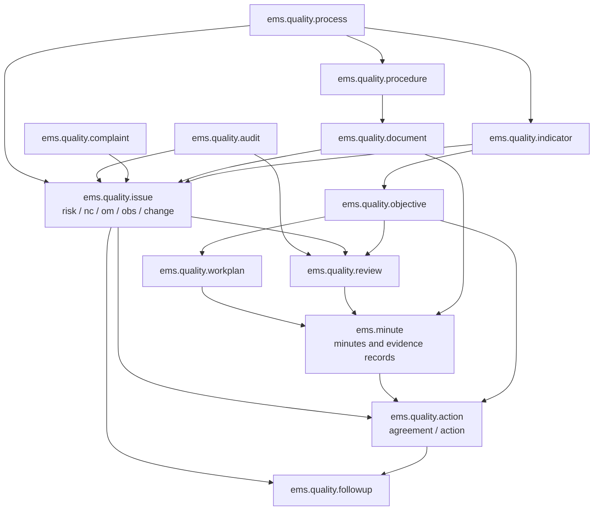
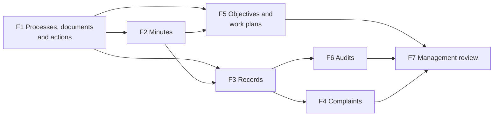

# ISO 9001 quality management inside EMS

**Status: design, current as of 2026-09-21. Phase 1 and phase 2 implemented on their branches, not yet
merged; phase 1's scope was reduced on 2026-09-21 (see "One owner per piece of information" below).** Every open design question was
closed with the developer between 2026-09-19 and 2026-09-20; this file is the design of record for the
work and should be kept current as each phase lands, then deleted once the last one ships (its contents
folded into `docs/en/developers/quality/` and the role manuals).

The centre is certified to ISO 9001 for its regulated teaching activities. Quality management currently
lives outside EMS: the registries in spreadsheets, the minutes and reports in documents. The goal is to
manage it inside EMS and keep generating the documents into the centre's Drive, with one stated priority:
**reduce the documentary load on the teaching staff**.

**One owner per piece of information (2026-09-21).** Phase 1 first shipped a full controlled-document
registry (version, state, approval and review dates, owner, distribution flags). In practice that
duplicated what each document already states in Drive: every change had to be made twice, and the import
could not bring every document or every detail across. The rule is now: **a phase only ships if, the day
it is deployed, something stops being done by hand elsewhere.** Controlled documents stay owned by Drive,
and EMS keeps only the documentary structure (processes → procedures → documents) with each document's
link, plus the embedded process map. EMS owns what it generates itself: minutes, agreements and, later,
records - and a registry that moves into EMS (nonconformities, improvements) only does so when it can be
imported complete and the spreadsheets become read-only the same day.

A fuller working document (including the as-is audit of the current setup, which is deliberately not
published here) is kept by the developer outside the repository.

---

## 0. Language: the centre's documentation is, and stays, in Catalan

**Catalan is the centre's working language, and its entire documentary system is written in Catalan: the
process map, every procedure sheet, every controlled document, every minute, every register, every form a
family or a teacher fills in.** That is not changed by moving the system into EMS. Anything EMS stores as
the centre's content, or generates on the centre's behalf, is in Catalan - the seeded catalogues, the
minutes and their sections, the generated PDFs, their file names, the document titles in the registry.
Nothing here is seeded in English "to be translated later", and no phase ships a step that asks someone to
translate the centre's own content from the interface.

The line to hold is between **the centre's content** and **the application's vocabulary**:

| | Language | How |
|---|---|---|
| The centre's content: names of processes, procedures, controlled documents, minute types and sections, anything copied from a document of the quality system | **Catalan only**, verbatim from the source document | written directly in the `data/custom/quality/*.csv` value |
| The application's vocabulary: field labels, menus, buttons, selection values, report headings, error messages | English in the source, shown in Catalan and Spanish | `_()` / `_t()` + `i18n/ca_ES.po`, `i18n/es_ES.po` |
| Role manuals | Catalan, Spanish, English | `docs/{ca,es,en}/<role>/` |

For the centre's content this is not a preference, it is the only thing that works: a `__import__.`-owned
record can never be translated through a `.po` file, so whatever the CSV says is what every reader sees, in
every language. The mechanism, and the consequences of getting it wrong, are in 8.1.1 - read it before
writing any new `data/custom/` row.

This was got wrong once already: phases 1 and 2 seeded all 120 names in English and left "translate them
from the interface" as a deployment step, which was corrected on 2026-09-20 by reading the wording back out
of the centre's own documents. Any phase from 3 onwards - the historical import of nonconformities and
improvement opportunities above all, since its source spreadsheets are entirely in Catalan - keeps the
source wording as it is rather than translating it into English on the way in.

---

## 1. Approach: build in EMS, use OCA as a design reference

Evaluated against `OCA/management-system` 18.0, which is actively maintained. Decision: **implement in
EMS**, borrowing OCA's semantics (origin/cause/severity catalogues, nonconformity stages, efficacy
evaluation, audit verification lists, management review structure) without adopting its code. Three
technical reasons:

1. **The package is indivisible.** `mgmtsystem_quality` is barely more than a data record; the substance
   is in its dependencies. `mgmtsystem_audit` and `mgmtsystem_review` both depend on
   `mgmtsystem_nonconformity`, which depends on `document_page_procedure` → `document_page` (a second
   repository, `OCA/knowledge`). Audit and management review cannot be adopted without also adopting
   OCA's nonconformity model and its wiki.
2. **Its data model splits what the centre keeps together.** The centre's risk, nonconformity and
   improvement registries are the same form with a different rating (impact × probability, impact ×
   opportunity, impact alone). In OCA a nonconformity is `mgmtsystem.nonconformity` while an improvement
   is a `mgmtsystem.action` of type `improvement`: two models with different fields. Fitting the centre's
   improvement records there means either losing half the fields (OCA actions have no origin, impact,
   opportunity rating or efficacy evaluation of their own) or calling something a nonconformity that
   explicitly is not one. Risks have no home at all: `mgmtsystem_hazard*` is occupational hazard, not
   clause 6.1 risk analysis.
3. **No meeting minutes anywhere in the repository**, and minutes are the largest documentary surface for
   teaching staff, so most of the work is in the part OCA does not cover.

`mgmtsystem_objective` is the only separately adoptable piece and is also declined: the centre's
objectives are a cascade (annual plan → partial objective → strategy → department objective) approved in
a departmental meeting and measured largely from data EMS already holds, so it would have to be extended
until nothing of the original remained, while dragging in `mgmtsystem` and `uom`.

Catalan translations of the OCA modules are close to empty, which would be a further cost.

## 2. What EMS already has and must not be duplicated

| Needed by the quality system | Already in EMS |
|---|---|
| Meeting attendees | `hr.employee`, with their corporate account |
| Department and team membership, posts | `hr.department`, `ems.workgroup`, `ems.role` |
| Teaching assignment, groups, subjects | existing curriculum and teaching models |
| Academic results per learning outcome | grade models — the raw material for several indicators |
| Absence and dropout figures | attendance models |
| Rooms, academic year | `ems.space`, `ems.course` |
| Satisfaction survey participation | LimeSurvey integration |
| Who is above whom, for approvals | `hr.employee.parent_id`, `tutor_scope_user_ids`, `find_head_of_studies()` |
| Corporate accounts and mail | Google Workspace integration |
| Minutes skeleton | `models/documentation/minute.py` (`ems.minute`), a stub whose own TODOs already describe most of what the real templates ask for |

Everything new lives in `models/quality/` with the `ems.quality.*` prefix, except minutes, which extend
the existing `ems.minute`.

---

## 3. Data model



The pivot is `ems.quality.action`: **a meeting agreement and an improvement action are the same concept**
(owner, deadline, follow-up, closure). Unifying them is what makes it possible to give a teacher one
single screen answering "what do I owe and by when", instead of spreading it across documents.

### 3.1. Processes, procedures, controlled documents

Only the documentary structure and the links (see "One owner per piece of information" at the top):

- **`ems.quality.process`** — `code`, `name`, `kind` (strategic/key/support), `sequence`, `active`.
  Seeded from the centre's process map (eight processes).
- **`ems.quality.procedure`** — `code`, `name`, `process_id`, `document_ids`, `active`.
- **`ems.quality.document`** — `code` (nullable), `name`, `procedure_id`, `process_id` (from the
  procedure, editable when there is none), `url` (its ordinary Drive link), `is_process_map`, `active`
  (archived when no longer in force). No version, state, dates, owner or distribution flags: those live
  in the document, in Drive. The form shows the document itself through Google's `/preview` address,
  derived from `url`, and opens it for editing in a new tab: one link per document.
- **Process map** — the centre's process map is a Google document, registered as one more document with
  `is_process_map`; `Quality > Process map` opens its form, so the picture is never redrawn in EMS.
- The three forms open **read-only** and unlock their fields with an *Edit* button, for whoever may
  write.

### 3.2. Actions and agreements

**`ems.quality.action`**: `code` (see 4), `name`, `description`, `type` (`agreement`, `immediate`,
`repair`, `corrective`, `preventive`, `improvement`, `change`), `responsible_role_id` plus
`responsible_employee_ids` (the legacy data holds values like "\<name\> + volunteers" and
"management team and department heads", so both a post and several people must be expressible),
`deadline_date` **and** `deadline_text` (real deadlines are often prose: "by the final meeting of the
year"), `resources`, `efficacy_criteria`, `completion_criteria`, the origin (`issue_id`, `minute_id`,
`objective_id`, `audit_id`, `review_id`; exactly one), scope fields, `followup_ids`, `state` (computed,
see 3.3), `is_late`.

**`ems.quality.followup`**: `date`, `state`, `description`, `author_employee_id`, and `issue_id` **or**
`action_id`. Replaces a fixed set of follow-up slots in the spreadsheets, which records had already
exhausted.

### 3.3. State is computed, never typed

```
no action proposal yet          → New (pending)
proposal but no follow-up yet   → Analysed (planning)
otherwise                       → the state of the latest follow-up entry
```

This is the rule the spreadsheets already implement, and it is worth keeping: **there is no editable
state dropdown**. Changing state requires adding a follow-up entry, which means recording why and when.
The five stages are New (pending) → Analysed (planning) → In progress (implementation) → Review
(measuring efficacy) → Closed. "Open" means anything not closed.

### 3.4. System records

**`ems.quality.issue`** — one model for risks, nonconformities, improvement opportunities, observations
and change plans, because they are the same form with a different rating:

`type` (`risk` / `nc` / `om` / `obs` / `change`), `code`, `entry_date`, `course_id`, `process_id`,
`description`, `impact` (0-10), `second_factor` (0-10: probability for risks, opportunity for
improvements, hidden for nonconformities), `total` (computed product), `rating` (computed band),
`origin_id`, `indicator_ids` (which indicators triggered it), `document_ids`, `analysis` (root cause,
nonconformities only), `action_ids`, `efficacy_criteria`, `completion_criteria`, `followup_ids`,
`state`, `parent_issue_id` (**optional**: a change plan may or may not derive from an observation,
improvement or nonconformity), `complaint_id`, `audit_finding_id`.

Rating bands, as currently computed by the centre: improvements and risks use
`total < 30` → low, `< 70` → medium, otherwise high; nonconformities use `impact < 5` → low, `< 8` →
medium, otherwise high.

**`ems.quality.origin`** — catalogue (audit, suggestions box, satisfaction surveys, personal
observation, management review, improvement teams, meeting, communication, SWOT, other). Worth adding
**supplier**, which the current list lacks.

**`ems.quality.complaint`** — a separate model, not an issue type: the lifecycle differs (registered and
analysed → closed, with an outbound notification) and the records contain personal data about
identifiable individuals, which calls for stricter access control. Fields: `number`, `entry_date`,
`course_id`, `entry_channel`, `complainant_partner_id` / `complainant_name` / `complainant_kind`,
`subject`, `analysed_date`, `closed_date`, `response_channel`, `response_note`, `issue_ids` (the
nonconformities it triggers), `state`, `active`.

### 3.5. Minutes and evidence records

`ems.minute` keeps what it has (date, nature, modality, space, department, workgroup, attendees,
absentees) and gains: `type_id` → `ems.minute.type`, `code`, `time`, `place_text` (for "Meet" or a
mailing list), `group_id` (teaching-team minutes), `is_centre`, attendees/absentees with a justified
flag and a default derived from the scope, `previous_minute_id`, `agenda_ids`, `section_value_ids`,
`agreement_ids` (actions of type `agreement`), `followed_agreement_ids` (still-open agreements from
earlier minutes, **preloaded**), `pending_topic_ids`, `annex_document_ids`, `redactor_employee_id`,
`approver_role_id` / `approver_employee_id` / `approval_date`, `state` (draft → to approve → approved),
`template_document_id` + `template_version`, `drive_file_id`, `pdf_attachment_id`.

**Optional sections through a catalogue, not booleans.** `ems.minute.section` holds the catalogue, each
with a `kind` that drives rendering: `text`, `agenda`, `previous_approval`, `agreement_followup`,
`agreements`, `pending_topics`, `annexes`, `signature`, plus four that carry a table of their own:
`harmonisation`, `gep` (CLIL), `team_constitution`, `objectives`, `meeting_calendar`.
`ems.minute.type` declares `name`, `code`, `kind` (`meeting` / `record`), `scope_kind`, `document_id`,
`approver_role_id`, `print_identification`, and `section_ids` (order, section, intro text, required).

Adding a minute type must be configuration, not development: there are well over a dozen types in use
(department in two variants, staff meeting, teaching team per group and session, improvement team in
three variants, generic, tutors, coordinations, guidance, evaluation boards, assembly, delegate
election, key handover, cash count, disciplinary hearing).

The four table sections exist because they are **not free text**: they are data EMS already knows and
should preload — groups and subjects of the department for harmonisation, subjects and teachers for
CLIL, workgroup members with post and speciality for team constitution, objectives for the objectives
section.

**`ems.minute.preset`** — a user-owned (or shared) prefill: type, usual place, usual attendees, recurring
agenda, default approver. It only prefills content; it never alters the structure or the controlled
document, which matters for the audit trail. Saved from the minute form itself, like a favourite filter —
no menu of its own.

**Evidence records** (cash count, key handover, delegate election, disciplinary hearing, training
attendance) are the same model with `kind = record` on their type, so the machinery — sequence,
signatories, approval, PDF, Drive, search, permissions — is written once and the staff have one place for
"papers that get signed and filed". Because the form is built from the sections its type declares, an
evidence record only shows its own.

Whether a record also **writes its fact where it belongs** is decided per type: a delegate election sets
`delegate_id` / `subdelegate_id` on `ems.group` (information that otherwise only exists inside a
document), a key handover marks the assignment on the space or the employee, a cash count writes nothing.

**`ems.signed.record`** — abstract mixin with `code`, `date`, `state`, `signatory_ids`,
`template_document_id` + `template_version`, `pdf_attachment_id`, `drive_file_id` and the PDF
generation/upload methods, inherited by `ems.minute`, `ems.quality.audit` (its report) and
`ems.quality.review`.

A graphical signature is an optional image on the employee record (nothing native is reusable:
`res.users.signature` is the e-mail signature and `hr.employee` has none). Where there is none, the PDF
prints name, post and "approved in EMS by X on date", which is the actual evidence; the image is
decorative.

### 3.6. Objectives, indicators, work plans

- **`ems.quality.objective`** — `parent_id` on itself reproduces the real cascade (annual plan objective
  → partial objective → strategy → department objective): `name`, `description`, `level`
  (centre/department/workgroup), `course_id`, `department_id` / `workgroup_id`, `owner_role_id`,
  `previous_year_proposal`, `action_ids`, **`agreement_id`** (the meeting agreement that approved it —
  today that link is prose), `indicator_ids`, `achievement` (excellent/adequate/basic/initial),
  `analysis`, `next_year_proposal`, `evidence_document_ids`.
- **`ems.quality.indicator`** — `code`, `name`, `process_id`, `objective_ids`, `unit`,
  `acceptance_value`, `target_value`, `direction`, `computation` (manual, or an EMS source),
  `responsible_role_id`.
- **`ems.quality.indicator.value`** — `indicator_id`, `course_id`, `period`, `note`,
  `evidence_document_ids`, and **three fields for the number**: `computed_value` (what the calculation
  yields, always recomputable), `manual_value` (the correction, usually empty), `value` (the manual one
  if set, otherwise the computed one — this is what reports use), plus `override_reason`, required when
  correcting. All three tracked, with chatter.

  Why three fields and not one stored computed field with `readonly=False`: such a field accepts the
  manual write but **loses it silently** the moment a dependency changes and Odoo recomputes. The split
  lets the calculation be redone without touching the correction, and shows the difference between what
  the machine says and what the centre says — which is exactly what gets asked when a figure in a report
  does not match the application.

  Corrections are a first-class feature, not a symptom: every year throws up special cases the
  calculation cannot anticipate. The only signal worth watching is the same indicator being corrected for
  the same reason several years running, which does suggest refining the calculation.

  Indicators that can be computed from EMS data include promotion and pass rates per learning outcome,
  absence and dropout, survey participation, and the share of closed records over total.
- **`ems.quality.workplan`** — the annual plan and report of a department or coordination: `course_id`,
  scope, the document-management block the current form already carries (who drafted, reviewed and
  approved the plan, and the same three for the report, with dates), `objective_ids`, `activity_ids`
  (outings and complementary activities), `teacher_activity_ids`, and **academic results computed** from
  the grades EMS already holds rather than typed in.

### 3.7. Audits

`ems.quality.audit` (`kind` internal/external/preaudit, dates, `course_id`, auditors — employees or an
external name —, auditees, plan and report documents, `checklist_id`, `answer_ids`, `finding_ids`,
`state`), `ems.quality.audit.checklist` + `.line` (a reusable ISO verification list),
`ems.quality.audit.answer`, and `ems.quality.audit.finding` (`type` nc/om/obs/strong_point,
`process_id`, `description`, `issue_id` — the record it opens —, `is_solved`).

Audit is by far the most frequent origin of records, so turning a finding into a record with one click
is the point of this phase.

### 3.8. Management review

`ems.quality.review`: `course_id`, `kind` (partial/final), `date`, `previous_review_id`, `minute_id`
(**the review is also a minute**: reuse `ems.minute` with its own type instead of duplicating attendees,
agenda and agreements), who carried it out, reviewed and approved it, and the per-block analysis.

Almost all of its content should be **computed or linked** rather than copied: open records by course,
audit findings, actions from the previous review, processes and their SWOT review, improvement teams and
their objectives, homologated suppliers, strategic documents and their approval dates, department
reports, objectives of this year and the next. What stays manual is the part that is genuinely
management judgement.

### 3.9. Suppliers

Homologation extends the **existing** provider records (`res.partner` with `contact_type = 'provider'`,
reachable from *Educational Community → Providers*) rather than introducing a parallel list:
`provider_frequency` (habitual/occasional), `homologation_state` (pending/homologated/rejected/
suspended), `homologation_date`, `homologation_review_date`, `homologated_by_employee_id`,
`evaluation_ids` → `ems.provider.evaluation` (date, course, criteria, outcome, evidence, whether it keeps
the homologation), `document_ids`, `issue_ids`. The management review's supplier block then becomes a
computed count instead of a typed table.

The evaluation criteria must be confirmed against the centre's current supplier homologation procedure
before seeding the catalogue.

---

## 4. Codes

**What lives inside a scope is numbered per scope; what lives in a single registry is numbered per
centre.** A minute belongs in a container (its department's, group's or team's folder) and is looked for
there; a nonconformity belongs to one registry that is filtered by process.

| Element | Code | Counter |
|---|---|---|
| Minute or evidence record | `ACTA-INF-2026-27-003` | per scope and course |
| Agreement or action | `ACORD-INF-2026-27-012` | per scope and course |
| Nonconformity | `NC-2026-27-007` | per centre and course |
| Improvement, observation, change plan | `OM-2026-27-045` | per centre and course |
| Risk | `RISC-2026-27-009` | per centre and course |
| Complaint | `QX-2026-27-016` | per centre and course |

- The type prefix keeps a minute and an agreement of the same department from being confused when cited.
- The academic year is written the way the centre writes it (`2026-27`), from a new stored computed short
  code on `ems.course` that is the single source of that string.
- Three digits everywhere: measured against the centre's own history, no counter comes close to
  exhausting them. `ir.sequence` padding is not a hard limit anyway.
- Hyphen as separator, even though the year segment contains one: nothing needs to parse these codes, and
  it keeps the code usable verbatim as a file name, which a slash would not.
- Scope codes are needed and **do not exist yet**: `hr.department` has no code field (neither native nor
  EMS-added) and `ems.workgroup` has only a name. `ems.group` needs none — its name is already short and
  unique. For centre-level minutes (staff meeting, management review, assembly) the numbering scope is
  the minute type itself, so they do not share a counter.
- Implementation: one `ir.sequence` per (scope, element type, course), resolved or created by a helper.
  That is how Odoo avoids gaps and collisions when two people approve minutes at once; a hand-rolled
  `max+1` does not. Note `ir.sequence.number_next_actual` is live application state and must never be a
  data-file column.

---

## 5. Menus

Two root menus, and **as few entries as possible**: with many menus users get lost. Everything else is a
**default facet** in the search view, using the pattern already in `res.partner` for "My students"
(issue #421): a computed, searchable boolean whose domain lives in one method, a `<filter>` using it, and
`search_default_<name>` in the action context so the facet is applied, visible and removable in one
click.

```
Minutes and agreements                       [seq 4 · all staff]
├── Minutes and records
├── My proposals          → own improvement proposals, simplified view
├── Agreements
├── Work plans            → their department's; objectives and report inside
└── Configuration                            [quality coordination and management]

Quality                                      [seq 9 · quality coordination, management, head of studies, secretariat]
├── Records               → nonconformities, improvements, observations, change plans, risks: one model
├── Complaints                               [restricted]
├── Audits                → findings inside the audit
├── Process map           → the process map document, previewed (first entry)
├── Management review
└── Configuration         → Processes · Procedures · Documents (structure + Drive links)
```

Two details that decide whether the default screen is useful or empty: default facets **inside the same
filter group combine with OR**, across groups with AND — which is what is wanted (*(mine **or** awaiting
my approval)* **and** *(current year)*); and a facet must be **inert for users it does not apply to**, so
nobody lands on an empty list.

Per-screen facets: minutes default to meeting minutes, mine, awaiting my approval, current year;
agreements to mine and open; records to open and current year, with a facet per type; documents grouped
by process; work plans to my department and current year.

The work plan sits in the staff application on purpose: its audience is the whole staff, and putting it
only under *Quality* would mean granting that application to everyone for a single screen.

Not menus, but one click away: audit findings (inside the audit), indicator values (inside the
indicator and the work plan), delegate elections and key handovers (also from the group and the space),
the process map (under Configuration).

**A teacher opens an improvement proposal** from a "Propose an improvement" button on the two screens
they use daily, with a short three-field form; and from a minute, turning a discussion item or an
agreement into a proposal that keeps the minute as its origin. They follow it both through the chatter
(they are a follower) and through the *My proposals* screen, whose simplified view hides impact,
ratings, process and internal coding, is read-only except for the chatter, and lets them edit their own
proposal while nobody has analysed it yet. A proposal whose outcome is never visible stops being made.

**Consequence for `views/`** (one folder per root menu, not per model folder): `views/minutes_agreements/`
and `views/quality/` are created, and **`views/documentation/` disappears** — its only content is the
`ems.minute` views, whose menu item is currently commented out. Same move as `views/employees/` in
September 2026. An `ems.workgroup` action hanging off *Quality* lives in `views/quality/` even though the
main workgroup action stays under *Educational Community*.

---

## 6. Documents, Drive and distribution

### 6.1. What is generated

PDF for minutes, evidence records, audit reports and the management review; PDF plus optionally `.xlsx`
for work plans and reports; **no file at all** for the registries — EMS is the registry, exported on
demand. QWeb for the PDF, with the institutional header and a footer carrying the controlled document's
code and version, which are exactly the two things that go stale when copied by hand.

### 6.2. File names and folders

The file name **starts with the record's code**, which already says what it is and whose it is, followed
by a readable tail for whoever finds it in a downloads folder:

```
ACTA-INF-2026-27-003 Departament Informatica 2026-09-02.pdf
Actes/<course>/<scope>/<file>.pdf
```

Same string in the database and in the file name, so there is one convention rather than two. The tail is
written without accents. Because the name describes itself, the folder tree no longer has to classify:
groupings by course, department, group, type or owner come from the record's fields. **The
`drive_file_id` is stored, not just the path**, so links survive moves and renames.

Once approved, the PDF is **immutable**: a correction produces a new version with its reason, and both
are kept.

### 6.3. Uploading, and what it needs

Today's Google integration (`models/shared/google_workspace_mixin.py`) uses a service account with a
single scope, `admin.directory.user`, and an OU-scoped admin role, with no domain-wide delegation.
Writing files needs a Drive scope added and the service account made a content manager of the shared
drives. Because these are shared drives and not anyone's personal Drive, the files belong to the drive:
**no domain-wide delegation and no impersonation**, and no service-account storage quota problem. Upload
through `queue_job`, so a Google outage cannot block approving a minute.

### 6.4. Distribution

**Out of scope for now (2026-09-21).** A portal page publishing the current documents was planned, fed by
the registry's state and distribution flags. With the registry reduced to structure and links (see the
top of this file) EMS no longer knows which version is current, so the distribution channels keep
linking to Drive as they do today. Revisit only if it can be done without keeping document state twice.

---

## 7. Permissions

Two standing principles: escalation follows the **real hierarchy**, not flat group membership (reuse
`tutor_scope_user_ids` / `find_head_of_studies()` patterns rather than an `ir.rule` with
`domain_force=[]`); and a teacher should see little and clear — theirs, and what they owe.

Two new groups are needed: **`ems.group_quality_coordinator`** (responsible for drafting and maintaining
most of the system's documentation) and **`ems.group_quality_committee`**.

| | Teacher | Tutor | Dept. head | Head of studies | Secretariat | Quality coord. | Committee | Management |
|---|---|---|---|---|---|---|---|---|
| Minutes of their department / teaching team | R+W own | R+W own | R+W theirs | R in their line | R | R all | R all | R all |
| Staff meeting minutes | R | R | R | R | R+W | R | R | R+W |
| Their agreements and actions | R+W | R+W | R+W theirs | R in their line | R | R all | R all | R all |
| Open an improvement or observation | **C** | **C** | C | C | C | C | C | C |
| Follow **their own** proposals | **R** | **R** | R | R | R | R | R | R |
| Open a nonconformity | — | — | C | C | C | C | C | C |
| Risks | — | — | — | R | R | R+W | R+W | R+W |
| Analyse, plan and close records | — | — | R+W own process | R+W | R+W | R+W all | R+W | R+W |
| Documentary structure and links | R | R | R+W | R | R | **R+W all** | R | R+W |
| Objectives and indicators | R their dept. | R | R+W their dept. | R+W | R | R+W | R+W | R+W |
| Work plan and report | R their dept. | R | **R+W theirs** | R+W all | R | R | R | R+W |
| Audits | — | — | R those affecting them | R | R | R+W | R | R+W |
| Management review | — | — | R approved | R | R | R+W | R+W | R+W |
| Complaints | — | — | — | R+W | R+W | aggregates only | — | R+W |
| Minute type and section catalogue | — | — | — | R | R | **R+W** | R | **R+W** |
| Supplier homologation | — | — | — | R | **R+W** | R | R | R+W (approves) |

Notes:

- **Any teacher can open an improvement or observation.** Opening a **nonconformity** is a formal
  qualification of the system and starts at department head.
- **Complaints never appear on any staff-facing screen.** They hold personal data about identifiable
  people; quality coordination needs the figures (how many, by channel, time to resolve) for the
  indicator and the review, not the detail — an aggregate view, not access to the records.
- The catalogue is administered by quality coordination **and** management. Because two hands maintain
  it: tracking and chatter on types and sections, and **archive, never delete**, so older minutes never
  point at nothing. Minutes already approved are unaffected by later catalogue changes, since their PDF
  is immutable and they store the template version they were generated with.
- The DNI printed on improvement-team minutes is deliberate (see 9, D15) and is read from
  `hr.employee.identification_id` with a **narrow `sudo()`**: that native field carries
  `groups="hr.group_hr_user"`, which neither teaching staff nor quality coordination nor the secretariat
  imply, so a naive read renders blank or raises for exactly the people generating the document — the
  failure class of issue #434. Same pattern already used for Google credentials (#478) and tutor
  justifications (#469). It is printed only by the minute types flagged for it.

---

## 8. Historical import

An import wizard reads the exported `.xlsx` files (not the live sheets) with `openpyxl`: that is the only
way to read the **real hyperlinks**, which the visible cell text does not show, and it needs no write
access or connectivity. Rules:

1. One sheet tab per process, resolved by tab name.
2. The original row-position identifier is **not** reused as an identifier; it is kept in `legacy_ref`
   together with the file and tab, so prose cross-references between records can still be resolved.
3. States are not imported: the follow-up entries are, and the state is recomputed with the same rule, so
   the derived value agrees by construction.
4. Free-text responsible values are **auto-mapped when the equivalence is obvious** (exact match with a
   catalogue post, or a gender/slash variant) and **presented for validation when it is not** (several
   posts, a post that does not exist in EMS, free text), in a review screen before importing. The
   original text is always kept in `legacy_responsible`.
   **External dependency:** the most frequent out-of-catalogue value is the *management team*, which does
   not exist in EMS as a role or a group. Tracked as **issue #494** (priority backlog). Until it lands,
   those entries stay in manual validation; mapping them to "Director" would be wrong, as that is a
   single-person post meaning something else.
5. Origins are mapped to the catalogue, keeping the original text.
6. Indicator references are linked by code where recognised; the rest becomes a note.
7. Hyperlink targets are extracted and linked to the document registry where the name matches a coded
   document; otherwise a record-type document without a code is created, flagged as pending coding.
8. A change plan whose description begins by citing another record is **proposed** as a child link, never
   applied automatically: the link is optional by design and a text heuristic gets it wrong.
9. Idempotent: re-running matches on `legacy_ref` and does not duplicate.
10. The source spreadsheets are not modified.

### 8.1. Master data placement

Per the repository's `data/` conventions:

| Content | Where |
|---|---|
| Catalogues (origins, sections, minute types, action types) | `data/custom/` CSV, `__import__.` prefix, `noupdate=False` |
| Processes, procedures and documents (codes, names, where each sits) | `data/custom/` CSV, then frozen (see below) |
| `url` of each document | **not in any CSV**: points into the centre's Drive, loaded separately (see 8.2) |
| Records, minutes, agreements, indicator values | live data, imported once by the wizard, never data files |

The **documentary structure is living data** — the quality coordination keeps it from `Quality >
Configuration` — so processes, procedures and documents are seeded once and then frozen with the `res.company._ems_freeze_living_custom_data()` mechanism already used
for `ems.group`; left as a plain synced CSV, the first upgrade would revert every edit made from the interface.

Its `drive_file_id` and `url` are deliberately **left out of the CSV entirely**, following the same
field-level carve-out the conventions already apply to `ems.course.is_current` and
`ir.sequence.number_next_actual`: a field the running application mutates on its own must not be a synced
column. It also keeps the centre's Drive link map out of a public repository, which is a welcome side
effect rather than the reason.

### 8.1.1. Language of the seeded data: Catalan, verbatim

Every name in these CSVs is stored **in Catalan**, exactly as the centre's own controlled document
writes it, and not in English with translations added on top. This is not a style preference, it is
the only thing that works: a `__import__.`-owned record is invisible to the `.po` pipeline, because
`TranslationModuleReader._export_translatable_records` selects `ir_model_data` rows whose `module`
is one of the modules being exported, and `__import__` never is. So the value the CSV writes (which
lands as the `en_US` key of the jsonb field) is the value every reader sees, in every language, and
there is no second place to put a Catalan version of it.

Since Catalan is the centre's working language and these names are the identity of documents cited in
an ISO 9001 audit, the CSV carries the Catalan title of each process, procedure, controlled document,
minute type and minute section. Same convention as `data/cat/ems.study.csv`, `ems.subject.csv` or
`ems.authorization.template.csv`, which have always held the centre's real Catalan content directly.

Two consequences worth stating:

- Titles are reproduced **verbatim**, including the few orthographic slips the source documents carry
  (`Revisar i actualizar el PEC`, `Elaborar i actualitzar al PAT`, `Determinar i revisar de perfils
  professionals`): the registry has to match what an auditor reads in Drive. Correcting them means
  correcting the Drive document first, then the CSV.
- Module strings — field labels, menus, buttons, report headings, selection values — stay English in
  the source and are translated through `i18n/ca_ES.po` / `i18n/es_ES.po` as the repository's coding
  standards require. Only *data* is Catalan-only.

### 8.2. Per-phase production data deliverable

**Every phase must ship, besides the code, the means to get the centre's real data into production:**

1. The `data/custom/` CSVs for whatever that phase introduces as configuration, in load order (processes
   before procedures before documents), committed with the phase.
2. A step-by-step procedure for production, kept **outside the repository** together with the data files
   it needs, following the pattern already used for the grade imports: a numbered document under
   `temp/<topic>/produccio/`, plus the source files (link lists, spreadsheets) that must not be
   committed.
3. Whatever cannot travel in a CSV: for F1 that is the document links, roughly sixty of them, loaded from
   a `code,url` file through a small import step rather than pasted by hand.
4. A verification checklist to run immediately after the deploy. This matters most for anything seeded
   once and then frozen: if the documentary structure lands wrong in production, correcting it afterwards
   needs a migration, not an edited CSV.
5. A rehearsal on the development database first. The deploy applies the CSVs by itself, so the rehearsal
   is what turns "it loaded" into "it loaded correctly".

Coexistence: for one academic year EMS is the source and the spreadsheets are kept read-only as history.
Not both in parallel.

---

## 9. Phases

One issue and one branch per phase, branching from `main` in order, under an umbrella issue that is never
auto-closed. Phases are genuinely sequential; branches are only stacked if a phase is stuck in review.



- **F1 — Process map, documentary structure, actions** *(small)*. The code base every other phase
  cites. Ships with the centre's real structure loaded. Delivers the process map as the first screen of
  *Quality*, and the processes → procedures → documents structure with each document's Drive link and
  an in-app preview, under *Configuration*, read-only until *Edit*. Deliberately nothing else about a document (see the top of this file).
- **F2 — Minutes and evidence records** *(large; the biggest return)*. Types, sections, presets, PDF,
  Drive upload, agreement carry-over, signature and approval. Suggested internal order: generic and
  department minutes with agreements and PDF; teaching team and staff meeting with attendee preloading;
  improvement team with constitution, objectives and closure; remaining types as configuration.
- **F3 — System records** *(medium)*. The five types, origin catalogue, computed rating and state, and the
  historical import. Also the short form any teacher uses to open an improvement.
- **F4 — Complaints** *(small)*. Small in code, delicate in permissions.
- **F5 — Objectives, indicators, work plans** *(medium-large)*. Where academic results stop being typed
  in. Start with one department and validate the figures against last year's document before
  generalising.
- **F6 — Audits** *(medium)*. Reusable verification lists, findings, and one-click conversion into
  records.
- **F7 — Management review** *(medium, only possible last)*. Consumes everything above.

Execution notes, all phases:

- **The centre's content is seeded in Catalan, verbatim** (see 0 and 8.1.1): catalogues, document titles,
  minute sections, imported registry text, generated file names. Only the application's own vocabulary is
  English-in-source plus `.po`. A phase that seeds anything of the centre's in English is not finished.
- Migrations for every new field or renamed XML ID, plus the equivalent in `post_init_hook` for fresh
  installs. Manifest version is not bumped without asking.
- **The phase is not finished without its production data deliverable** (see 8.2): the `data/custom/`
  CSVs, the step-by-step import procedure and its data files outside the repository, the loader for
  anything a CSV cannot carry, and the post-deploy verification checklist.
- **Root menus are created by the phase that makes them useful, not earlier.** F1 creates only *Quality*,
  visible to quality coordination and management; *Minutes and agreements*, which the whole staff sees,
  does not exist until F2. Merging a phase deploys it, so no half-built application should ever be
  visible to the staff.
- `TransactionCase` per model and a tour per screen, including the per-role smoke tours. Tours log in as
  **the least-privileged role that should have access**, not admin: teacher for the proposal form and for
  their agreements, department head for department minutes, quality coordination for the rest.
- Gate with a scoped `./test.sh <TestClass>`.
- Manuals per role in Catalan, Spanish and English. **A new role folder is created,
  `docs/{en,ca,es}/quality/`**, at the same level as the others rather than nested under `admin/`, since
  quality coordination is a role of its own with its own group. That also means: its `index.md` in three
  languages, a new row in each `docs/<lang>/index.md`, and **updating `CLAUDE.md`**, which enumerates the
  documentation roles in two places.
- Real translations in `i18n/ca_ES.po` and `i18n/es_ES.po`, verified by reading the database, not just by
  the `.po` being present. With this many new fields and this many shared labels ("Responsible",
  "Origin", "State", "Date"), the risk of a reused label missing its own `#:` reference is high.

---

## 10. Decisions already closed

Design decisions taken with the developer (D) and taken autonomously and confirmed (A). The full list,
with the discarded alternative for each, is in the developer's working document; the ones that constrain
implementation:

| | Decision |
|---|---|
| D | Build in EMS; OCA as design reference only |
| D | The change-plan record type may link to the observation, improvement or nonconformity it derives from, but it is **not required** |
| D | Minutes are unified into one model with **optional sections** |
| D | Approval can be by person **or by post**; users can save their own prefill presets |
| D | A graphical signature lives on the employee record and is not essential |
| D | Evidence records are **not** minutes, and do not carry a minute's sections |
| D | Numbering: per scope for minutes and agreements, per centre for records; academic year written in full |
| D | **One** controlled minute template with optional sections; the previous per-variant templates become obsolete, superseded by it |
| D | The quality coordination role gets its own manuals folder |
| D | Complaints are not archived for now; revisit archiving closed items older than X years later |
| D | Improvement-team minutes keep printing the DNI (needed to claim innovation credit) |
| D | Computed indicators are taken as good automatically, and remain correctable afterwards with the change recorded |
| D | Supplier homologation extends the existing provider records |
| D | The minute type and section catalogue is administered by quality coordination **and** management |
| D | On import, only unclear responsible equivalences are validated by hand |
| A | One `ems.quality.issue` model with a type, complaints separate |
| A | State always computed from the latest follow-up; no editable state field |
| A | Agreement and improvement action are the same model |
| A | Section catalogue rather than a boolean per section |
| D | **One owner per piece of information:** document version, state and dates stay in Drive; EMS keeps only the structure and the links (2026-09-21) |
| D | `Quality > Process map` shows the process map document, as the app's first entry; the map is one more document of the structure |
| D | One link per document: the preview is derived from the ordinary link (Google's `/preview`), no "Publish to the web" copy |
| D | The structure's forms open read-only; an *Edit* button unlocks them for whoever may write |
| A | Structure and links in EMS, file in Drive; no wiki, no document migration |
| A | Approved PDFs immutable; corrections produce a new version |
| A | Flat, predictable Drive tree; `drive_file_id` stored |
| A | Inside the `ems` module (`models/quality/`, `views/quality/`), not a separate module |
| A | Drive upload through `queue_job` |
| A | Import from the exported `.xlsx`, not the live sheets |
| A | Phase order F1 → F7; minutes before records, despite records being what an auditor looks at |
| A | The documentary structure is living data, seeded once then frozen |
| A | Any teacher may open an improvement; nonconformities start at department head |
| A | The management review reuses `ems.minute` for its own minute |
| A | Two root menus, few entries, default facets for everything else |
| A | The work plan lives in the staff application, not under *Quality*, and is not duplicated |
| A | ~~Current documents are published as a portal page~~ - dropped with the registry's state (2026-09-21) |
| A | Indicator values are three fields plus a required reason for overrides |
| A | Complaint indicators are stored as closed values per course, never recomputed live |
| A | DNI printed only by flagged minute types, read with a narrow `sudo()` |
| A | "Management team" is not mapped to any existing post on import (issue #494) |

## 11. Open dependencies

- **Issue #494** — define the management team as an assignable role. Blocks the responsible mapping in
  F3.
- Supplier homologation criteria to be confirmed against the current procedure before F7.
- Whether the improvement-team **closure** minute also prints the DNI, as the constitution one does.
