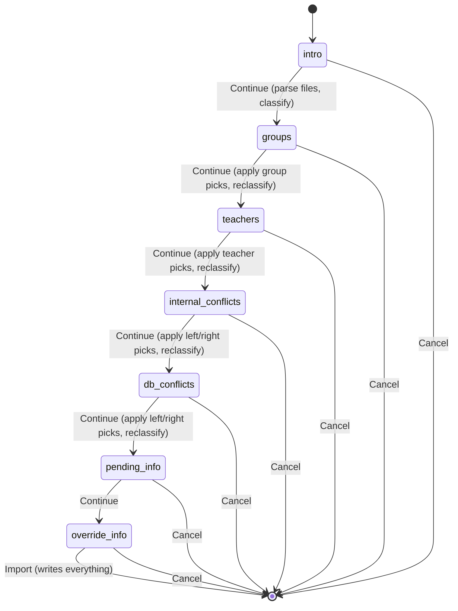

Status: PARTIALLY IMPLEMENTED 2026-08-01, same session as the design was confirmed. Supersedes
the deleted `plans/group_room_per_subject_override.md` (that problem is solved here by rule 2
below instead of a separate fix).

**Done:** #1 (scoped per-employee file import removed - `teacher_id`/`file` fields, `_onchange_file`,
the Schedule tab's "Import" button) and #2 (`find_external_conflicts` → `classify_external_conflicts`,
co-teaching left alone + surfaced non-blocking, space conflicts now block instead of auto-archiving).
Verified: backend tests (`TestWorkingSchedulesImportWizard`, `TestAttendanceTemplate`), the wizard's
own browser tour, and `TestEmployeeTour` (Schedule tab still renders without the Import button) all
green; docs/i18n/changelog updated.

**Also done, found while verifying #2 against the real incremental (department-by-department)
workflow:** reusing `sync_from_schedule_batch`/`_reconcile_teacher_groups` for the importer's own
write path silently archived a shared teacher's already-imported *other* department schedule the
moment a second department's file mentioned that same teacher again - zero error, pure data loss.
Fixed with `_reconcile_fresh_import`/`sync_from_schedule_batch_fresh_import` (importer-only, no
`touched_templates` pre-scan) and `ems.teaching.sync_from_schedule(..., replace=False)` for the
importer's call. Same session also added `ems.attendance_template.find_self_conflicts` - a teacher
imported in this batch, double-booked against their own already-active schedule for a genuinely
different subject/group (e.g. two departments scheduling them at the same time) - surfaced as its
own named `blocking_issues_html` line / `ValidationError`, instead of falling through to the raw,
unworded `check_overlap` constraint error. See
`docs/en/developers/employees/working_schedule.md`'s "Reconciliation"/"Overlap handling" sections
for the full detail. Known, accepted limitation: `find_self_conflicts` only compares against
already-written DB data (across separate imports) - two overlapping entries for the same teacher
*within* the single file/batch being submitted right now (a malformed source export) still
surfaces as the raw `check_overlap` error, not a named banner.

**Not done / next up:** #3 was re-scoped 2026-08-01 from a simple "inline dropdown" idea into a
full **multi-step wizard** (7 screens, statusbar progress) per the developer's own detailed,
button-by-button spec. Fully designed below in "Multi-step wizard (step-by-step import)" -
**no code written yet**, the developer ran out of usage quota for the day right after specifying
it. This section is what to pick up from next session.

# Why

The current importer (`ems.working_schedules_import_wizard` + `ems.attendance_template`'s
`sync_from_schedule_batch`/`_reconcile_teacher_groups`/`find_external_conflicts`) assumes it may
be writing on top of an already-populated, still-current schedule — so it tries to reconcile
co-teaching, split/merge templates, and auto-archive "external" conflicts by guessing. That
machinery is genuinely complex, and a real bug report (2026-08-01, an overlap `ValidationError`
during a batch import that couldn't be reproduced against current data - see this session's
investigation) showed how hard it is to reason about.

**Key fact that unlocks the simplification** (confirmed by reading
`models/settings/course_transition_wizard.py`, merged in from
`353-add-course-transition-wizard-setup-next-course` same session): `ems.group` records are
**permanent and reused across academic years** ("ems.group carries the course number but not the
academic year, so groups are reused" - `_apply_detach_unplaced`'s own docstring). What actually
gets archived at transition time is each outgoing `ems.attendance_template` (`_apply_cleanup`,
scoped to the studies being transitioned in that run - transitions happen per-study/department,
not all at once). So the moment a study's transition has been applied, every schedule import for
its groups starts from a genuinely blank slate — no reconciliation-against-existing-data is
needed, because there IS no existing active data to reconcile against for that scope.

This means the importer doesn't need to know or care whether it's "next-course prep" or not: it
can always assume it's filling empty slots, and treat any ACTIVE overlap it finds as a real
problem to resolve interactively, never something to guess-and-archive.

# What changes

## 1. Batch import only, no more mid-course single-teacher file import

Remove the scoped path entirely: `ems.working_schedules_import_wizard.file` field,
`teacher_id` field, `_onchange_file`, the `item.get('teacher_id')` branch in `create()`, and the
"Import" button + `onImportClick()` on the employee's own Schedule tab
(`static/src/js/backend/schedule_grid_field.js`). A teacher joining mid-year gets their schedule
via the tab's own **existing** "New" panel (`openNewPanel()` - blank framework or copy from
another teacher, already built, untouched) or by hand - never a single-file XML upload.

Keeps `attachment_ids` (the general, cog-menu importer) as the only way in. Keeps the
pending-identification-code mechanism (`X1`, `X2`...) - a batch load can still include posts not
yet staffed.

## 2. Batch sync stops reconciling against existing data - new simpler write path

**Implemented** (see "Done"/"Also done" at the top - this section is kept as the original
rationale, not a still-open TODO). `sync_from_schedule_batch`/`_reconcile_teacher_groups`/
`find_external_conflicts` stay **exactly as they were**, untouched - they are also used by
`ems.teaching.sync_from_schedule()` for the Schedule tab's own live, single-teacher edit, which is
a genuinely different case (editing an already-populated schedule mid-year) the developer
explicitly wants unchanged.

The batch file importer got its own, separate write path: `_reconcile_fresh_import` +
`sync_from_schedule_batch_fresh_import` (`ems.attendance_template`), plus
`ems.teaching.sync_from_schedule(..., replace=False)`. Overlaps are classified via
`classify_external_conflicts` (co-teaching left alone/surfaced non-blocking, space conflicts
block) and `find_self_conflicts` (a submitting teacher double-booked against their own existing
schedule, blocks) - the actual shape landed on is two checks/classifications rather than the
original three-rule sketch drafted below, refined during implementation once real incremental-
import edge cases (see "Also done" above) were found. The **multi-step wizard** section further
below is what turns these existing blocking checks into an interactive, resolvable step instead
of a hard stop.

## 3. Interactive correction for unresolved group/teacher

Superseded 2026-08-01 by the full multi-step wizard design below - see that section for the
current spec (steps 2 and 3 there cover exactly this, now as their own dedicated screens instead
of an inline dropdown in a single-screen preview).

# Multi-step wizard (step-by-step import) — full design (2026-08-01, NOT YET IMPLEMENTED)

Replaces the current single-screen wizard (one form, several stacked banners) with a guided,
multi-step flow — Odoo's own `state` + statusbar-widget pattern (the same shape used by several
native multi-step wizards, e.g. `account.payment.register`) — so each class of problem gets its
own screen instead of a wall of red/yellow/blue banners all at once. Specified in full by the
developer; renumbered here 1-7 for clarity (the developer's own message skipped a number).

## Flow overview

`state` (Selection, the 7 steps below, `widget="statusbar"`, non-clickable — no jumping steps by
clicking the bar itself) drives which screen shows.

**No "back" button, decided (not asked — the developer explicitly left this call to us at every
step):** a group/teacher pick made in an earlier step can change what conflicts even exist
downstream (a different group implies a different room, which changes step 5's conflict list), so
"go back and re-decide" would need re-validating or discarding every later step's decisions —
real complexity for a recovery path that **Cancel** (always enabled, every step, discards the
whole in-progress wizard) already covers just as well: re-upload and walk through again.

**Buttons — Odoo's own real Bootstrap classes, no custom CSS colors needed** (`btn-primary`
already renders as Odoo v18's default purple/violet brand color, matching "lila" natively):
- **Cancel** — `btn-danger` (red), present on every step.
- **Continue** — `btn-primary` (purple), steps 1 through 6.
- **Import** — `btn-success` (green), step 7 only — the one button that actually writes data.

**Loading feedback on every transition:** each click re-runs server-side classification (parsing
step 1→2, or re-checking conflicts against the latest picks for every later step) before
advancing — reuse the same `ui.block()`/`.unblock()` pattern already built for the file upload and
the current Import button (`working_schedules_import_wizard_form_controller.js`), scoped to
whichever button is visible for the current `state`.

## Step-by-step (renumbered 1-7; developer's own numbers in parentheses)

### 1 (their 1) — Welcome + file upload
Static help text: recommend running this importer during next-course prep, once the old
schedules have already been archived by the course transition wizard; running it against a
course already in progress can create conflicts/overlaps that then need manual resolution. Below
it, the existing `attachment_ids` field (same widget, same spinner). Buttons: Cancel / Continue.
**Continue:** parse every attached file into `teacher_entries` (existing
`_parse_schedule_entries`-adjacent logic) — **without writing anything yet**, this whole wizard
now only writes at the very end (step 7's Import) — cache the parsed structure (see "Data model"
below), classify unresolved groups, advance to step 2.

### 2 (their 3) — Resolve unrecognized groups
One line per **distinct** unresolved `<Students>` name found anywhere in the batch (dedup by raw
name — the same typo'd group appearing in 20 hour-nodes across a file shows as ONE line, and
picking a group for it applies to all 20 occurrences). Each line: the raw text from the file + a
`Many2one` to `ems.group`, **with Odoo's native create-on-the-fly allowed** (plain Many2one, no
`no_create`/`no_create_edit` context key) — satisfies "o crearlo al vuelo, como ya permite Odoo de
forma nativa" for free, no bespoke code needed. No unresolved lines → green success banner instead
of the list, matching the wizard's existing banner visual language. **Continue:** every line must
have a value picked (block Continue otherwise, inline validation) before substituting the picks
into `teacher_entries` and advancing to step 3.

### 3 (their 4) — Resolve unrecognized teachers
Same shape as step 2, but for teacher identification: one line per distinct unresolved identifier
(an e-mail matching nobody by `work_email` — see the open question below on telling this apart
from a legitimate pending-identification code) + a `Many2one` to `hr.employee`, **create
explicitly disabled** (`context="{'no_create': True, 'no_create_edit': True}"`) — the developer's
own call: creating a brand-new teacher belongs to step 6 (pending-identification, automatic at
Import time), not here. No unresolved lines → green success banner. **Continue:** apply picks,
re-derive `teacher_entries`, advance to step 4.

### 4 (their 5) — Resolve overlaps *within this same import*
A genuinely new check, not built yet: two entries **inside the batch itself** (same file, or two
files uploaded together) that collide — either the same space+time claimed by two different
`(subject, group)` combinations, or the same teacher double-booked at the same time in two
different rooms — excluding the case where both entries share subject **and** group (that's
intentional co-teaching declared twice in the source data itself, not a conflict). Each colliding
pair renders as **two side-by-side columns** (teacher / subject / group / weekday / time per
side) with a radio button choosing which one prevails — **left selected by default**. The
discarded side is dropped from `teacher_entries` entirely before anything downstream sees it. No
conflicts found → green success banner. **Continue:** apply picks, advance to step 5. This closes
the one known gap called out in `find_self_conflicts`'s own docstring (that method only ever
compared against already-written DB data, never within the same submitted batch).

### 5 (their 6) — Resolve overlaps *from this import against already-active DB schedules*
The current red `blocking_issues_html` mechanism — `classify_external_conflicts`'s
`space_conflicts` + `find_self_conflicts`'s self-conflicts (both are "an active DB session
collides with a new entry" cases; unified into one step/UI here) — now resolved interactively
instead of just blocking with a "go fix your file and re-upload" error. Same two-column/radio-
button UI as step 4: left = the new entry from this import, right = the existing active DB
session, **left default**. Choosing left archives/trims the existing DB session's template to
free that slot before the new one is written; choosing right drops that specific new entry from
what gets imported (the existing DB session is left completely alone). **Explicitly excluded from
this step** (the developer's own parenthetical — "evitando los de un docente hacia sí mismo,
porque eso se recrea"): a teacher's own existing session for the **exact same** `(subject,
group-set)` combo being resubmitted now — that's just an in-place update, already excluded by
construction in both `classify_external_conflicts` (`teacher_ids not in submitting_teacher_ids`)
and `_reconcile_fresh_import`'s own key-scoped logic; nothing new needed there, just confirming it
stays excluded once this becomes a wizard step instead of a raised exception. Legitimate
co-teaching (`classify_external_conflicts`'s `co_teaching` return value) is **not** part of this
step's resolvable list — there's nothing to discard, both sides stay — shown instead as a small
non-blocking informational aside above/alongside this step, same wording as today's banner. No
resolvable conflicts found → green success banner (the co-teaching aside, if any, can still show
alongside it). **Continue:** apply picks, advance to step 6.

### 6 (their 7) — Pending-identification teachers (informational)
Today's blue `info_html` content, moved into its own step: lists every placeholder code (`X1`,
`X2`...) or bare not-yet-hired name that will become a new "Pending teacher" employee at Import
time, plus a short explanation that its real identity/Google account can be filled in afterwards
via the existing "Generate Google account" button. Nothing to resolve — always either this list or
a green success banner. **Continue** advances to step 7 (purely informational, no server
recomputation needed).

### 7 (their 8) — Existing teachers being overwritten (informational) + final Import
Today's yellow `overrided_teachers_html` content: which already-known teachers will have their
schedule/templates recreated by this import. Green success banner if none. This step's primary
button is **Import** (green, `btn-success`), not Continue — clicking it is what finally writes
everything: `ems.teaching.sync_from_schedule(replace=False)` +
`ems.attendance_template.sync_from_schedule_batch_fresh_import`, using the fully-resolved
`teacher_entries` accumulated across every prior step's picks. On success, closes/reloads exactly
like `import_planner_data()` does today.

## Data model sketch (not final — confirm shape while implementing)

- `ems.working_schedules_import_wizard` gains `state` (Selection, the 7 steps above,
  `widget="statusbar"`) and a way to carry the parsed-and-partially-resolved `teacher_entries`
  across steps/RPCs. A `TransientModel` record already survives across the several `write()`
  calls a multi-step wizard implies (unlike a plain in-memory `new()`), so this can be a real
  stored field (e.g. a private JSON/binary blob) rather than needing anything cleverer — worth a
  small spike to confirm the `entries` dicts (already plain ints/strings — `group_ids`,
  `subject_id`, `dayofweek`, `hour_from`/`hour_to`) serialize cleanly as-is.
- New child `TransientModel`s, one `One2many` each, `wizard_id` back-reference:
  - `....group_line` — `raw_name` (Char), `group_id` (Many2one, create allowed).
  - `....teacher_line` — `raw_identifier` (Char), `teacher_id` (Many2one, create disabled).
  - `....internal_conflict_line` / `....external_conflict_line` — `left_label`/`right_label`
    (Char, prebuilt display text — reuse `_conflict_lines`'s formatting) + `keep` (Selection
    `[('left', ...), ('right', ...)]`, default `'left'`). Whether internal and external conflicts
    need two separate models or can share one (with a discriminating field) is a Green-phase
    call, not a design one.
- Each step's Continue is a real server method (`action_continue_groups()`,
  `action_continue_teachers()`, ...) that: validates the current step's lines are all resolved,
  folds the picks back into the cached `teacher_entries`, re-runs the *next* step's own
  classification against the updated data, populates that step's lines/success-banner, and
  flips `state`.

## Open questions to settle while implementing (use best judgment, not blocking)

- Telling apart "a genuinely unresolved e-mail" from "a legitimate pending-identification code" in
  step 3's line list — today's onchange already distinguishes them (`_is_email_like`); step 3
  should probably only list genuine e-mail-shaped-but-unmatched identifiers as "needs a teacher
  picked", since a placeholder code isn't a *problem* to resolve here, it's expected input handled
  in step 6.
- Exact serialization shape for carrying `teacher_entries` + resolved picks between steps.
- Whether internal-conflict and external-conflict line models are actually two models or one
  shared model with a discriminating field.
- Tour coverage for a 7-step wizard is a substantial testing effort on its own (statusbar
  progression, each step's success/non-success banner, the two-column radio picks, the Many2one
  create-vs-no-create behavior) — budget for this explicitly in the Red phase, don't treat it as
  an afterthought.

# Not changing

- `ems.teaching.sync_from_schedule()` (with `replace=True`), `sync_from_schedule_batch`,
  `_reconcile_teacher_groups`, `_archive_stale_schedule_sync`, `_write_schedule_sync` - all stay,
  serving the Schedule tab's own live single-teacher edit exactly as today.
- `ems.attendance_schedule.check_overlap` (the `@api.constrains`) - still the actual DB-level
  guardrail; the new interactive resolution above is a *pre-check* in the wizard so the user gets
  asked instead of hitting that constraint's raw error, not a replacement for it.
- Pending-identification-code (`X1`/`X2`) creation logic in `create()`.
- The Schedule tab's own "New" panel (blank framework / copy from another teacher) - already the
  intended mechanism for a mid-year newcomer.

# Rough shape of the work (DTON) — for the multi-step wizard (#3)

1. **D:** update `docs/en/developers/employees/working_schedule.md` with the final design (this
   plan's "Multi-step wizard" section, condensed) once implemented; user-facing admin doc
   (`docs/{en,ca,es}/secretary/` or wherever this wizard is documented for the acting role) needs
   the new step-by-step flow explained (screenshots per step likely warranted, given how visual
   this change is).
2. **T (Red):** tests for: the new `find_internal_conflicts`-shaped check (step 4), each step's
   own state-transition method (validates its lines, folds picks in, advances `state`), the
   group/teacher correction lines (create-allowed vs create-disabled), the two-column left/right
   resolution for both internal (step 4) and DB (step 5) conflicts, success-banner-when-empty for
   every resolvable step. Tour coverage is substantial here — see the last open question above —
   budget real time for it, not an afterthought.
3. **T (Green):** implement (state field + statusbar view, child line models, per-step action
   methods, the two-column radio-button template, button color classes).
4. **N:** coding-guidelines pass, pylint redefined-builtin check.
5. **Close:** i18n (new step labels/banners), changelog, delete this plan file once shipped.
