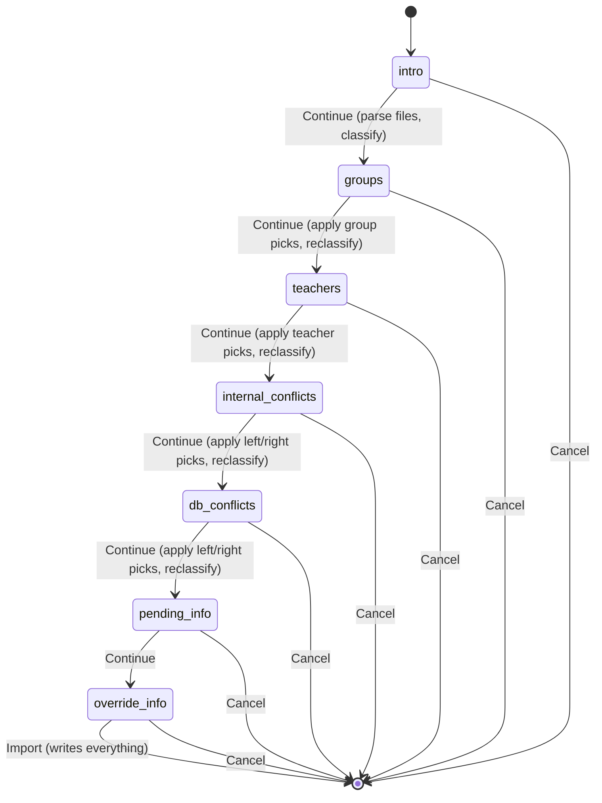

Status: PARTIALLY IMPLEMENTED 2026-08-01, same session as the design was confirmed. Supersedes
the deleted `plans/group_room_per_subject_override.md` (that problem is solved here by rule 2
below instead of a separate fix).

**Done:** #1 (scoped per-employee file import removed - `teacher_id`/`file` fields, `_onchange_file`,
the Schedule tab's "Import" button) and #2 (`find_external_conflicts` → `classify_external_conflicts`,
co-teaching left alone + surfaced non-blocking, space conflicts now block instead of auto-archiving).
Verified: backend tests (`TestWorkingSchedulesImportWizard`, `TestAttendanceTemplate`), the wizard's
own browser tour, and `TestEmployeeTour` (Schedule tab still renders without the Import button) all
green; docs/i18n/changelog updated.

**Also done, found while verifying #2 against the real incremental (department-by-department)
workflow:** reusing `sync_from_schedule_batch`/`_reconcile_teacher_groups` for the importer's own
write path silently archived a shared teacher's already-imported *other* department schedule the
moment a second department's file mentioned that same teacher again - zero error, pure data loss.
Fixed with `_reconcile_fresh_import`/`sync_from_schedule_batch_fresh_import` (importer-only, no
`touched_templates` pre-scan) and `ems.teaching.sync_from_schedule(..., replace=False)` for the
importer's call. Same session also added `ems.attendance_template.find_self_conflicts` - a teacher
imported in this batch, double-booked against their own already-active schedule for a genuinely
different subject/group (e.g. two departments scheduling them at the same time) - surfaced as its
own named `blocking_issues_html` line / `ValidationError`, instead of falling through to the raw,
unworded `check_overlap` constraint error. See
`docs/en/developers/employees/working_schedule.md`'s "Reconciliation"/"Overlap handling" sections
for the full detail. Known, accepted limitation: `find_self_conflicts` only compares against
already-written DB data (across separate imports) - two overlapping entries for the same teacher
*within* the single file/batch being submitted right now (a malformed source export) still
surfaces as the raw `check_overlap` error, not a named banner.

**Not done / next up:** #3 was re-scoped 2026-08-01 from a simple "inline dropdown" idea into a
full **multi-step wizard** (7 screens, statusbar progress) per the developer's own detailed,
button-by-button spec, then refined three more times the same day: (2) co-teaching becomes an
explicit per-row choice in steps 4/5 instead of a silent assumption, plus a new "reasignar aulas"
resolution for group-split/"desdoble" room collisions; (3) that resolution's default should be
"reasignar aulas", not pick-one, and the fix must be per-schedule-block, not `ems.group.space_id`
- first attempt at "per-block" proposed a brand-new persistent override model; (4) **that model
was itself wrong** per the developer's correction - `ems.attendance_template`/`ems.attendance_
schedule` are teacher-owned attendance-taking artifacts, not the source of truth for room; the
room belongs on the actual schedule block (`resource.calendar.attendance`) upstream of them; (5)
the one open subtlety from round 4 (does a room reassignment need to survive a *later* re-import
of the same file) - decided: no, deliberately not carried forward, kept as simple as "fallback to
the group's room, fix again by hand if it collides again" (see "Room reassignment"'s "Re-import
durability" note); and (6) **round 4's own fix turned out to be more complex than necessary** -
`ems.attendance_schedule.space_id` (the recurring weekly line, already read by `check_overlap`/
`classify_external_conflicts` today) already gives the right granularity with zero changes to
`_plan_schedule_sync`'s template-grouping key, once `_schedule_lines` is taught to prefer each
entry's own `space_id` over the group-derived default - plus a real, independently-found bug
(`ems.attendance_session_header._compute_space_id` reads the template's room, not the schedule
line's, so attendance-taking would show a stale room once they can diverge) that needs fixing
alongside it; (7) proposed `ems.attendance_template.space_id` become a non-editable `compute`;
and (8) **reverted 2026-08-01, per the developer** - keeping it editable/stored (exactly as
today) turned out simpler than the compute from round 7, so that's what stays: just relabeled
("Session's default space"). **Phase 0 (this whole room-granularity foundation) implemented and
tested 2026-08-05** - see "Room reassignment"'s own status note below for what shipped and what
turned out unnecessary once actually built (a planned new onchange on `ems.attendance_schedule`
was found redundant with a `default_space_id` context the template's view already had). The
remaining wizard phases (1-7, multi-step UI) are still design-only - **no code written yet** for
those.

**Reviewed 2026-08-05 against the same day's separate `study_ids`/`has_sessions`/"Edit" work**
(the multi-study support + identity-field locking on `ems.attendance_template`/
`ems.attendance_schedule`, see `docs/en/developers/attendance/attendance_template.md`'s "Identity
fields, locking, and the 'Edit' button" section): no stale `level_id`/`study_id` (singular)
references found anywhere in this file - this plan's own text only ever dealt with
`group_ids`/`subject_id`/`teacher_ids`/`space_id`, never level/study directly, so that rename
needed no changes here. Confirmed (by reading the current code) that
`sync_from_schedule_batch_fresh_import` already calls `_write_schedule_sync` directly
(`models/attendance/attendance_template.py:250`) - so that method's `study_ids` union-across-groups
behavior (added 2026-08-05) already applies to this wizard's eventual write path for free, no
wizard-specific work needed for multi-study support.

**One genuine integration gap found, then corrected in scope after developer clarification** (see
"Room reassignment"'s "Interaction with the `has_sessions` lock" section for the full writeup):
first pass scoped this narrowly to the wizard's own step 5 UI (writing a reassigned room onto an
already-active DB entry). The developer corrected that framing - this is a property the
`ems.attendance_schedule` **model** itself must uphold, not something specific to this wizard:
*"Yo no me refería a la pestaña Schedule, me refería al modelo attendance_schedule, vinculado al
modelo attendance_template."* The actual fix lands on `_archive_stale_schedule_sync`/
`_write_schedule_sync` themselves (moved out of "Not changing" below) - shared infrastructure
between the live Schedule tab's own save path and this wizard's future one, so the fix benefits
(and changes the behavior of) both, not just the not-yet-built wizard.

**This model-level fix IMPLEMENTED AND TESTED 2026-08-05, ahead of the multi-step wizard itself**
(per the developer's own requested order - foundational, and step 5 depends on it): new shared
mixin `ems.attendance_mixin` (`models/shared/attendance_mixin.py`, deliberately generic name per
the developer's own request - a home for future shared attendance-model code, not just this rule)
providing `_write_or_new_version(vals)`; both models' `action_new_version()` refactored into thin
wrappers over it; `_plan_schedule_sync`/`_archive_stale_schedule_sync`/`_write_schedule_sync`
rewritten for the per-line match described above (`_match_schedule_lines`, `_schedule_line_vals`).
Verified: all 5 pre-existing test classes touching this pipeline still green
(`TestAttendanceTemplate`, `TestAttendanceScheduleLogic`, `TestAttendanceTemplateSyncFromSchedule`,
`TestWorkingSchedule`, `TestWorkingSchedulesImportWizard` - 123 tests total), plus 5 new tests
covering the mixin's two branches directly and the sync pipeline's three per-line outcomes
(untouched/updated-in-place/archived-and-recreated). `pylint --enable=redefined-builtin` clean.
Docs (`attendance_template.md`/`attendance_schedule.md`) and this branch's changelog updated.
**What's still not built:** the multi-step wizard itself (phases 1-7 below) - this piece only
covers the shared model-level rule steps 4/5 will eventually call into.

**Skeleton + step 1 IMPLEMENTED AND TESTED 2026-08-05** (same day, later): the `state` Selection
field (statusbar, 7 values from the "Step-by-step" section below), the single "Continue" button
(`action_continue()`, dispatching to `_continue_from_intro()` for step 1 and a plain
`_advance_state()` placeholder for steps 2-6), and step 1 itself (parse-without-writing + cache,
via the new `_classify_attachments()` helper shared with the live onchange preview) are all built
and working. **`create()` had to become a plain, un-overridden default** - it used to do the
entire import as a side effect of the wizard's first save, which the multi-step flow's first
"Continue" click would now trigger prematurely; the real write logic moved into `_apply_import()`,
called only by the final step's `import_planner_data()` from the cached, already-parsed data (not
a re-parse of the XML). Found and fixed a real, costly-to-diagnose Odoo gotcha in the process: a
`type="object"` button returning a falsy value gets silently converted into "close the window" by
the web client (`action_service.js`'s own `doActionButton`) - for this `target: "new"` dialog, that
closed the whole wizard on the very first "Continue" click, since `action_continue()` had no
explicit return. Fixed with `_reopen_self_action()` (re-opens the same wizard record as a fresh
window action) - **any future step's own button method must return a real action dict too, or it
will silently close the wizard instead of advancing**. See
`docs/en/developers/employees/working_schedule.md`'s "Multi-step wizard skeleton" section for the
full writeup of this trap. Verified: `TestWorkingSchedulesImportWizard` (42 tests, including 5 new
ones for the state machine itself) and all 3 tours in `TestWorkingSchedulesImportWizardTour` green
(the pending-teacher tour now clicks all the way through every placeholder step to the final
Import, proving the skeleton is clickable end-to-end in a real browser, not just in a backend
test). i18n added for the 7 state labels, the "Continue" button, the intro screen's help text, and
the placeholder steps' notice - plus one **pre-existing, unrelated gap** found and fixed along the
way: the wizard's "these teachers already have a schedule" warning banner text had never actually
been translated at all (confirmed via `psql`, not just the `.po` diff) despite being old, unchanged
text - fixed now while already in this exact view for other reasons.

**What's still not built:** the actual resolution screens for steps 2-6 (group/teacher correction
lines, the internal/DB conflict classification UI, the pending-teacher/overridden-teacher info
screens' own dedicated content) - see the "Step-by-step" section below for each one's full design.

**Corrected the same day, right after the developer actually tried it:** the first cut of step 1
had ported the old single-screen wizard's four banners (red/blue/yellow) onto the welcome screen
verbatim, live-updated via `@api.onchange('attachment_ids')` - functionally identical to the old
wizard's own validation, just relocated. The developer's read: *"al cargar el fichero, no salga
nada en esta primera ventana, solamente que se active el botón 'Continue'... o que se pueda
cancelar"* - resolving an unresolved e-mail/group is exactly what steps 2-3 exist for, so showing
(or blocking on) it at the welcome screen pre-empts their whole purpose. Fixed: removed all four
banner fields and the onchange entirely; `ready_to_import` is now a plain `bool(attachment_ids)`
compute, no content validation before Continue is clickable. Every real problem (unresolved
e-mail, missing classroom, room/schedule conflicts) is deferred to `_apply_import()` at the final
step - today that means it surfaces at the Import click (as a plain error dialog) instead of
whichever future screen will eventually own it. The one thing that still can't be deferred: an
unresolvable subject/group *code* (not e-mail) still blocks leaving the welcome screen, since
`_parse_schedule_entries()` produces no entries at all for that node - nothing to cache forward.
Re-verified: `TestWorkingSchedulesImportWizard` back down to 32 tests (10 obsolete onchange/banner
tests removed, 4 of them adapted to assert the same underlying checks at their new, later point
instead) and all 3 tours green, including both tours' own banner-checking steps rewritten to match
- the unknown-teacher tour now clicks all the way through to Import before asserting the error,
via a real `.o_error_dialog`, not a wizard banner. Also removed while in the area: `_bullet_html()`
(the now-unused banner-rendering helper - left the `.ems_wizard_bullet_list` CSS rule in `ems.css`
in place though, including its hard-won `break-inside: avoid` fix, since steps 2-7 will need the
exact same bullet-list rendering again soon) and 3 now-orphaned `.po` entries for the removed
banner text (one of which - "already has a schedule" - had ironically just been given its first
real translation minutes earlier, as part of the very same day's skeleton work, before this
correction made it dead again).

**Corrected again the same day: Continue/Import/Cancel moved from `<header>` to `<footer>`.** The
developer tried the wizard again and reported the buttons still looked wrong: *"los botones
Continue y Cancel deberían estar donde aparecen ahora Save y Discard (y ocultar o eliminar
estos dos)"*. First attempt misdiagnosed this as `web.FormStatusIndicator` (a small, unrelated
"unsaved changes" icon pair) and tried hiding it via a `className` override on a custom
`FormController` + a scoped CSS rule - `./upgrade.sh` was clean and all 3 tours stayed green, but
the developer reported *"está exactamente igual que antes. No veo cambios"*. Re-diagnosed by
reading `web.FormView`'s own template: a `target: "new"` dialog with no `<footer>` in its arch
falls back to Odoo's generic Save/Discard/Remove buttons, portaled straight into the modal's own
`.modal-footer` - completely independent of whatever's in `<header>`. Real fix: moved the 3 action
buttons into a real `<footer>`, keeping only the `state` statusbar field in `<header>` - matches
every other wizard in this codebase (e.g. `ems.grade_import_wizard`). Reverted the incorrect
`className`/CSS attempt. Tour selectors updated from `.modal .o_form_statusbar button[name='...']`
to `.modal .modal-footer button[name='...']`. Re-verified: all 3 tours in
`TestWorkingSchedulesImportWizardTour` green. See
`docs/en/developers/employees/working_schedule.md`'s new "Action buttons belong in `<footer>`, not
`<header>`" subsection for the full mechanism writeup.

# Why

The current importer (`ems.working_schedules_import_wizard` + `ems.attendance_template`'s
`sync_from_schedule_batch`/`_reconcile_teacher_groups`/`find_external_conflicts`) assumes it may
be writing on top of an already-populated, still-current schedule — so it tries to reconcile
co-teaching, split/merge templates, and auto-archive "external" conflicts by guessing. That
machinery is genuinely complex, and a real bug report (2026-08-01, an overlap `ValidationError`
during a batch import that couldn't be reproduced against current data - see this session's
investigation) showed how hard it is to reason about.

**Key fact that unlocks the simplification** (confirmed by reading
`models/settings/course_transition_wizard.py`, merged in from
`353-add-course-transition-wizard-setup-next-course` same session): `ems.group` records are
**permanent and reused across academic years** ("ems.group carries the course number but not the
academic year, so groups are reused" - `_apply_detach_unplaced`'s own docstring). What actually
gets archived at transition time is each outgoing `ems.attendance_template` (`_apply_cleanup`,
scoped to the studies being transitioned in that run - transitions happen per-study/department,
not all at once). So the moment a study's transition has been applied, every schedule import for
its groups starts from a genuinely blank slate — no reconciliation-against-existing-data is
needed, because there IS no existing active data to reconcile against for that scope.

This means the importer doesn't need to know or care whether it's "next-course prep" or not: it
can always assume it's filling empty slots, and treat any ACTIVE overlap it finds as a real
problem to resolve interactively, never something to guess-and-archive.

# What changes

## 1. Batch import only, no more mid-course single-teacher file import

Remove the scoped path entirely: `ems.working_schedules_import_wizard.file` field,
`teacher_id` field, `_onchange_file`, the `item.get('teacher_id')` branch in `create()`, and the
"Import" button + `onImportClick()` on the employee's own Schedule tab
(`static/src/js/backend/schedule_grid_field.js`). A teacher joining mid-year gets their schedule
via the tab's own **existing** "New" panel (`openNewPanel()` - blank framework or copy from
another teacher, already built, untouched) or by hand - never a single-file XML upload.

Keeps `attachment_ids` (the general, cog-menu importer) as the only way in. Keeps the
pending-identification-code mechanism (`X1`, `X2`...) - a batch load can still include posts not
yet staffed.

## 2. Batch sync stops reconciling against existing data - new simpler write path

**Implemented** (see "Done"/"Also done" at the top - this section is kept as the original
rationale, not a still-open TODO). `sync_from_schedule_batch`/`_reconcile_teacher_groups`/
`find_external_conflicts` stay **exactly as they were**, untouched - they are also used by
`ems.teaching.sync_from_schedule()` for the Schedule tab's own live, single-teacher edit, which is
a genuinely different case (editing an already-populated schedule mid-year) the developer
explicitly wants unchanged.

The batch file importer got its own, separate write path: `_reconcile_fresh_import` +
`sync_from_schedule_batch_fresh_import` (`ems.attendance_template`), plus
`ems.teaching.sync_from_schedule(..., replace=False)`. Overlaps are classified via
`classify_external_conflicts` (co-teaching left alone/surfaced non-blocking, space conflicts
block) and `find_self_conflicts` (a submitting teacher double-booked against their own existing
schedule, blocks) - the actual shape landed on is two checks/classifications rather than the
original three-rule sketch drafted below, refined during implementation once real incremental-
import edge cases (see "Also done" above) were found. The **multi-step wizard** section further
below is what turns these existing blocking checks into an interactive, resolvable step instead
of a hard stop.

## 3. Interactive correction for unresolved group/teacher

Superseded 2026-08-01 by the full multi-step wizard design below - see that section for the
current spec (steps 2 and 3 there cover exactly this, now as their own dedicated screens instead
of an inline dropdown in a single-screen preview).

# Multi-step wizard (step-by-step import) — full design (2026-08-01, NOT YET IMPLEMENTED)

Replaces the current single-screen wizard (one form, several stacked banners) with a guided,
multi-step flow — Odoo's own `state` + statusbar-widget pattern (the same shape used by several
native multi-step wizards, e.g. `account.payment.register`) — so each class of problem gets its
own screen instead of a wall of red/yellow/blue banners all at once. Specified in full by the
developer; renumbered here 1-7 for clarity (the developer's own message skipped a number).

## Flow overview

`state` (Selection, the 7 steps below, `widget="statusbar"`, non-clickable — no jumping steps by
clicking the bar itself) drives which screen shows.

**No "back" button, decided (not asked — the developer explicitly left this call to us at every
step):** a group/teacher pick made in an earlier step can change what conflicts even exist
downstream (a different group implies a different room, which changes step 5's conflict list), so
"go back and re-decide" would need re-validating or discarding every later step's decisions —
real complexity for a recovery path that **Cancel** (always enabled, every step, discards the
whole in-progress wizard) already covers just as well: re-upload and walk through again.

**Buttons — Odoo's own real Bootstrap classes, no custom CSS colors needed** (`btn-primary`
already renders as Odoo v18's default purple/violet brand color, matching "lila" natively):
- **Cancel** — `btn-danger` (red), present on every step.
- **Continue** — `btn-primary` (purple), steps 1 through 6.
- **Import** — `btn-success` (green), step 7 only — the one button that actually writes data.

**Loading feedback on every transition:** each click re-runs server-side classification (parsing
step 1→2, or re-checking conflicts against the latest picks for every later step) before
advancing — reuse the same `ui.block()`/`.unblock()` pattern already built for the file upload and
the current Import button (`working_schedules_import_wizard_form_controller.js`), scoped to
whichever button is visible for the current `state`.

## Step-by-step (renumbered 1-7; developer's own numbers in parentheses)

### 1 (their 1) — Welcome + file upload
Static help text: recommend running this importer during next-course prep, once the old
schedules have already been archived by the course transition wizard; running it against a
course already in progress can create conflicts/overlaps that then need manual resolution. Below
it, the existing `attachment_ids` field (same widget, same spinner). Buttons: Cancel / Continue.
**Continue:** parse every attached file into `teacher_entries` (existing
`_parse_schedule_entries`-adjacent logic) — **without writing anything yet**, this whole wizard
now only writes at the very end (step 7's Import) — cache the parsed structure (see "Data model"
below), classify unresolved groups, advance to step 2.

**Corrected 2026-08-05, after actually building and using this screen: "classify unresolved
groups" above does NOT mean showing/blocking on them here.** `ready_to_import` (gating Continue)
is just `bool(attachment_ids)` - no content validation of any kind runs before Continue is even
clickable. An unresolved e-mail is deferred all the way to the final Import step (today; to step 3
once it exists) - the only thing that still blocks leaving this screen is a node whose own
schedule content fails to parse at all (an unresolved subject/group *code*, which produces no
entries to defer in the first place). See `docs/en/developers/employees/working_schedule.md`'s
"intro screen shows no validation output" note for the full reasoning and the developer's own
framing (*"al cargar el fichero, no salga nada en esta primera ventana, solamente que se active el
botón Continue... o que se pueda cancelar"*).

### 2 (their 3) — Resolve unrecognized groups

**IMPLEMENTED 2026-08-05** — confirmed with the developer first, since building this exactly as
designed here changes the intro screen's own previously-documented behavior (an unresolved group
name used to permanently block leaving Welcome; now it's deferred here instead, matching this
section's original design). See `docs/en/developers/employees/working_schedule.md`'s "Screen 2 —
'Resolve groups'" section for the full mechanism and the exact conflict that prompted asking
rather than assuming. Subject *codes* are unaffected — still no resolution screen for those, still
blocks at Welcome.

One line per **distinct** unresolved `<Students>` name found anywhere in the batch (dedup by raw
name — the same typo'd group appearing in 20 hour-nodes across a file shows as ONE line, and
picking a group for it applies to all 20 occurrences). Each line: the raw text from the file + a
`Many2one` to `ems.group`, **with Odoo's native create-on-the-fly allowed** (plain Many2one, no
`no_create`/`no_create_edit` context key) — satisfies "o crearlo al vuelo, como ya permite Odoo de
forma nativa" for free, no bespoke code needed. No unresolved lines → green success banner instead
of the list, matching the wizard's existing banner visual language. **Continue:** every line must
have a value picked (block Continue otherwise, inline validation) before substituting the picks
into `teacher_entries` and advancing to step 3.

### 3 (their 4) — Resolve unrecognized teachers

**IMPLEMENTED 2026-08-05** — see `docs/en/developers/employees/working_schedule.md`'s "Screen 3 —
'Resolve teachers'" section for the mechanism. Unlike screen 2's group-code question, this one was
unambiguous: the plan already fully specified this exact deferred-resolution behavior for an
unresolved e-mail, so no developer check-in was needed before building it. Building it does change
what "an unknown e-mail" means for the existing tour/tests written before this screen existed (it
now surfaces as a resolvable line here instead of an error dialog at the final Import) - adapted
the same way screen 2's pre-existing tests were.

Same shape as step 2, but for teacher identification: one line per distinct unresolved identifier
(an e-mail matching nobody by `work_email` — see the open question below on telling this apart
from a legitimate pending-identification code) + a `Many2one` to `hr.employee`, **create
explicitly disabled** (`context="{'no_create': True, 'no_create_edit': True}"`) — the developer's
own call: creating a brand-new teacher belongs to step 6 (pending-identification, automatic at
Import time), not here. No unresolved lines → green success banner. **Continue:** apply picks,
re-derive `teacher_entries`, advance to step 4.

### 4 (their 5) — Resolve overlaps *within this same import*
A genuinely new check, not built yet: two entries **inside the batch itself** (same file, or two
files uploaded together) that collide on space+time. **Revised 2026-08-01 (second round,
developer feedback) — no case is silently auto-resolved any more, every colliding pair is shown
and classified** (see "Conflict kind classification" below, shared with step 5):

- **Co-teaching-eligible** (same subject, sharing the group) — shown as a **yellow warning**
  (not red: this might be entirely legitimate), first-level radio **"Es co-docencia"** (default,
  keeps both) vs **"Prevalece uno"** (reveals the same two-column/radio UI as the plain-conflict
  case, to discard one side). This replaces the original design's silent auto-exclude of this
  exact shape — the developer explicitly doesn't want co-teaching *assumed*, since a genuine
  typo/error in the source file can produce the identical shape.
- **Desdoble-eligible** (same subject, **different** group) — second-level radio **"Reasignar
  aulas"** (default — see "Room reassignment" below, two `ems.space` dropdowns instead of
  discarding either side) vs **"Prevalece uno"** (fallback, today's plain pick-one).
- **Plain conflict** (different subject) — unchanged: two side-by-side columns (teacher /
  subject / group / weekday / time per side), one radio, **left default**, no extra options —
  this shape can never be legitimate co-teaching or a room-only fix.

No conflicts of any kind → green success banner. **Continue:** apply every row's resolution
(co-teaching keeps both; pick-one drops the discarded side from `teacher_entries`; room-
reassignment updates the relevant `ems.group.space_id`(s) and keeps both), advance to step 5.
This also closes the one known gap called out in `find_self_conflicts`'s own docstring (that
method only ever compared against already-written DB data, never within the same submitted
batch).

### 5 (their 6) — Resolve overlaps *from this import against already-active DB schedules*
The current red `blocking_issues_html` mechanism — `classify_external_conflicts`'s `co_teaching` +
`space_conflicts` + `find_self_conflicts`'s self-conflicts — now **all** routed through the exact
same three-way classification and resolution UI as step 4 (co-teaching-eligible /
desdoble-eligible / plain-conflict), left = the new entry from this import, right = the existing
active DB session, **left default** for co-teaching/plain rows; for desdoble-eligible rows
**"reasignar aulas" is the default** (see "Room reassignment" below), same as step 4. Choosing
"prevalece uno" on the left archives/trims the existing DB session's template to free the slot
before the new one is written (or drops the new entry if the right side wins); choosing
"reasignar aulas" sets a genuinely different `space_id` on the entry/block for the slot(s)
involved instead of discarding anything. **Revised
2026-08-01 (second round):** `co_teaching` no longer gets silent, no-choice treatment (the
"non-blocking informational aside" from the first design round is dropped) — it now surfaces as
the same yellow-warning, co-docencia-or-pick-one row as step 4's own co-teaching-eligible case.
**Still explicitly excluded** (unchanged from the first round — the developer's own parenthetical,
"evitando los de un docente hacia sí mismo, porque eso se recrea"): a teacher's own existing
session for the **exact same** `(subject, group-set)` combo being resubmitted now — that was never
a conflict to classify in the first place, already excluded by construction in both
`classify_external_conflicts` (`teacher_ids not in submitting_teacher_ids`) and
`_reconcile_fresh_import`'s own key-scoped logic. No resolvable conflicts of any kind → green
success banner. **Continue:** apply picks, advance to step 6.

## Conflict kind classification (shared by steps 4 and 5)

One helper, reused by both steps regardless of whether the pair came from an internal
(within-batch) or external (against-DB) search — given two colliding entries/sessions:
- same `subject_id` **and** sharing at least one `group_id` → `co_teaching_eligible`.
- same `subject_id`, **no** shared `group_id` → `desdoble_eligible` — two distinct groups
  teaching the same subject at the same time is really a single split ("desdoble") session that
  needs two different rooms; the collision usually means the split's destination room was never
  in the source file, so both groups still carry their shared, original room.
- different `subject_id` → `plain_conflict` — pick-one only, no other option makes sense.

Applies uniformly to every pair regardless of which check produced it — notably, a
`find_self_conflicts` pair (same teacher, different combo) can still be `desdoble_eligible`: the
same teacher legitimately teaching both halves of a split class at the same time is a realistic
case, not an edge case to special-case away from room-reassignment.

## Room reassignment (desdoble-eligible rows, steps 4 and 5)

**Redesigned 2026-08-01 (fourth round, developer correction) — both earlier drafts of this
section were wrong on the same underlying point.** Round 2 said write to `ems.group.space_id`
(wrong: group-wide, not block-specific). Round 3 proposed a brand-new standalone
`ems.attendance_space_override` model — also wrong, per the developer: `ems.attendance_template`/
`ems.attendance_schedule` are **teacher-owned attendance-taking artifacts** (a teacher can freely
archive/add/edit/delete their own `attendance_schedule` rows), so treating them — or a satellite
table bolted onto them — as the *source of truth* for room assignment loses the actual origin of
that data. `sync_from_schedule`/`sync_from_schedule_batch_fresh_import` **derive**
`ems.attendance_template`/`ems.attendance_schedule` from the schedule blocks (`cells`/`entries`),
never the other way round — the room, if it can vary per block, has to live upstream, on the
block itself.

**The schedule block is `resource.calendar.attendance`** (`ems_working_schedule_assignation` in
`working_schedule.py` — the model backing a teacher's personal `resource.calendar`, rendered by
the Schedule tab's grid; `dayofweek`/`hour_from`/`hour_to`/`subject_id`/`group_ids`, one row per
weekly slot). Each block becomes one `ems.attendance_schedule` line, carrying its own room; blocks
sharing subject + group-set + teacher-set still form one shared `attendance_template` exactly as
today — **room does not need to be, and per the fifth round below isn't, part of that grouping** —
a template's own lines can simply hold different rooms from one another.

**Simplified 2026-08-01 (fifth round) — the developer's own follow-up question ("would saving
the room on the session instead of the template simplify anything?") revealed the fourth round's
own plan above was *more complex than necessary*.** `ems.attendance_schedule.space_id` (the
recurring weekly block/line — not `ems.attendance_session_header`, the frozen per-date
attendance-taking snapshot, which would be the wrong place for the reasons in the developer's
own framing: conflict detection needs to check *before* any date-specific session exists, and
that model's own docstring says it must stay unaltered when master data changes) **already
exists, and `check_overlap`/`classify_external_conflicts` already read from it, not from
`ems.attendance_template.space_id`.** A desdoble collision (two different groups) already
produces two separate templates today, purely because `group_ids` already differs between them —
room was never actually needed as part of the template-grouping key at all. Dropped the fourth
round's step 3 (extending `_plan_schedule_sync`'s key) entirely; here is the corrected, smaller
list:

1. `resource.calendar.attendance.space_id` (`working_schedule.py`) is currently `compute=
   "_compute_space_id", store=True`, `@api.depends("group_ids", "group_ids.space_id")` — always
   silently overwritten from the group. Drop the `compute`, keep it a plain stored field: still
   **defaulted** from `group_ids[:1].space_id` the moment a block is first built (same UX as
   today for the common, no-override case), but an already-set value is authoritative from then
   on — nothing re-derives it afterwards.
2. `entries`/`cells` (the shared dict shape built by the grid's `apply_schedule_changes` or the
   importer's `_parse_schedule_entries`, and consumed by `ems.teaching.sync_from_schedule`/
   `ems.attendance_template.sync_from_schedule*`) start carrying that resolved `space_id`
   through, instead of leaving room to be re-derived downstream — this is what lets the wizard's
   "reasignar aulas" pick reach the block that gets written.
3. `_schedule_lines` (`ems.attendance_template.py`) currently takes one `space_id` argument and
   applies it uniformly to every line it builds. Change it to prefer each entry's own `space_id`
   when present, falling back to the passed-in group default otherwise (`entry.get("space_id",
   space_id)`) — a one-line change. `_write_schedule_sync`/`_plan_schedule_sync` need **no other
   change**: templates keep grouping purely by `(subject, group_ids, teacher_ids)` exactly as
   today. `_reconcile_teacher_groups`/`_reconcile_fresh_import` are entirely unaffected — this
   only touches the final line-writing step.
4. **Reverted 2026-08-01 (seventh round, developer feedback) — `ems.attendance_template.space_id`
   stays an editable, stored field, exactly as it already is today; the sixth round's "convert to
   compute" idea is dropped as unnecessary complexity.** Only one change on top of today's
   existing field (`_onchange_group_ids` included, unchanged):
   - Relabel it — `string="Space"` → `string="Session's default space"` — to make clear its role
     from here on is a *default/seed* for new schedule lines, not the authoritative room (that's
     `ems.attendance_schedule.space_id`, per point 3 above).
   - **Planned new `@api.onchange('attendance_template_id')` on `ems.attendance_schedule` turned
     out unnecessary once actually implemented (found 2026-08-05, verified empirically):** the
     template's own form view (`views/attendance/attendance_template/form.xml`) already has
     `context="{'default_space_id' : space_id, ...}"` on the `attendance_schedule_ids` field — a
     new line added through it already gets `default_space_id` from Odoo's own generic
     `default_<field>` context convention, with zero extra code. Confirmed via
     `env['ems.attendance_schedule'].with_context(default_space_id=...).new(...)` returning the
     right value with no onchange involved at all - see
     `test_new_schedule_line_defaults_space_from_template_context` in `tests/
     test_attendance_template.py`. No onchange was added.
   - **One characteristic worth documenting, not fixing:** both sync paths still blindly write
     `template.space_id = first_group.space_id.id` on every run (`_write_schedule_sync`,
     unchanged) — a template kept in sync by the live editor or a re-import will have any manually
     edited "default" reset back to the group's current room on the next sync. Accepted as-is:
     this field is no longer authoritative for anything (conflict detection and attendance-taking
     both read the line-level field), so losing a stale default suggestion here costs nothing real
     - only a template maintained *entirely* by hand, never touched by either sync path, would
     keep a genuinely custom default long-term. Revisit only if this specific gap turns out to
     matter in practice - not a reason to add the same "respect what's already there" logic
     already applied to the line level.
5. **Real bug found while validating this, needs fixing regardless of anything else:**
   `ems.attendance_session_header._compute_space_id` (`attendance_session.py`) currently derives
   its room from `attendance_schedule_id.attendance_template_id.sudo().space_id` — the
   **template**, skipping straight past the schedule line's own `space_id` field entirely. Harmless
   today only because both values are always forced identical by the current uniform-write
   behavior being replaced in point 3 above; once a line's room can genuinely diverge from the
   template's, a teacher taking attendance for that date would see the *wrong* (template-level,
   stale) room unless this is changed to read `attendance_schedule_id.space_id` directly.

This is, in effect, the real fix for the previously-deferred, now-deleted
`group_room_per_subject_override` plan — confirmed once traced properly, and simpler than either
of this plan's own two earlier attempts at it: no new model, no template-grouping change, just
letting the room that already lives at the right granularity (`attendance_schedule.space_id`)
actually flow from the source block instead of being blindly re-derived, plus fixing one stale
read on the attendance-taking side.

**Interaction with the `has_sessions` lock — expanded 2026-08-05 into a model-level fix, not just
a wizard-step one.** First pass at this review scoped the gap narrowly to step 5's interactive
room-conflict resolution; the developer corrected that framing: *"Yo no me refería a la pestaña
Schedule, me refería al modelo attendance_schedule, vinculado al modelo attendance_template"* -
i.e. this is a property the `ems.attendance_schedule` model itself must uphold regardless of which
caller (the live Schedule tab's editor, or this wizard) triggers the sync, not something to bolt
on only inside the wizard's own UI.

**What this actually means: `_archive_stale_schedule_sync`/`_write_schedule_sync` themselves need
to change** (previously listed under "Not changing" below - moved out, see that section). Traced
the current code (`models/attendance/attendance_template.py`) to ground this rather than assume:
both methods are the **shared** archive-then-write pass (`_run_schedule_sync_plans`) used by
**both** `sync_from_schedule_batch` (the live Schedule tab's own single-teacher edit) **and**
`sync_from_schedule_batch_fresh_import` (this wizard's future write path) - there is only one
implementation of this pipeline, not two. Today, for a persisting template (`key in
grouped_entries`), the behavior is unconditional and coarse: `_archive_stale_schedule_sync`
archives **every** one of the survivor's current `attendance_schedule_ids` regardless of whether
each one actually changed or has `has_sessions`, and `_write_schedule_sync` then recreates **all**
of them fresh via `_schedule_lines`. This already happens in production today, for both callers,
completely independent of anything built in this session's separate multi-study/locking work -
it's a pre-existing "blunt instrument" the new `has_sessions` invariant now needs threaded through.

**Required change (not yet implemented) - per matched schedule line, not per whole template:**
1. Match each of the survivor's *current* `attendance_schedule_ids` against the incoming entries
   (exact key still to confirm at Green time - `(weekday, start_time, end_time)` is the natural
   candidate, since that's a line's own identity within a template).
2. **No matching entry at all** (the slot is genuinely gone) → archive that line, exactly as
   today - unaffected by this change. Archiving is always allowed regardless of `has_sessions`
   (only in-place field edits are locked, per the developer's own framing when that lock was
   designed: *"no hay problema en borrar (archivar) o crear schedules, pero la edición es el
   problema"*) - `unlink()` was never used here anyway (see `attendance_schedule.md`'s "history
   guard": a line with real sessions can't be unlinked at all, only archived).
3. **Matches an entry and nothing about it actually differs** (same room too) → leave it alone
   entirely - not even a no-op archive+recreate. A genuine improvement over today's blanket
   behavior, not just a side effect of the `has_sessions` fix.
4. **Matches an entry but a locked field differs (`space_id`, e.g. a room reassignment)** → check
   that line's `has_sessions`: **`False`** → plain `write()` in place (keeps the same DB id,
   exactly the "same behavior as manually editing" principle the developer stated: *"si no hay
   sesiones relacionadas, se actualiza; si las hay, se archiva y se crea la nueva entrada"*).
   **`True`** → archive that line and create a fresh one with the new values (conceptually the
   same archive-then-clone shape as `action_new_version()`, but seeded with the *new* entry's
   values rather than a copy of the old ones - whether Green-phase code literally reuses
   `action_new_version()` or writes adjacent logic with the same archive-first ordering is an
   implementation detail, not a design one).

**Shared implementation, per the developer's explicit reuse requirement** (*"a edición o archivado
+creación se refiere... ya sea desde el wizard, desde la edición en vivo... o la edición a mano de
attendance_templates o attendance_schedules"*) — one predicate, one place, not reimplemented per
caller:

- **New mixin `ems.attendance_mixin`** (`models/shared/attendance_mixin.py`, matching this
  codebase's existing small-focused-mixin convention - see `ems.hex_color_mixin` for the pattern;
  named generically on purpose - a home for future shared attendance-model code too, not only this
  one rule), providing `_write_or_new_version(self, vals)`: writes `vals` in place if
  `not self.has_sessions`, or archives `self` and returns `self.copy({'active': True, **vals})`
  otherwise. Both `ems.attendance_template` and `ems.attendance_schedule` add it to their
  `_inherit` list (each already has its own `has_sessions` field/compute - the mixin only supplies
  the shared decision, not the field itself, since the two models' `@api.depends` paths genuinely
  differ).
- **`action_new_version()` on both models becomes a thin wrapper**: `self._write_or_new_version({})`
  - since the button is only ever visible when `has_sessions` is already `True`, this always takes
  the archive+clone branch, exactly as today; the template's own extra
  `attendance_schedule_ids.action_unarchive()` step (needed because `action_archive()`/`copy()`
  cascade to children) stays as a small piece of model-specific logic layered on top of the
  generic call, not something the mixin needs to know about.
- **The sync pipeline (`_archive_stale_schedule_sync`/`_write_schedule_sync`) shares the same
  `has_sessions` predicate, but can't literally call `_write_or_new_version()` as one atomic step**
  - both methods must keep the existing "archive across the WHOLE batch first, write across the
  whole batch second" ordering (see `_plan_schedule_sync`'s own docstring for why: a same-room
  collision between two DIFFERENT plans' lines, one already-fresh and one not-yet-archived-stale,
  is exactly what that ordering prevents - a genuine risk here too, since two colliding plans
  wanting the same target room is precisely the desdoble/room-reassignment scenario steps 4/5 are
  built for). So the line-level match (per key, computed once and reused by both passes - extend
  `_plan_schedule_sync`'s returned dict with the per-key breakdown so the two passes never
  recompute it independently and risk disagreeing) still splits the *mechanics* of `_write_or_
  new_version` across the two passes: pass 1 archives a stale-or-superseded line iff
  `line.has_sessions` (this predicate doesn't change between passes - it depends on session
  existence, not `active` status, so both passes can read it independently and agree); pass 2
  either writes the new value onto a still-active (never archived) line, or creates a brand new
  one to replace an archived one. The *decision* is identical to `_write_or_new_version`'s, and
  worth a code comment cross-referencing it explicitly, even though the two-pass constraint means
  the sync pipeline can't call that method as a single unit the way the manual "Edit" button does.
5. A genuinely **new** entry with no existing counterpart → create fresh, exactly as today,
   unaffected.

**Duplicates and fully-vacated templates are unaffected by this change** - `_archive_stale_
schedule_sync`'s other two cases (`key not in grouped_entries` → the whole template is archived;
a persisting key with more than one active template sharing it → every non-survivor duplicate is
archived outright) stay exactly as they are today; only the **survivor's own schedule lines** get
the finer per-line treatment above.

**Consequence for this plan's scope:** this is broader than a wizard-only concern - it changes
already-shipped, daily-used behavior on the live Schedule tab's own save path too, confirmed
deliberate by the developer (the model's own invariant should hold everywhere, not only inside
this not-yet-built wizard). Needs its own tests covering **both** callers: a live single-teacher
edit that touches a slot with real sessions must now go through archive+recreate for that specific
line while an untouched sibling slot in the same save is left alone (today's code would touch
both), and the wizard's future write path inherits the exact same per-line behavior for free once
`_archive_stale_schedule_sync`/`_write_schedule_sync` themselves are fixed - no wizard-specific
duplication of this logic needed.

## Migrations — checked explicitly (2026-08-01), conclusion: none needed for this room work

Per CLAUDE.md's migration rules, checked every schema/behavior change above individually rather
than assuming:
- `resource.calendar.attendance.space_id`: dropping `compute=` from an already-`store=True`
  field. The column already holds the correct value (guaranteed by the compute up to the moment
  of deploy); Odoo does not touch or recompute existing column data just because a field stops
  being computed. Nothing to backfill.
- `ems.attendance_schedule.space_id`: no field definition change at all, only which Python code
  writes to it (`_schedule_lines`). No schema impact.
- `ems.attendance_session_header._compute_space_id`: the compute *formula* changes, but today's
  old and new formulas always agree (`attendance_schedule.space_id` and
  `attendance_template.space_id` are currently forced identical by the uniform-write behavior this
  same work replaces) — so no already-stored value is wrong at the moment this deploys. Provided
  the `@api.depends` list includes `attendance_schedule_id.space_id` (not just
  `attendance_schedule_id`), Odoo's own recompute engine keeps future divergence correctly synced
  without any manual backfill.
- `ems.attendance_template.space_id`: relabeling only (`string=`) — not an XML-ID rename, doesn't
  trigger CLAUDE.md's XML-ID migration rule at all.
- New wizard fields/child models (`state`, conflict/correction lines): all on the wizard's own
  `TransientModel` - transient data is never migrated/backfilled, Odoo recycles it.
- No XML ID (view, action, menu, or the wizard model/its records) is renamed or removed anywhere
  in this design.

Confirmed no migration is already pending/unapplied either — the manifest version
(`18.0.0.22.0`) matches the highest existing `migrations/` folder, so this work starts from a
clean baseline. **Re-verify this conclusion once the actual code is written** (per the project's
own "verify empirically, not just source reading" convention) — this is a design-time analysis,
not a substitute for checking the real diff before considering the work done.

**Re-import durability — resolved 2026-08-01, deliberately NOT carried forward (developer
decision):** raised above as an open subtlety — does a later re-import of the same file (e.g. a
corrected department file re-uploaded next month) need to remember a "reasignar aulas" choice
made in an earlier import, given the importer's own `_create_schedule` unlinks **every** existing
`resource.calendar.attendance` row for a teacher before recreating them fresh from the parsed XML
(`attendance_ids = [[5], ...]`), and the planner XML never carries room at all today? **Decided:
no** — explicitly not worth the complexity ("no quiero añadir complejidad extra, porque además,
las aulas seguramente cambiarán de un curso a otro"). The fallback is simply the group's own
current room, same as always; if that collides again on a later re-import, the admin just runs
"reasignar aulas" again in the wizard at that point — a fresh decision each time, not a stored
one, matching how the room can legitimately be different from one course to the next anyway.
**Forward-looking note the developer flagged, not yet confirmed as real:** the planner export may
start sending room directly in the XML at some point ("es probable que me pasen el aula en el
XML") — when/if that happens, `_parse_schedule_entries` should read it straight into the entry's
own `space_id` (taking priority over the group's default), and a collision only reduces to
"reasignar aulas" for whatever the source genuinely leaves unresolved. Not implemented now — no
confirmed XML shape to parse yet; revisit if/when the planner format actually changes.

**Deliberately out of scope for this plan** (unchanged from the previous round): an actual
per-cell room-picker UI in the live Schedule tab grid. The *data path* above (space_id threaded
through `cells`/`entries`, respected instead of overwritten) benefits the live editor
automatically once built — a manually-set room would survive a grid re-save exactly like any
importer-set one would survive a re-import — but there is still no UI affordance today for a
teacher to actually pick a different room per cell in the grid itself; that's a separate,
not-yet-requested feature, worth its own follow-up plan if wanted later.

Continue is blocked until every desdoble-eligible row with "Reasignar aulas" chosen ends up with
the two sides no longer colliding (exact validation — both sides need a picked room, or only the
losing side needs to move while the other keeps its default — is a Green-phase call).

## Complexity flag (asked for explicitly re: step 4's co-teaching change)

Not exaggerated, but real: today, same-subject/same-group pairs are silently dropped before ever
becoming a line at all. Making them a genuine row again means:
- each row needs a two-level radio (mode, then left/right only if "pick one" is chosen) — one new
  interaction pattern, reused identically in step 5 and, for the desdoble case, in a room-dropdown
  variant, so it's one new UI shape, not three.
- the `internal_conflict_line`/`external_conflict_line` model's resolution field grows from a
  plain `[left, right]` Selection into something representing `co_teaching`/`left`/`right`/
  `reassign_rooms`, plus, only for the last one, two extra Many2one room fields — a richer line
  model than originally sketched, not a structurally new subsystem.
- a **simpler, functionally-equivalent alternative** worth considering at Green time: a single
  flat radio group per row (`Co-docencia` / `Prevalece izquierda` / `Prevalece derecha` /
  `Reasignar aulas`, only the options relevant to that row's `kind` shown) instead of a genuine
  two-level reveal-on-choice UI — same outcome, less client-side state to manage.

### 6 (their 7) — Pending-identification teachers (informational)
Today's blue `info_html` content, moved into its own step: lists every placeholder code (`X1`,
`X2`...) or bare not-yet-hired name that will become a new "Pending teacher" employee at Import
time, plus a short explanation that its real identity/Google account can be filled in afterwards
via the existing "Generate Google account" button. Nothing to resolve — always either this list or
a green success banner. **Continue** advances to step 7 (purely informational, no server
recomputation needed).

### 7 (their 8) — Existing teachers being overwritten (informational) + final Import
Today's yellow `overrided_teachers_html` content: which already-known teachers will have their
schedule/templates recreated by this import. Green success banner if none. This step's primary
button is **Import** (green, `btn-success`), not Continue — clicking it is what finally writes
everything: `ems.teaching.sync_from_schedule(replace=False)` +
`ems.attendance_template.sync_from_schedule_batch_fresh_import`, using the fully-resolved
`teacher_entries` accumulated across every prior step's picks. On success, closes/reloads exactly
like `import_planner_data()` does today.

## Data model sketch (not final — confirm shape while implementing)

- `ems.working_schedules_import_wizard` gains `state` (Selection, the 7 steps above,
  `widget="statusbar"`) and a way to carry the parsed-and-partially-resolved `teacher_entries`
  across steps/RPCs. A `TransientModel` record already survives across the several `write()`
  calls a multi-step wizard implies (unlike a plain in-memory `new()`), so this can be a real
  stored field (e.g. a private JSON/binary blob) rather than needing anything cleverer — worth a
  small spike to confirm the `entries` dicts (already plain ints/strings — `group_ids`,
  `subject_id`, `dayofweek`, `hour_from`/`hour_to`) serialize cleanly as-is.
- New child `TransientModel`s, one `One2many` each, `wizard_id` back-reference:
  - `....group_line` — `raw_name` (Char), `group_id` (Many2one, create allowed).
  - `....teacher_line` — `raw_identifier` (Char), `teacher_id` (Many2one, create disabled).
  - `....internal_conflict_line` / `....external_conflict_line` — `left_label`/`right_label`
    (Char, prebuilt display text — reuse `_conflict_lines`'s formatting) + `kind` (Selection
    `[('co_teaching_eligible', ...), ('desdoble_eligible', ...), ('plain_conflict', ...)]`,
    computed once when the line is built — drives which resolution options the view offers) +
    `resolution` (Selection, valid options depend on `kind`: `co_teaching`/`pick_one` for
    co-teaching-eligible rows — `co_teaching` default; `reassign_rooms`/`pick_one` for
    desdoble-eligible rows — `reassign_rooms` default; `pick_one` only — fixed — for plain
    conflicts) + `left_space_id`/`right_space_id` (Many2one `ems.space`, only relevant/shown when
    `resolution = 'reassign_rooms'`, pre-filled with the room causing the collision — on Continue,
    each side that got a *different* room from its original one gets that `space_id` written
    straight onto its own entry/cell before the normal sync methods ever run, see "Room
    reassignment" - **except step 5's right side (an already-active DB record, not a fresh
    entry/cell): see that section's "Interaction with the `has_sessions` lock" note, added
    2026-08-05, for the `action_new_version()` fix needed there instead of a raw write**).
    Whether internal and external conflicts need two separate models or can share one (with a
    discriminating field) is a Green-phase call, not a design one.
- **No new persistent model, and no template-grouping change needed** (corrected 2026-08-01,
  fourth then fifth round — earlier drafts of this sketch proposed a new model, then a
  `_plan_schedule_sync` key change; neither is needed). The room lives on
  `resource.calendar.attendance.space_id` (changed from a pure compute to a plain stored field,
  defaulted once at block creation) and flows through to `ems.attendance_schedule.space_id` (the
  line-level field, already what conflict detection reads) via a one-line change to
  `_schedule_lines` — see "Room reassignment" above for the final mechanism.
- Each step's Continue is a real server method (`action_continue_groups()`,
  `action_continue_teachers()`, ...) that: validates the current step's lines are all resolved,
  folds the picks back into the cached `teacher_entries`, re-runs the *next* step's own
  classification against the updated data, populates that step's lines/success-banner, and
  flips `state`.

## Open questions to settle while implementing (use best judgment, not blocking)

- Telling apart "a genuinely unresolved e-mail" from "a legitimate pending-identification code" in
  step 3's line list — today's onchange already distinguishes them (`_is_email_like`); step 3
  should probably only list genuine e-mail-shaped-but-unmatched identifiers as "needs a teacher
  picked", since a placeholder code isn't a *problem* to resolve here, it's expected input handled
  in step 6.
- Exact serialization shape for carrying `teacher_entries` + resolved picks between steps.
- Whether internal-conflict and external-conflict line models are actually two models or one
  shared model with a discriminating field.
- Tour coverage for a 7-step wizard is a substantial testing effort on its own (statusbar
  progression, each step's success/non-success banner, the two-column radio picks, the Many2one
  create-vs-no-create behavior) — budget for this explicitly in the Red phase, don't treat it as
  an afterthought.
- Two-level reveal-on-choice radio vs. a single flat radio group with only the row's valid
  options shown (see "Complexity flag" above) for steps 4/5's conflict rows — functionally
  equivalent, worth picking whichever is less client-side code at Green time.
- If/when the planner XML starts sending room directly (see "Room reassignment"'s
  forward-looking note), the exact node/attribute shape to parse - not yet confirmed, revisit
  only once real data with that shape exists.
- **Not optional, added 2026-08-05:** step 5's "reasignar aulas" resolution, when the right side
  (existing DB entry) already has `has_sessions = True`, must call that line's
  `action_new_version()` rather than writing `space_id` directly - see "Room reassignment"'s
  "Interaction with the `has_sessions` lock" note. Needs its own test: a right-side line WITH real
  sessions takes the `action_new_version()` path (archived original + fresh clone with the new
  room); one WITHOUT sessions still takes the plain direct-write path (no unnecessary
  archive/clone churn for a line that was always freely editable anyway).

# Not changing

- `ems.teaching.sync_from_schedule()` (with `replace=True`), `sync_from_schedule_batch`,
  `_reconcile_teacher_groups` - stay exactly as they are, serving the Schedule tab's own live
  single-teacher edit. **`_archive_stale_schedule_sync`/`_write_schedule_sync` are NOT in this
  list anymore (moved out 2026-08-05)** - see "Room reassignment"'s "Interaction with the
  `has_sessions` lock" section above: both need the per-line has_sessions-aware update-vs-
  archive+recreate fix, and since they're shared infrastructure (`_run_schedule_sync_plans`),
  that fix lands on the live Schedule tab's save path too, not only this wizard's. `_schedule_lines`
  (called by `_write_schedule_sync`) still also gets the small, backward-compatible per-entry
  `space_id` change described in "Room reassignment" - behavior for the live editor is unaffected
  by *that specific* change, since its own `cells` never carry an explicit `space_id` today, so it
  keeps falling back to the group-derived default exactly as before.
- `ems.attendance_schedule.check_overlap` (the `@api.constrains`) - still the actual DB-level
  guardrail; the new interactive resolution above is a *pre-check* in the wizard so the user gets
  asked instead of hitting that constraint's raw error, not a replacement for it.
- Pending-identification-code (`X1`/`X2`) creation logic in `create()`.
- The Schedule tab's own "New" panel (blank framework / copy from another teacher) - already the
  intended mechanism for a mid-year newcomer.

# Rough shape of the work (DTON) — for the multi-step wizard (#3)

1. **D:** update `docs/en/developers/employees/working_schedule.md` with the final design (this
   plan's "Multi-step wizard" section, condensed) once implemented; user-facing admin doc
   (`docs/{en,ca,es}/secretary/` or wherever this wizard is documented for the acting role) needs
   the new step-by-step flow explained (screenshots per step likely warranted, given how visual
   this change is).
2. **T (Red):** tests for: the new `find_internal_conflicts`-shaped check (step 4), each step's
   own state-transition method (validates its lines, folds picks in, advances `state`), the
   group/teacher correction lines (create-allowed vs create-disabled), the two-column left/right
   resolution for both internal (step 4) and DB (step 5) conflicts, success-banner-when-empty for
   every resolvable step. Tour coverage is substantial here — see the last open question above —
   budget real time for it, not an afterthought. **`_archive_stale_schedule_sync`/
   `_write_schedule_sync`'s per-line has_sessions-aware fix is DONE (2026-08-05, see the status
   note near the top of this file and "Room reassignment"'s "Interaction with the `has_sessions`
   lock")** - built and tested ahead of the wizard itself, exactly as planned here, since step 5
   depends on it. Nothing left to do for that piece; the wizard's own step 4/5 work can now build
   on top of it directly rather than needing to build it first.
3. **T (Green):** implement (state field + statusbar view, child line models, per-step action
   methods, the two-column radio-button template, button color classes). The shared
   `_archive_stale_schedule_sync`/`_write_schedule_sync` fix no longer needs building here - done.
4. **N:** coding-guidelines pass, pylint redefined-builtin check.
5. **Close:** i18n (new step labels/banners), changelog, delete this plan file once shipped.
